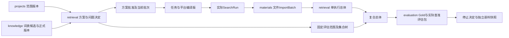

# V0.12检索块、方案与追问技术契约

首次形成：T1.2／产品V0.12（2026-09-16）；现行契约对齐T1.8／V0.18（2026-09-29）。实施状态以对应任务证据为准。

本文是[T02方案与批次确认](modules/02-检索与评估.md#plan-confirmation)的详细契约（原第19节附件）。保留已确认决定，不变更技术栈、容量、许可、Gold与质量门槛，不扩大M0验收范围。

## 1. 所有权与流程

projects继续拥有研究范围访谈与ResearchConstraint；retrieval拥有检索块、方案、批次、方案追问与评估范围定义；knowledge拥有正式词表及图谱候选；evaluation拥有Gold、暴露记录、样本与评估结果。models只返回结构化候选DTO，由负责模块校验并持久化；不直接写访谈答案、确认或正式词表。

八步导航保持不变，第二步细分为2A范围与概念、2B检索方案。当前2A先确认领域与一级分面，再保存五项字段、主动请求词项细化；分面交接以[T09](modules/09-领域分面与策略模板.md)为准。2B读取已确认范围的固定版本，将标题、方向与关键词拆块，追问当前可决定问题，预览任务矩阵，显式确认方案与当前批次，然后选择平台并编译。已保存平台偏好可复用，但不能代替本项目目标选择。回传后触发新一轮诊断；仅影响相关决定及其下游。WorkflowProjection从上述所有者读取，不保存第二套批准状态。

分面分析标记维度，技术要素分解拆实体与假说，知识组织系统提供获准命名来源，概念组配形成规范逻辑树。四者共同工作，不要求用户选一种方法。模板版本记录适用学科、维度、关系提示、问题前提、建议及夹具。首版启用生命科学模板，通用结构支持后续模板，不建设未验证的多学科自动推理能力。

图中的读取／命令不转移数据所有权；箭头表示版本依赖，不表示每步都调用模型。

## 2. 持久化契约

所有对象沿用project_id、UUID、不可变内容版本、revision、创建者、指纹与审计。下表是字段设计，不是已存在的数据表。

| 对象／所有者 | 必需字段与约束 |
|---|---|
| SearchPlan／retrieval | plan_id、version、scope_version、concept_version、template_version、input_snapshot、blocks、tasks、batch_definitions、evaluation_scope_refs、unresolved_items、content_fingerprint；input_snapshot固定标题、方向、关键词及来源片段 |
| SearchBlock／retrieval | plan_version、block_key、facet_type、label、source_spans、term_refs、relation_hypotheses、decision_refs；term_refs区分同义、上下位、相关词和来源许可；正式词项指向knowledge版本，不复制写入词表 |
| SearchPlanTask／retrieval | plan_version、task_key、purpose、required_blocks、optional_variant_refs、logical_ast、filters、exclusions、output_partition、required_decisions、dependencies、expansion_conditions；可选块形成显式独立变体 |
| SearchPlanBatch／retrieval | plan_version、batch_key、task_refs、prerequisites、activation_conditions、approval_ref；是用户决定执行的一组任务，绝不复用materials.ImportBatch表 |
| SearchInterviewRound／retrieval | plan_draft_id、trigger、input_revision、frontier_version、display_snapshot、status、model_task_ref；trigger为after_decomposition／before_composition／after_return |
| SearchInterviewQuestion／retrieval | round_id、stable_question_id、question_version、prerequisite_refs、required_for_tasks、text、options、recommendation_snapshot、reason、impact、source_refs、resolution_state；科学关系待核查与策略未决定分开 |
| SearchInterviewDecision／retrieval | question_id/version、display_snapshot_id、answer_type、answer_payload、recommendation_hash、actor、answered_at、expected_revision、supersedes_ref；不覆盖旧决定 |
| SearchEvaluationScope／retrieval | scope_id、version、plan_version、task_refs、required_platform_targets、population_set_ast、output_partition、inclusion_rules、record_unit、dedupe_version、applicability、fingerprint；独立声明达标的唯一范围真值，非每条检索式一份；evaluation只保存引用本版本及指纹的评估快照 |
| PlanApproval／retrieval | 复用ApprovalRecord的subject_type=search_plan，固定plan_version、batch_id、decision_snapshot_hash、actor、confirmed_at；审批内容与当前适用性分别存储 |
| QueryBundleVersion／retrieval | 增加plan_version、task_id、batch_id、concept_version、platform_target、platform_rule_version、semantic_fingerprint；编译产物CompiledQuery归该对象拥有并固定相同来源 |
| SearchRun／retrieval | 增加上述方案／任务／批次／编译版引用；保存实际表达式与平台改写，不能以生成式替代执行式 |
| ResultPopulationVersion／retrieval | kind=single_run或composite；单执行保留query_run_id、import_batch_ids及完整性；复合总体增加evaluation_scope_version、source_population_versions、set_ast、record_unit、dedupe_version、member_ids、provenance、completeness_assessment、fingerprint |
| EvaluationPackageVersion／evaluation | 增加evaluation_scope_version、composite_population_version、query_bundle_versions/run_refs；保留Gold、查准样本、隔离与暴露字段；旧单查询引用兼容读取 |

组合约束：同plan_version内block_key、task_key、batch_key唯一；跨项目引用拒绝；任务依赖和逻辑树禁止成环；任务引用块、问题与变体必须存在。计划内容确认后不可就地修改。审批必须匹配内容指纹及问题快照。独立评估范围冻结后，改变任务、平台、组合运算、纳入规则或去重单元必须生成新版，不允许保留旧分母原地改值。

DependencyEdge至少覆盖scope→plan、concept→plan/query、decision→task/batch、plan/task/batch→query→run→single_population、evaluation_scope/source_population→composite_population→evaluation_package→approval/stop。materials.DatasetSnapshot显式引用获准总体与来源，主集／补充集标签不会因去重丢失。

## 3. 问题前沿、答案与确认

规则引擎按前提计算当前问题前沿；模型只补充尚不能由规则、权威词表或有效缓存解决的语义疑点。资料中的命令文字是研究内容，不是用户答案或系统指令。用户自由文本先保存原文，再形成候选答案映射；编号重复、遗漏、语义歧义或与前提冲突时保持未决，展示待确认映射。不得让模型自行确认该映射。

“本轮均按建议”提交display_snapshot_id及所展示题目的ID／版本／推荐指纹。服务端检查该快照仍适用，并原子展开为逐题决定；任一已过期则整体409并展示差异，不能部分悄悄采用。明确结构化答案可直接保存；自然语言含糊答案不按默认推荐补齐。只处理已展示且前提满足的问题，不能批准未来轮次。

| 对象 | 状态与转换 |
|---|---|
| 访谈轮次 | draft→awaiting_answer→ready_to_confirm；可paused后恢复；输入变化后superseded，不让旧模型结果更新当前轮次 |
| 问题 | unresolved→answered；不确定可记uncertain并说明；与当前批次无关可deferred，依赖它的任务仍blocked；未知机制若已有明确检索处置，可resolved_for_search，绝非scientifically_confirmed |
| 方案 | draft→ready_to_confirm→confirmed；confirmed为不可变历史，适用性另记current／needs_reconfirmation／superseded；变更复制新草稿 |
| 批次 | planned→ready→active→returned；不足回传保留partial；后续条件未满足为blocked；returned不代表质量通过 |

确认命令重新读取权威版本并加锁：用户具备项目操作权、范围有效、方案无悬空引用、当前批次必要决定均有明确处置、语义变化已展示、指纹匹配，才记录ApprovalRecord与SearchPlanConfirmed事件。当前批次之外的未决问题不阻断无依赖任务。后续批次激活须另核前提和用户确认；若变更任务语义或范围，先确认新方案版本。SearchPlanConfirmed不产生FormalSearchApproved，不触发自动外部检索。

上游答案变化只重开依赖它的决定，返回影响列表；历史答案与批准保留。与ResearchConstraint冲突的策略修改先由projects确认范围新版，再由retrieval确认方案，不允许retrieval代写范围。正式词项接受由knowledge公开命令创建ConceptVersion，检索模块只绑定返回版本。

## 4. 多任务合并与评估

单SearchRun可分多个文件ImportBatch回传；SearchPlanBatch可包含多个任务／平台的SearchRun。两种“批次”在页面、API和表名均区分。材料去重保留RecordOccurrence到原文件、任务、平台及执行的多条来源。

先冻结SearchEvaluationScope，再从参与执行建立单总体，最后按冻结集合树形成复合总体。OR取并集，AND取交集；跨平台记录仅在可靠身份匹配后运算，身份歧义保留unknown。NOT须有明确全集与完整排除分支，不能在缺失来源上推断未命中。必要执行缺失、导出截断、解析未完成或身份歧义未处理均不允许该总体成为正式抽样框。

成员三态沿用[T02命中与收录](modules/02-检索与评估.md#hit-observations)：OR(hit,unknown)=hit、OR(miss,unknown)=unknown；AND(miss,unknown)=miss、AND(hit,unknown)=unknown。单记录命中确定不代表总体已完整，也不免除必要平台执行。复合总体expected_hit_count不可直接相加平台命中数；保存各来源计数，合并去重后统计实际成员，完整性由来源和集合运算证据判定。

疾病主集与跨疾病机制补充集分区；相同文献可有双标签，但补充来源不自动进入主集评估或统计。每个独立声明范围继续Gold有效总数≥50，分别执行调优／独立验收与查全／实际结果查准≥0.85门槛；不是每条子式都建50条Gold。单式独有贡献和漏检诊断不等于单式获准。20篇反馈仅作调优诊断，不能替代正式查准抽样。

独立Gold、标签、误差和受保护查准样本不进入追问、知识提取或模型上下文。回传诊断只读调优用途材料；独立包发生暴露沿用整包永久转调优规则，不能通过新方案ID、新轮次或重新导入洗掉暴露史。停止决定固定评估范围与具体版本；只有必要范围全部满足其门槛时才对相应范围显示validated，不对整个项目泛化。

## 5. API增量与服务守卫

下表均以`/api/v1`为前缀，是待开发契约。沿用会话／CSRF、项目授权、Idempotency-Key、expected_revision和错误信封；静态接口表不覆盖当前实现生成的OpenAPI。

接口唯一索引及错误信封见[T07 API契约](modules/07-数据与API契约.md#api)。本附件的对象、批次、追问、权限和迁移守卫继续适用；不另维护一份端点表。

输入／语义或业务门槛不满足用422；快照／revision过期或同幂等键异输入用409；异步受理202。登录、权限及其他状态码按T07统一契约。错误体使用单数`recovery_action`，并含`code,message,object_ref,blocking_items,responsible_role,trace_id`。PLAN_UNCONFIRMED、BATCH_PREREQUISITE_UNRESOLVED、SEMANTIC_CHANGE_REQUIRES_CONFIRMATION及POPULATION_INCOMPLETE属422；QUESTION_SNAPSHOT_STALE属409。不得返回无权项目或受保护标签正文。

方案／问题／批次命令按聚合固定锁序执行，批准读取与写入同一事务；并发改版不能在检查后换内容。任务通过fencing_token、input_revision和输入指纹回写，迟到候选只归历史。QuestionAnswered、SearchPlanConfirmed、SearchPlanApplicabilityChanged、SearchPlanBatchActivated、CompositePopulationFrozen沿用Outbox／Inbox及stream_seq，不新增事件基础设施。

## 6. 模型调用、降本与降级

任务类型限于block_disambiguation、interview_question_suggestion、return_diagnosis；通用规则拆块、问卷前沿、推荐批量采纳、保存答案、确认、AST组装／编译、集合计算和门槛判断均零模型调用。问题模板建议须区别于AI新建议，不展示不存在的AI核查。

ContextManifest固定范围／概念／方案／问题前沿版本、用途、允许的来源片段及权限版本。缓存键至少含上述指纹、模板／提示／模型路由版本、任务类型和授权域；读取缓存及交付前再核验许可。相同在途任务复用，不因刷新页面产生新付费；仅新歧义或新增调优证据触发增量任务。模型建议不完整／结构非法则保留失败与人工入口，不自动反复重试付费。

无模型配置、预算不足、许可不明或服务不可用时，规则问卷、人工拆块、编辑及显式确认仍可用；需获准材料支持的语义判断保留待处理，不能用无来源生成替代。预算预留、费用未知对账及质量冻结沿用统一网关，不引入检索模块供应商直连。M1实现实际调用前的最小网关／隔离／费用证据，M6执行全平台质量成本对照，不能把首次调用防护拖到M6。

## 7. 迁移与阶段交付

追加表与可空历史引用，旧查询和SearchRun标记legacy_unverified，继续只读展示原证据，不自动伪造计划批准。用户复用旧查询时显式建立／确认新方案，通过语义映射和执行证据核验后决定当前适用性；无法证明口径一致则重新执行。旧Gold隔离和暴露历史始终继承。功能开关按项目控制新流程；关闭开关只保留可恢复历史，不成为绕过新关卡的入口。

M0保留原范围与验收基线。M1依次交付：方案数据和规则模板→问题卡片与人工路径→统一模型网关最小能力→确认／平台编译守卫→执行与回传来源。M2交付回传诊断、影响式重确认、评估范围与复合总体、独立包隔离和停止。M3沿用固定主集／补充集语料边界。M6完成总体质量费用、容量及灾备验收。工期在M1拆分估算后重排，原20—22周不视为新增需求后的承诺。

PSMB5例为设计／合成回归夹具：首批Q01、Q02、Q11，后续条件补查；LSD1与PRMT5关系待核查；首轮无默认NOT、年份、语言或物种限制。示例的字符串不作为真实平台执行证明。上线前仍需各已启用平台实际入口、规则及脱敏导出证据。

## 8. 验收与交付状态

新增产品S23—S28与技术T30—T37见[验收映射](验收与实施映射.md)。设计→对象→API→守卫→测试的完整链在该表保留。本次仅同步文档，没有执行新增接口测试、真实检索或模型质量试验；历史评审不自动覆盖此增量。
