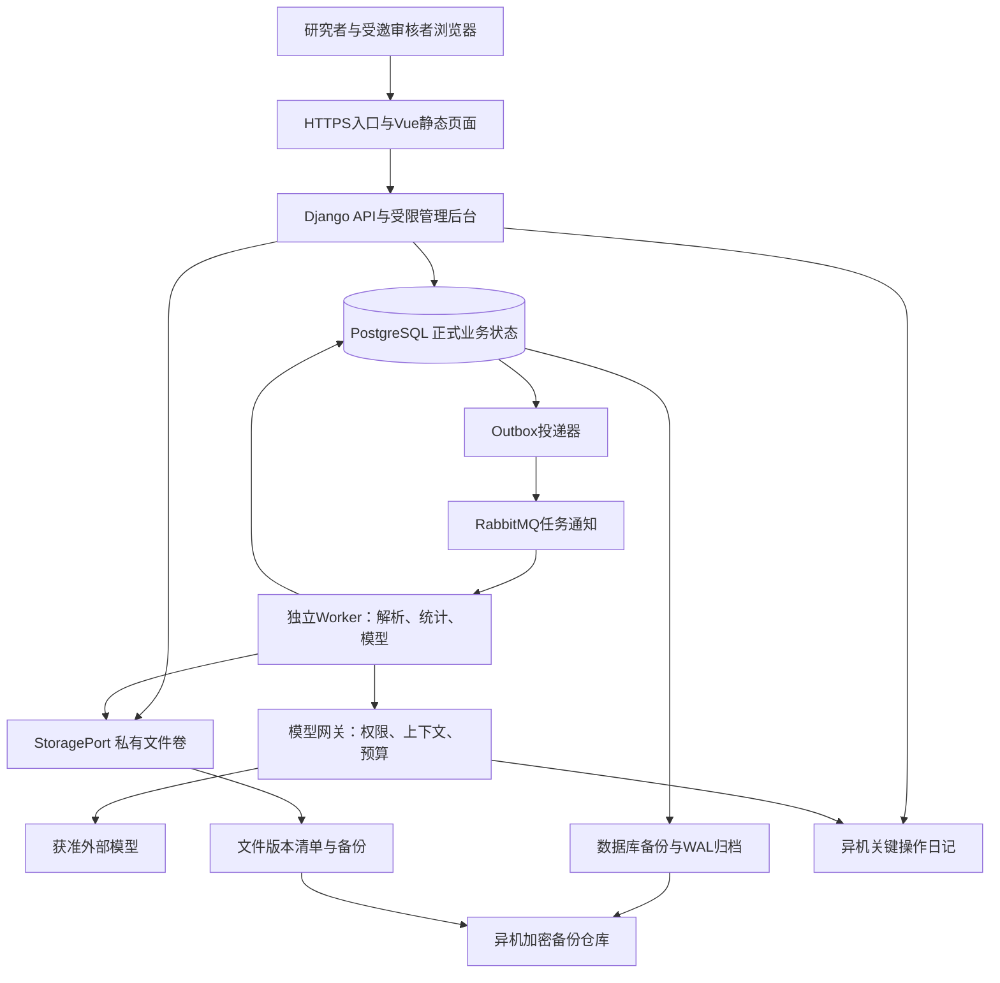

# T00 总体架构与模块所有权

<a id="module-entry"></a>

> 主责模块：`all`｜计划阶段：M0—M6｜输入：产品模块定义｜输出：部署、模块边界和开发顺序。
> 当前按职责维护；历史编号及迁移位置见[章节索引](../章节索引.md)，开发优先使用现行主题锚点。
> 产品规则与技术实现状态分开判断，设计文字本身不等于已交付能力。

## 1. 已确定的实施边界

| 事项 | 本版约定 |
|---|---|
| 用户与部署 | 单套受控服务器、邀请制账号、项目成员隔离；保留机构独立部署的配置边界，首版不建设机构计费或统一身份平台 |
| 主用户旅程 | 登录→轻量建项→领域及一级分面确认→保存五项范围→主动细化词项→范围与概念确认→拆块与方案追问→显式确认方案及当前批次→平台配置→探索检索→种子与知识构建→Gold与正式检索→语料确认→统计与引文分析；步骤为后端可重建投影，不取代模块业务真值 |
| 外部检索 | 21个平台目录保留；用户在外部平台执行、筛选、导出后回传。规则适配不等于API接入或实际命中 |
| 检索评估 | Gold有效记录总数≥50；Gold正例用于查全，负例用于误检回归；查准基于实际结果全量标注或固定分层抽样；调优与独立验收阶段均须双指标≥85% |
| 全文 | 本地自动提取文字PDF；扫描件、复杂表格及公式保留待人工补录／核查状态，不用空提取冒充完整分析 |
| 模型 | 来源许可和项目设置同时允许才外发；材料受限时可做获准本地解析／统计，依赖外发的语义任务等待，不默认建设本地推理集群 |
| 旧系统 | 选择性复用解析及业务经验，显式迁移；旧通过状态不能直接获得当前版本资格 |
| 性能目标 | 普通查询服务端p95≤2秒；长任务在请求体接收完成后2秒内持久化受理并返回任务ID；上传传输、模型耗时和人工等待单列 |
| 恢复目标 | RPO≤1小时、RTO≤4小时；数据库和文件均需异机可恢复副本，目标须演练验证 |
| 删除与保留 | 私人项目删除立即禁用访问和处理；30天恢复期后清理在线内容，备份滚动保留30天；不含正文的审计元数据保留1年，较短许可要求优先 |

容量数字是验收输入，不是无限项目或任意大小图谱的承诺。实施起始测试集设10个活动项目、合计2万题录与2000份全文；每份全文以≤50MiB、≤300页作为首批样例上限。此为可调整的容量配置，不改变科学纳排或丢弃超限材料：超限进入待拆分／单独导入任务，调整配置后重测。共享图谱初始压测包上限5万实体、20万带条件关系；超过该测试包时不承诺相同性能，由管理员分域发布并进行容量测试。

## 2. 系统组成与部署



主服务器以Linux容器运行入口、API、Worker、RabbitMQ和PostgreSQL；同一后端镜像启动不同进程。前端产物作为静态文件部署，Node仅用于构建。开发、验收和试点使用分开的数据库、文件前缀、队列及供应商配置；测试默认使用合成材料和模型桩，真实材料不得自动复制至开发环境。

初始资源估算为4 vCPU、16GiB内存、200GiB SSD，不属于已测最低配置或采购承诺；解析并发1、模型在途请求2、程序统计并发1为调度起值。入队可多于执行数，按用户轮转，单项目不得长期占满Worker。CPU／内存压力触发排队而非静默减少必要分析。云厂商、地域、域名和模型供应商在部署配置中选定，并先通过实际许可与连通性检查。

数据库、队列及私有文件端口不对浏览器公开。应用只通过HTTPS提供接口；后台管理单独路径并受邀请账号与操作权限控制。数据库／文件仓库是正式数据来源，队列、索引和前端状态均可重建。

## 3. 技术选型及版本治理

| 组件 | 选择与职责 | 版本治理 |
|---|---|---|
| 前端 | Vue 3＋TypeScript；路由、检索表单、证据定位与图谱联动 | 使用官方create-vue起步，Node 24 LTS且≥24.12.0；锁定Vue、构建工具与Node版本，提交依赖锁文件 |
| 后端 | Python 3.12、Django 5.2 LTS；Django REST Framework作为API层 | 固定兼容系列，开工时选择已核实安全补丁；不追随浮动latest镜像 |
| 数据库 | PostgreSQL 17；关系数据、JSONB配置、事务、版本和账本 | 精确镜像摘要与扩展版本纳入部署清单；迁移脚本受版本控制 |
| 后台任务 | Celery 5.6＋RabbitMQ 4.3；任务通知与受控执行 | 锁补丁与配置；业务任务记录在PostgreSQL，不依赖队列保存最终业务状态 |
| 文件 | StoragePort首版实现为私有文件卷；异机备份使用独立仓库 | 不建设公开下载桶；每份内容有指纹、许可、版本、到期日及备份状态 |
| PDF | pypdf适配器提取文字和页号；保留原文件供人工核验 | 固定解析器版本及参数；复杂布局不承诺可靠章节或表格还原 |
| 图表 | Vue组件承载统计图和分批加载的实体关系图 | 可视化组件替换不改变分析结果；布局参数与科学方法参数分开 |
| 备份 | PostgreSQL持续WAL归档／pgBackRest；文件独立增量备份 | 同一恢复清单关联数据库目标点、文件指纹、日记游标；按第15节演练 |

本轮核查的Django 5.2仍为受支持LTS系列；Django REST Framework具有Django 5.2支持记录。采用成熟系列是当前选择，实施锁文件仍须核查补丁与兼容性，不能把本文的系列号当作可直接安装的完整清单。[Django版本表](https://www.djangoproject.com/download/)、[DRF发布记录](https://www.django-rest-framework.org/community/release-notes/)

RabbitMQ起始选择4.3系列，当前社区支持截至2026-11-30；上线跨越该日期前须完成受支持系列的升级验证，不能把4.x理解为长期支持。其余组件支持范围及官方依据见[技术资料核查](../reviews/技术资料核查.md)。[RabbitMQ支持表](https://www.rabbitmq.com/release-information)

前端起步以[Vue官方快速开始](https://vuejs.org/guide/quick-start.html)所列create-vue要求为准；Node下限须同时满足脚手架和Vite，不能仅检查其中一个。

首版不加入独立图数据库、Elasticsearch或单独向量服务。关系表、按权限限定的词项检索及可复算统计先满足试点；嵌入检索通过可选SearchIndexPort增加，只有相应质量基线通过且许可允许时启用，不替代正式平台检索，也不默认扩大模型调用。现有Neo4j只读适配可作为外部图谱输入端口，不能充当未经审核的正式资产库。

<a id="modules"></a>

## 4. 模块、数据所有者与调用方向

| 模块代码 | 对应产品层 | 唯一写入的核心对象 | 对外能力 |
|---|---|---|---|
| identity | 应用公共能力 | User、Invitation、ProjectMembership、AccessPolicyRevision | 身份、项目角色、统一授权裁决 |
| projects | 服务应用 | Project、ResearchConstraint、ScopeSession、ScopeAnswer、ScopeQuestionSuggestion、RequiredDependency、WorkflowProjection、DecisionPackageVersion、Review | 轻量建项、范围访谈与确认真值、八步投影、研究者选题与决策包、可选受邀评审授权 |
| retrieval | 数据底座／查询应用 | SearchStrategyTemplateVersion、SearchFacetProposalSet、SearchStrategyFacetProposal、SearchFacetDecisionVersion、PlatformTarget、PlatformRuleVersion、SearchPlan、SearchBlock、SearchPlanTask、SearchPlanBatch、SearchInterviewRound/Question/Decision、SearchEvaluationScope、SearchOptimizationPolicyVersion、QueryOptimizationTrial、QueryBundleVersion、SearchRun、ResultPopulationVersion、FinalQueryApproval、SearchStopDecision | 领域与一级分面建议／决定、查询编译、六关检查、人工执行记录、结果总体、正式确认与四类停止 |
| materials | 数据底座 | ImportBatch、FileObject、MaterialAccessDeclaration、SourceRecord、SourceStatusVersion、RecordOccurrence、IdentityCluster、DatasetSnapshot | 不可变导入批次、去重、来源映射、材料用途许可、文件与语料冻结 |
| evaluation | 数据底座隔离域 | GoldPartition、GoldLabel、RecallEvaluationScopeVersion、SourceCoverageObservation、GoldHitObservation、PrecisionSamplingPolicyVersion、ResultPrecisionSampleVersion、ResultRelevanceLabel、EvaluationPackageVersion、EvaluationRun、GoldRetirement | Gold独立性与命中核验、结果集查准、双85%评估包及退役 |
| knowledge | 知识底座 | ConceptVersion、PrivateGraphVersion、Entity、ClaimVersion、EvidenceUnit、ReferenceMatch | 词表、关系、原文证据与科学核查 |
| analysis | 智能中台 | ResearchFacetTemplate、ProjectFacetVersion、DocumentFacetAssignment、AnalysisPolicyVersion、AnalysisCapabilityAssessment、AnalysisRun、TopicCluster、CitationEdge | 个人切面模板、项目独立切面、逐模块准入、统计、分类、主题及引文分析 |
| research | 服务应用／智能编排 | AuthorLimitation、GapCandidate、FollowupPlan、FollowupReport、ValidationCard、QuestionFrame、CandidateDecisionVersion、CandidateExpertReviewVersion | 七类空白、四类线索、三关、研究者候选决定和可选专家意见 |
| assets | 知识底座后台 | GraphAssetVersion、Contribution、LicenseRecord、AdmissionReview、ScientificReview、Publication、Withdrawal | 贡献、外部资产、审核、发布与撤回 |
| entitlements | 应用公共能力 | ContributionEligibility、Reward、AccessGrant、RewardLedger、AvailabilityEvent | 唯一奖励、90天额度、暂停转用及FIFO |
| execution | 智能中台公共能力 | Task、TaskAttempt、InputRef、DependencyEdge、Outbox、Inbox、CacheEntry | 调度、幂等、依赖失效和恢复 |
| models | 智能中台 | ModelUseCasePolicyVersion、ModelInvocationDecision、ModelRouteVersion、ContextManifest、ModelCallAttempt、BudgetLedger、BenchmarkRun | AI用例登记、调用决策、权限、路由、上下文、费用及质量监控 |
| operations | 应用公共能力 | AuditEvent、DeletionRequest、RecoveryManifest、CriticalJournalRef、MonitorSubscription | 审计、删除恢复、告警及人工监测任务 |

同一模块包含API入口、应用服务、领域规则、数据仓储及测试。模块不能导入另一个模块的ORM模型执行写操作；跨模块命令调用公开服务，查询经只读选择器取得版本化DTO。后台任务也走相同应用服务。CI检查模块导入边界，关键对象通过数据库约束和服务测试再次保障。

`WorkflowProjection`是projects维护的可重建读模型，聚合八步流程的`current_step`、`available_actions`、`blocking_items`、`responsible_role`、`input_versions`、`applicability`及各模块事件水位。各负责模块以业务事务和Outbox同提交，投影消费者幂等更新；影响当前页面的命令成功后可调用只读选择器立即重算该项目，并在异步事件到达后校正。投影不拥有审批、验收或权限真值，丢失时从各模块DTO及事件流重建。

projects编排范围访谈：在此前新增的立项领域分面由retrieval提供版本化候选及用户决定DTO，projects只消费其当前已确认版本，不写检索分面表。knowledge仅返回当前用户可访问的概念／图谱候选DTO，models仅运行固定输入的语义歧义任务，只有projects能写`ScopeSession`、`ScopeAnswer`和`ResearchConstraint`。关键词建议在knowledge中以`ConceptSuggestion`保存来源与用户决定，经projects确认范围后由knowledge创建不可变`ConceptVersion`；任何候选或模型JSON都不能直接进正式词表。

identity计算身份与项目角色，assets提供当前来源／发布许可，entitlements提供当前权益，evaluation提供材料用途保护；统一授权入口组合结果，内容模块在每次实际读取与交付执行裁决。管理员的业务身份不默认得到所有私人项目读取权；系统维护超级用户不作为日常审核账号。

Django Admin用于平台目录、受控配置、失败任务和审核索引。审批、发布、撤回、发奖和gold退役必须调用专用命令；状态字段只读，禁用绕过规则的批量更新和直接编辑。官方后台适合内部管理，流程性页面仍由专用Vue页面提供。[Django Admin说明](https://docs.djangoproject.com/en/5.2/ref/contrib/admin/)

## 17. 开发顺序与交付完成标准

| 阶段 | 开发产物 | 放行依据 |
|---|---|---|
| M0 入口与范围 | 工程骨架、身份／权限、项目列表与原子建项、范围访谈、关键词候选、ResearchConstraint版本、WorkflowProjection、任务／事件骨架 | 对应阶段的[现行验收目录](../验收目录.md)，以及[实施证据归档](../验收与实施映射.md)；历史M0结果不替代新增契约 |
| M1 检索准备（含方案与追问） | 拆块模板、问题卡／快照与人工路径、最小模型网关、方案及批次确认、平台配置、探索检索、不可变导入批次、种子筛选、概念词表与项目知识输入、查询编译及六关前置检查 | 对应阶段的[现行验收目录](../验收目录.md)，以及[实施证据归档](../验收与实施映射.md)；历史M0结果不替代新增契约 |
| M2 检索评估闭环 | 回传追问、影响式改版、评估范围及复合总体、Gold分区、结果总体、查准策略与样本、多轮执行、独立EvaluationPackageVersion、四类停止决定 | 对应阶段的[现行验收目录](../验收目录.md)，以及[实施证据归档](../验收与实施映射.md)；历史M0结果不替代新增契约 |
| M3 语料与基础分析 | DatasetSnapshot、PDF许可、逐模块AnalysisCapabilityAssessment、描述性统计、共现与引文分析 | 对应阶段的[现行验收目录](../验收目录.md)，以及[实施证据归档](../验收与实施映射.md)；历史M0结果不替代新增契约 |
| M4 研究决策 | 导航切面、证据／空白、候选、补查、研究者定题与可选受邀评审 | 对应阶段的[现行验收目录](../验收目录.md)，以及[实施证据归档](../验收与实施映射.md)；历史M0结果不替代新增契约 |
| M5 图谱后台与共享 | 双来源、规范化／审核／发布、资格奖励、撤回与FIFO | 对应阶段的[现行验收目录](../验收目录.md)，以及[实施证据归档](../验收与实施映射.md)；历史M0结果不替代新增契约 |
| M6 质量与试点 | 模型质量／成本基线及逐项优化、容量与灾备演练、人工监测待办 | 对应阶段的[现行验收目录](../验收目录.md)，以及[实施证据归档](../验收与实施映射.md)；历史M0结果不替代新增契约 |

阶段发布的完整场景清单以[现行验收目录](../验收目录.md)按阶段筛选为准；下表旧编号只是基础示例，不能代替全量门槛。M1包含领域分面及首次静态编译，M2包含用户NOT阈值、联合范围和逐条查全核验，M3—M4包含来源状态复核。历史M0证据不追溯扩大，新流程启用须通过增量迁移与页面场景。

各阶段可在依赖允许处并行，但不能把尚未启用的图谱奖励或算法标签隐藏为“已完成”。人员至少覆盖前端、后端／数据、领域核查和运维测试职责，可兼任但记录责任者；未确定实际人员前不编造固定周数或报价。实施排期应以M1、M2的真实失败样例校准。

实施仓库建议结构：

```text
frontend/                 Vue页面、API类型与交互测试
backend/config/           环境、会话、路由与Worker配置
backend/modules/          第4节各业务模块
backend/ports/            模型、文件、平台规则与外部图谱接口
backend/adapters/         已核验的具体格式与供应商实现
tests/contracts/          API、状态与模块交接
tests/scenarios/          按现行验收目录全部适用S/T场景，不维护截断编号副本
tests/fixtures/           合成材料与获准脱敏样例
deploy/                   容器、备份、恢复与告警配置
docs/                     OpenAPI、迁移映射、运行手册和验收证据
```
