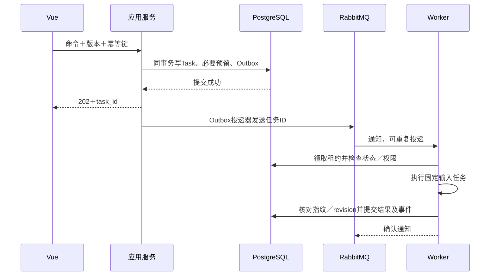

# T06 任务、事件与模型

> 主责模块：`execution／models`｜计划阶段：M0—M6｜输入：带版本的业务任务｜输出：可恢复任务、模型产物和费用。
> 当前按职责维护；历史编号及迁移位置见[章节索引](../章节索引.md)，开发优先使用现行主题锚点。
> 产品规则与技术实现状态分开判断，设计文字本身不等于已交付能力。

## 9. 任务、事件与并发协议

### 9.1 受理及事件投递

技术状态为`created/queued/running/waiting/succeeded/failed/cancelled`；waiting另存原因与责任者。成功仅表示技术执行完成，业务守卫另判。取消更新任务revision；已发生供应商费用保留，旧结果只能按原版本保存且不得更新当前指针。

Outbox写入与业务事务同提交；投递采用publisher confirm，崩溃后可以重投。Worker按数据库task_id领取带有效期的租约，并使用fencing_token拒绝过期Worker回写。Inbox按consumer/event_id去重；事件顺序使用下述独立流序号，业务revision只用于对象并发检查，不用于判断过滤订阅的缺口。

事件信封增加`stream_id, stream_seq, aggregate_revision, transaction_id, event_index`。每个聚合事件流由拥有模块在同事务锁定流头分配连续stream_seq；一事务多事件依event_index排序，共享业务revision也有不同流序号。订阅某流的消费者取得完整信封，对无关类型仅推进流游标，不把它们当作丢失事件；受限payload仍须按消费者服务身份授权，不为推进水位暴露正文。

已有流首次订阅须载入拥有模块提供的一致快照及其stream_seq，之后从该点补拉；新流从1开始。乱序先缓存并从持久EventStore按`stream_id/from_seq`补拉，重复跳过；未知schema只挂起受影响流，不阻塞全部消费者。跨流不假定全局顺序，消费者通过明确的已提交依赖引用核验；新资格事件必须引用同事务已提交Publication。事件载荷与普通日志分域，EventStore过期前形成可验证快照与消费水位，不能静默丢掉恢复所需的前驱。

入队与消费均不能承诺模型请求exactly once。队列丢失时按数据库未结束任务重建通知；对于可能已发往供应商但结果未知的付费尝试，先对账，不能按“重建通知”再次付费调用。Celery重试和延迟确认是执行工具，不能代替业务幂等。[Celery任务说明](https://docs.celeryq.dev/en/stable/userguide/tasks.html)

### 9.2 锁与冲突

同库事务使用Django事务边界和PostgreSQL行锁；乐观revision用于用户编辑冲突。固定锁顺序为项目／预算→目标聚合→依赖控制行，奖励队列按用户ID／资产ID排序；数据库死锁只有限次退避重试纯数据库事务，外部模型调用绝不在锁内进行。[Django事务文档](https://docs.djangoproject.com/en/5.2/topics/db/transactions/)

模型和解析任务完成时核对输入指纹、目标版本、取消标记、当前权限；旧版本结果归历史，费用归实际尝试。运行中依赖改变不覆写旧输入，创建新任务或标旧任务当前不采用。状态／权限／账本更新本身零模型调用。

## 10. 模型调用与成本控制

### 10.1 调用入口与实际上下文

统一入口按顺序执行：是否需要语义处理→当前许可和用途保护→输入与策略指纹→同范围在途任务合并／有效缓存→预算预留→组装ContextManifest→供应商调用→输出结构、来源与覆盖校验→权限复查→写候选产物与结算。技术上兼容多供应商端口，首版只配置一个通过基线的实际供应商；未配置显示待启用，不虚构可用模型。

ContextManifest逐片段保存ID、正文范围、来源、许可、用途和token估计；模型真正看到的材料必须在清单中。受保护验收材料不进入上下文、缓存或嵌入；参考文献内的指令视为材料内容，不能改变任务、触发工具或获得秘密。模型默认无任意网络、文件和执行工具，只返回模式约束的候选JSON。

### 10.2 复用与质量门槛

缓存键包含同用户授权域、材料及版本指纹、任务类型／需求、模板、模型路由、提取器／策略版本。公共资产只能在当前许可下复用，不能跨用户命中私人缓存；许可撤回、删除和到期立即使相关内容不可交付。摘要、解释和向量片段均继承来源限制，除非有单独明确允许的派生保留授权。多来源内容不能简单取最宽权限。

文献级提取与项目综合分开。新增材料只提取新增部分，改变候选条件只重做受影响综合；规则校验、指标、筛选、页面读取和权益处理不调用模型。低成本路由、批处理或裁剪策略先通过独立质量对照：产品§12.1冻结的各项指标不低于基线、人工工作量不增加且无新增严重科学错误才放行。随机任务在看结果前固定重复评测次数和比较方法；证据不足保持原路径，不以“非关键退化”放宽指标，也不以双85%下限替代质量比较。

### 10.3 预算与未知费用

预算按币种分别记账；没有已确认汇率不能混币直接比较。事务内检查`settled＋reserved＋本次最坏允许费用≤hard_limit`，预留覆盖允许输出与重试边界。每次尝试有独立费用记录；未知费用保留预留并标待对账，不按0释放。超额或无法保守估计时等待用户针对增量任务决定，不能静默降质。供应商超出已知计价范围的差额如实记账并冻结新增调用，不能声称硬预算能控制供应商错误计费。

请求超时先通过供应商request_id／幂等能力查状态；没有查询能力时待人工对账，只有确定未提交或已失败且可重试才发新尝试。对方不提供幂等时不承诺零重复计费。详细调用日志在受限项目内容域保存；普通运维日志只含ID、用量、错误类别，不含原文、提示词、答案或密钥。

### 10.4 已登记用例、调用决策与监控

`models`唯一写`ModelUseCasePolicyVersion`：`use_case_id`、阶段及业务所有者、允许的触发动作、输入材料和许可用途、规则／图谱替代路径、模型路线及质量基线、项目／资产预算归属、每次尝试的保守费用上界、输出模式与校验规则、人工确认点、失败降级和启用状态。只有已验收启用的用例能向真实供应商发请求；`试验中`仅在隔离验收任务及明确配置下运行，不能把试验输出直接推进正式对象。策略升级建新版，已受理任务固定旧版并在交付时再核当前许可和适用性。

应用服务对每个具有AI入口的业务动作记录`ModelInvocationDecision`，即使结果是零调用。字段至少包括项目／资产域、actor及授权域、`use_case_id`与策略版、业务对象及输入指纹、触发命令／幂等键、决策时间、`decision`（`rule_completed/cache_reused/inflight_joined/provider_requested/permission_blocked/budget_blocked/policy_paused`）、`reason_code`、复用或关联任务ID、估计上界及预算预留引用。它是审计与度量事实，不含原文或提示。只在发送供应商请求时创建`ModelCallAttempt`，以`task_id/attempt_id`关联策略、路由／提示／模型版、供应商request_id、ContextManifest、计价版及实际响应。重试、补做、升级均是独立尝试，不覆盖第一笔费用；状态`unknown_billing`须继续占用预留。

监控投影从调用决定、任务、尝试、账本与质量评测重建，不作为第二份业务真值。按项目／资产、阶段、用例、路线、模型／提示版本及时间窗分别计算：符合条件的业务动作数、零调用原因、实际请求和合并在途数、缓存命中、输入／输出用量、预估／预留／已结算／未知费用、单个完成任务总费用、失败和重试／升级费用、p50／p95排队及执行时延、输出结构／来源／覆盖校验失败、人工修正工时及冻结基线质量差值。分母和样本量始终显示；预算占用以权威账本计算，不依赖监控投影是否及时。普通日志和指标不含材料正文、提示词、候选输出或受保护标签；必要细节在项目受限证据域查看。

管理员按`use_case_id`版本化配置费用偏差、重复／重试、时延、缓存异常及质量回归的预警条件，附观察窗口、样本门槛、责任人和处理动作；供应商价格／模型行为变化触发计价与质量基线复核。硬预算由事务守卫直接阻断，不等待异步告警。成本不确定、许可撤回或严重科研错误时只暂停受影响路线的新尝试，保留已完成结果与历史账本；未知付费先对账，不能自动重发。业务所有者决定人工恢复或回到已验收路线，受影响产物经其所属模块标待复核。告警有`open/acknowledged/resolved`、原因、处置与复测引用，监控读取不触发模型调用。

质量与成本优化按用例独立放行：冻结同输入、同许可、同任务完成标准和代表性困难样例，比较端到端费用（含失败、重试、升级）、人工工作量、时延、来源完整性及严重科学错误；低价路线、批处理、上下文裁剪及缓存策略均须通过对应独立质量评测才启用。若模型本身没有稳定可识别版本或供应商价格不可核，对应路线标`unverified`并保持已验证配置或人工待处理，不以模型自报分数替代质量证据。M1.3先交付决定记录、预算、最小看板以及超预算、重复重试、未知计费和输出校验失败的告警；各业务用例首次启用前补其质量夹具，M6复测整体成本与质量漂移。

## 21. T1.5 一级分面模型任务

`facet_disambiguation`是独立于词项候选的任务类型。项目建项后先由规则／获授权图谱本地生成领域与分面候选；仅出现语义歧义或用户主动请求补充时，且许可、预算及已发布模型路线齐备，才投递模型任务。该任务只允许最小的已保存项目名称、方向、核心关键词及获许可的图谱片段，不读取尚未填写的五项范围答案、受保护 Gold、全文或其他项目内容。输出必须是带来源和不确定性标记的候选 JSON，不能直接写领域决定或正式范围。用户界面显示调用、复用、失败和费用状态。

此例外不改变原有词项网关：五项字段保存后仍须用户主动点击生成，系统不因进入页面或确认分面自动触发词项模型。任务键和迟到校验同时包含项目、输入、领域模板、图谱／权限与模型版本；无模型或预算不足时规则／人工路径保持可用。
