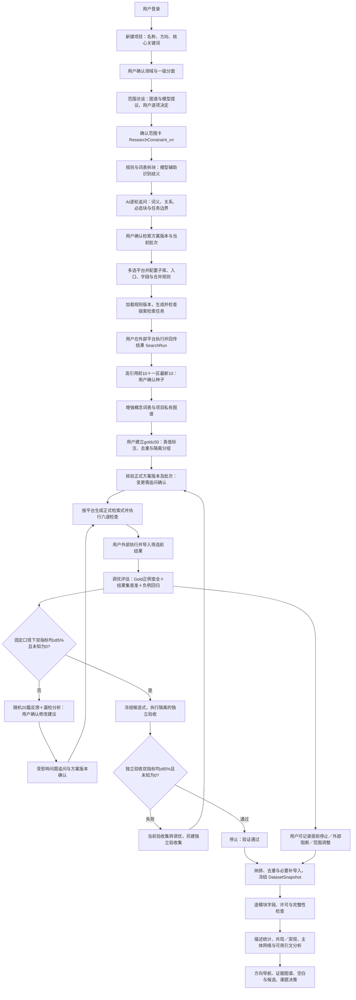

# P00 产品定位、旅程与范围

> 主责模块：`projects`｜计划阶段：M0—M6｜输入：全局目标与页面入口｜输出：各模块的业务边界。
> 当前按职责维护；历史编号及迁移位置见[章节索引](../章节索引.md)，开发优先使用现行主题锚点。
> 产品规则与技术实现状态分开判断，设计文字本身不等于已交付能力。

## 1. 产品定位与已确认决策

面向已有研究方向、尚未形成具体科学问题的博士生和科研人员，帮助他们基于可复现的文献—专利联合检索，形成有证据支撑、能够在自身条件下开展、可与导师讨论的课题。

第一版以“铁死亡介导癌症放疗抵抗”为贯穿主题。该短语是用户输入的研究方向，不能自动成为平台已接受的因果结论。演示中的记录、关系、候选课题和状态仅用于验证交互；本轮不输出该方向的真实文献综述或创新性判断。

已确认：

- 文献与专利检索共同构成整个平台的数据底座，覆盖全部上层应用。
- 用户登录后以“项目名称＋研究方向＋至少一个核心关键词”建立项目；其他范围和资源条件由建项后访谈逐步补齐，允许保存草稿。
- 范围访谈以“必填项完整、矛盾已处理、用户确认”为结束条件，生成不可变的`ResearchConstraint_vn`。后续范围变更新建版本并重算受影响下游状态，不覆盖历史。
- 关键词工作台并列展示核心词、同义词、上位词、下位词、相关词和排除词，每项标注用户输入、导入文献、私有图谱、授权共享图谱或模型推测来源；只有用户接受的词项才进入当前概念版本。
- 标题与关键词共同触发检索块建议；规则及权威词表优先，大模型处理歧义和解释。用户确认词义、关系未决项、必选块、任务目的、放宽边界与批次后，冻结版本化`SearchPlan`，才允许生成可执行的平台查询。
- AI追问覆盖拆分后、组合前和结果回传后；按前提已满足的设计决策逐轮展开，提供推荐答案、理由与影响，支持逐题或“本轮均按建议”。回答须落入结构化决定并关联版本，模型推断不代替用户批准。
- 检索按疾病／目标对象主集和跨范围机制补充集分别归集；任务用途不同，不把所有概念强制AND，不把不同目的结果无条件混成一个统计或Gold总体。详见第5.1.0节。
- 当前没有检索 API：平台生成检索计划和检索式，由用户在外部数据库执行、筛选并回传结果；平台不把生成检索式显示为已执行检索。
- 粗检索前由用户选择一个或多个检索平台，必要时继续选择子库、检索入口和模式；粗检索、细检索与NOT调优均按该平台对应版本的检索规则生成。支持字符串的入口提供可复制检索式，表单入口提供逐行字段与操作指引。
- 粗检索依据已确认方案的当前批次，围绕用户关键词及概念块分别进行定位与背景覆盖，筛选高引用前 10 篇，以及 SCI 或 SSCI 一区期刊中最新发表的 10 篇，形成领域知识构建种子集。
- 种子文献与大模型的关键词描述共同辅助构建包含同义词、上位词和下位词的概念词表；文献支撑领域基本知识图谱，词表与图谱反向生成细检索式。
- 每次生成或修改检索式后按任务类型重新检查规则、语法、语义及受影响回归项；正式检索策略最终确认须取得平台实际执行及gold验收。粗检索和候选证据补查按第5.1.4.1节执行适用关卡，不能冒用正式检索通过标识。
- 用户选择并确认gold数据集；每个独立声明达标的评估范围至少包含50条去重、完成相关／不相关有效标注的记录，按调优集与独立验收集分开保存。最终检索式须同时在冻结独立gold正例上达到查全率≥85%，并在实际结果集的全量或预先固定分层样本上达到查准率≥85%，经过负例回归及排除词审查后才可确认。指标结论限于平台、日期、gold、结果总体及评估方法。
- 任一指标未达到 85% 时，从当前轮符合抽样条件的检索结果中随机抽取 20 篇文献，由用户标出无关记录及理由；平台据此提出 NOT 等修订建议。查全率不足时同时分析 gold 调优集的漏检记录，补词或撤回误删条件；重新人工执行并回传结果，持续迭代至双指标达标。20 篇反馈样本不代替 gold 验收。
- gold正例的命中用于评估查全；典型负例用于误检回归和排除审查，不单独代替对实际结果集的查准评估。查准率基于全量人工标注，或事先固定的分层随机抽样，并同时报告样本量、抽样方法和不确定性。
- 停止检索分为“验证通过、用户提前停止、外部条件阻断、范围调整后终止”四类；只有第一类能获得“正式检索已验证”状态，其他类型可进入带覆盖限制的探索性分析。
- 以研究项目为工作容器，七个场景共享概念词表、数据版本、证据和判断。
- 首次无数据时，AI只辅助建立用户可编辑的方向切面；粗检索导入后展示探索预览，细检索通过既定确认流程并完成分析字段检查后生成正式导航报告。种子集用于知识启动，不能代表领域统计总体。
- 切面模板归个人保存、跨项目复用；项目继承独立版本。点击切面默认筛选当前结果，只有主动选择“针对该切面补充检索”才生成新的查询任务与数据版本。
- 热点、前沿候选、迁移和衰退信号必须关联统计范围、时间窗、方法与原始记录；共现、引用与机制证据分开表达。CNKI／WoS／Scopus选择只开启引文数据准备入口，实际分析能力由字段与覆盖检查决定。
- 优先走通方向探索、联合检索、证据分析、空白发现、课题论证；竞争合作与持续监测提供关联入口。
- 通常输出3—5个有依据的候选课题，以及1个用户选定课题的详细论证和证据附件；合格候选不足时报告实际数量及待补原因，不为凑数虚构空白。
- 科学价值与个人可行性分别评价，允许给出“当前条件下不建议开展”。
- 导师或合作者核查具体判断，意见与人员身份、证据版本一起保存。
- “尚未检索到证据”“证据不足”“证据相互冲突”必须区分；潜在空白需通过检索覆盖检查和专家核查。
- 空白分为证据／内容、对象／人群、方法、理论／视角、场景／地理／时效、矛盾、技术／实践／政策七类，允许多标签；机制、数据、验证、应用及专利等保留为细分标签，切面取值与空白类型组成可下钻矩阵。
- 作者自述不足、引用关系、图谱断裂及少量突现主题都是待核查线索。原文缺失、导出截断、参数过滤或尚未执行补检不能被解释为研究不存在。
- 首版复用已有提取与统计，用户可选用VOSviewer、CiteSpace或bibliometrix并回传可追溯结果，无需每次同时运行三款工具。图片仅作附件，不作为可复算结果。
- 每条重点候选默认补检最近24个月并单列最近12个月，完成研究问题结构化及价值／可行性检查，再经专家核查。当前用户条件不足与科学价值分别表达；新证据到来时重新核查受影响判断。
- 优化以同一批任务、相同输入与范围的优化前方案为质量基线，逐项比较词表、提取、证据追溯、检索和课题论证；未经对比验证的优化不启用，不靠增加用户核查工作量弥补质量下降。
- 交互步骤及时响应；文献分析、图谱更新与监测分析允许后台批处理。已完成且仍有效的结果复用，新增材料只处理受影响部分；等待中的必要分析不能伪装成完成。
- 以完成一次选题任务的实际模型费用为主成本指标，记录调用量、输入输出量、重试及高能力模型补做费用。先消除重复与规则任务调用，再验证低成本模型分工；不预设未经测量的降本比例。
- 同一用户在有相应访问权限的项目间，可以复用版本匹配的文献级提取；项目相关性、空白与课题建议和导师核查状态分别处理。首版不默认跨用户共享缓存。
- 图谱后台有两条来源路径：用户导入材料构建个人／项目图谱；管理员收集并审核已有成型图谱。前者默认私有，后者按实际授权范围入库；可收集不等于可向所有用户开放。
- 用户自愿选择图谱版本或子图，预览贡献范围后提交。原始全文、课题方案和导师意见不自动共享；未贡献不影响原有研究功能。审核发布的共享图谱资产与私人提取缓存独立管理。
- 规范化后的带条件关系用于重合率比较；低重合还须满足有效增量与质量要求。管理员审核来源、权限、结构和发布，领域审核者核查科学判断；“已入库”不等于“所有关系已证实”。
- 每份正式接纳的独立合格贡献获得一份奖励，用户选定可授权的相邻领域图谱并激活后使用90天。支持在线浏览、检索及在本人项目引用／辅助分析，不包含默认批量下载、再分发或额外模型额度；重复贡献不重复领奖。
- 未发布贡献可撤回；已发布贡献申请撤回即暂停涉事内容对所有用户的新读取、检索、模型取用和新授权，管理员处理恢复或下架。正式撤回终止关联奖励剩余时长，其他未开始的独立续期顺序前移；已用部分不追溯收费。奖励目标因非用户原因整体不可用时暂停计时，可恢复或转用剩余时长。
- 项目引用共享图谱的固定版本，升级由用户选择；错误或授权问题仍需主动标记受影响判断。到期不能通过缓存继续访问受限内容；历史笔记和报告仅在原授权允许范围保留。
- 有新证据或明确修复方案的必要补做在预算内继续；没有新信息的无效重复请求停止并保留进度。用户设置硬预算后，预计超额需说明未完成工作和增量费用，由用户决定继续或暂停，不静默降低质量。

核心价值：让用户回答“为什么选这个题、证据在哪里、我能否开展、什么情况出现时应该修改或放弃”。

## 2. 用户、场景与完成标准

| 角色 | 核心工作 | 主要权限 |
|---|---|---|
| 研究者／项目所有者 | 定义问题、在外部数据库执行检索、筛选与导入记录、确认种子与 gold 集、比较课题、提交核查 | 编辑项目、锁定词表／图谱／检索／验证版本、管理评审授权、导出 |
| 导师／受邀合作者 | 核查关系、提出反证、评议路线与资源条件 | 在授权项目中阅读与评审；修改原始记录需另行授权 |
| 数据管理员（后台） | 管理人工导入、许可范围、规范化和失败任务；维护图谱目录、贡献审核、重合规则、发布／撤回与奖励授权；后续维护连接器 | 仅访问履职所需的提交包和管理数据；不因后台身份默认查看所有私人项目，不替专家确认科学判断 |
| 图谱领域审核者 | 对受邀图谱范围核查机制、因果、争议关系及来源，提出修订意见 | 在被分配的贡献包／图谱版本内核查科学判断；发布权限另行授予，同人兼任时两类审核记录仍分开 |

首版任务完成：候选题对比可解释；选定题有科学问题、可证伪假说、路线、最低验证方案、资源缺口与停止条件；每个关键判断可回溯；未解决事项清晰。导师可以要求修改，无需为了完成流程强制通过。

项目只保存生命周期（草稿／进行中／用户暂停／本轮完成／已归档）及用户当前主任务，不用单一线性阶段替代全部子流程。检索按文献／专利任务包、导航按分析快照、三关按候选、论证按决策包、贡献按提交包分别保存状态。概览由依赖关系汇总“可继续操作、阻断原因及责任人”，不能用最慢支线锁定全项目；本轮完成不强制所有候选通过或完成可选贡献。

### 2.1 子流程聚合与阻断矩阵

| 目标操作／产物 | 必需前提 | 不阻断它的独立事项 |
|---|---|---|
| 粗检索执行与探索预览 | 对应平台的生成前适用检查、实际回传与可用字段；预览注明局部覆盖 | 尚未建立gold、其他来源未完成、图谱贡献未审核 |
| 停止后探索性分析 | 有明确`SearchStopDecision`、已确认语料快照和对应模块的字段／方法条件；报告显示未达项与覆盖限制 | 未获得正式验证标识、其他分析模块字段不足 |
| 文献正式导航 | 本文献任务包确认、已固定语料／纳排、适用分析配置及字段质量合格 | 专利任务未验证；只声明文献范围，不显示双源完成 |
| 专利分析或双源确认 | 专利任务包自身验收；双源确认还须所选文献任务包通过 | 不相关候选的补查和可选共享图谱审核 |
| 候选三关／立项依据 | 预先登记的必要主检索依赖、候选证据补查清单、问题及价值／可行性完成；立项依据另需专家核查 | 其他候选未完成；不依赖专利的候选不因专利支线停滞而阻断，但保留“未完成专利核查”提示 |
| 课题讨论稿／正式决策包 | 讨论稿可带明确待核查项；正式包须所选候选、路线及必要评审通过 | 贡献奖励未领取；非选定候选仍可保留待验证 |
| 图谱贡献发布／奖励 | 对应包的重合、来源、质量、发布及授权检查 | 个人研究仍在迭代，不以研究任务完成作为贡献前提 |

每个目标通过`requiredDependencies`记录必要任务／版本及用途；在看到结果前由用户确认研究范围和所需来源，不能因未通过临时取消依赖来获得相同范围的“完成”。合理调整必须创建新范围、保留理由并重新判断相关门槛。贡献始终可选；文献／专利分别完成不自动等同于双源完成。

### 2.2 历史批准与当前适用性

所有“已确认／已核查”分成三个字段：不可变的历史审批结果（谁在何时基于哪版通过／拒绝）、当前适用性（适用／需复核／不适用／已撤销）和新版本流程状态（待执行／检查中／未通过／已通过）。创建V2不把V1历史通过改写为未通过；采用新范围后，V1可标“仅适用于原范围”。发现V1依据本身错误时追加撤销或需复核事件，保留原决定与原因。

本文其余“失效／过期／不沿用”均指对应缓存或当前用途资格的变化，不删除历史审批记录。旧gold因验收结束退役不同于原标注错误：前者禁止后续复用为独立验收，但不撤销已完成固定版本的历史结论；后者须评估并标记历史结论是否需复核。

### 2.3 主用户旅程与页面准入

项目内用八步工作流组织主路径；第2步增加“2A范围与概念”和“2B检索块与方案确认”两个子步骤，不额外增设重复平台选择步骤，每步固定显示当前输入版本、待办、阻断原因、负责人、输出及当前适用性。项目概览只聚合这些状态，不另造一套冲突的“项目已完成”判定。

| 步骤 | 用户操作 | 系统输出 | 进入下一步的条件 |
|---|---|---|---|
| 1. 项目信息 | 登录后新建项目，填项目名称、研究方向和至少一个核心关键词 | 私有项目及初始范围草稿 | 必填字段有效；不继承演示项目的通过状态 |
| 2. 范围与概念 | 在2A关键词工作台及访谈中确认对象、机制、方法／干预、结局、场景及纳排标准；在2B核对检索块、逐轮回答方案问题并确认任务组合与批次 | `ResearchConstraint_vn`、`ConceptVersion`、版本化`SearchPlan`与追问决定 | 2A确认范围；2B确认概念块和当前批次所需决策；方案守卫未通过时只保留草稿，不生成可执行平台任务 |
| 3. 检索平台 | 多选文献／专利平台，逐个确认子库、入口、字段、过滤和合并规则 | `PlatformTarget`及适用规则版本 | 每个必需目标有可用规则；否则只输出不可执行的逻辑草稿 |
| 4. 探索检索 | 复制平台式或按表单指引在外部执行，回传原始导出及执行信息 | `SearchRun`、导入批次、解析／去重报告和局部覆盖提示 | 适用生成检查通过且已实际回传；此时不获得正式验收标识 |
| 5. 种子与知识构建 | 确认高引用前10和一区最新10，核查概念词表和项目基础图谱 | `SeedSetVersion`、新`ConceptVersion`和私有`KnowledgeGraphVersion` | 种子选择依据和关键词来源可追溯；缺额可有理由确认 |
| 6. Gold与正式检索 | 建立并确认gold，固定调优／验收分组，多轮执行—回传—评估—修订 | 逐轮`QueryIteration`、查全／查准报告、NOT审计和停止决定 | 按固定方法验收或明确以其他三类原因停止 |
| 7. 语料确认 | 完成纳排筛选、去重确认、必要题录补导入及按任务补全文 | 不可变`DatasetSnapshot`、来源映射、字段覆盖和材料级别报告 | 记录可解析且用户确认纳入口径；已完整回传的题录不重复上传 |
| 8. 统计与引文分析 | 选择分析模块、时间窗和切面，对异常归一和引文匹配进行核查 | 带语料版本、分母、方法、字段覆盖及局限的分析结果 | 每个模块单独通过数据条件；未满足时显示待补材料而不生成伪结果 |

返回前序步骤始终可用。修改研究范围、概念语义、平台目标、gold或查询时，系统先生成新版本，再把受影响后续产物标为“需重新验证”。旧版、当时指标、人工决定和执行凭据保留可查。

## 3. 原始四层框架的产品落地

| 架构层 | 首版职责 | 核心对象／输出 |
|---|---|---|
| 数据底座 | 平台与子库目录、检索规则版本、文献与专利人工回传、授权导入、标准化与去重、种子筛选、专利族归并、gold 标注与评估；导航字段、引用快照及真实引文关系导入 | 平台配置、执行日志、原始记录、种子集、gold集、验证报告、分析语料快照与字段覆盖报告 |
| 知识底座 | 基于用户导入材料构建私有图谱，管理平台收集及用户贡献的共享图谱；实体归一、关系核查、切面与词表维护；按授权引用图谱辅助检索与研究 | 个人图谱、贡献包、共享资产及版本、重合报告、图谱使用授权、概念／切面版本、主张、证据和来源链 |
| 智能中台 | 查询规划、按平台编译与校验、筛选辅助、结构化提取；程序统计、主题聚类与跨期比较；AI辅助切面定制、结果解释、证据综合、空白审查与课题生成 | 检索任务、版本化统计与主题簇、切面导航报告及可审计建议；每一步允许人工修订 |
| 服务应用 | 七个场景组成一个项目工作流 | 方向地图、检索工作台、主体网络、证据图谱、候选对比、课题决策包、监测收件箱 |

贯穿四层：身份与授权、来源许可、版本管理、任务恢复、成本配额、审计和质量评估。AI 输出作为待核查对象保存，不能无痕覆盖源数据。

共享知识路径：用户私有图谱→自愿选定贡献包→规范化比较与审核→发布资产；平台收集的成型图谱→来源及质量审核→发布资产。发布资产经授权进入项目参考层，可辅助词表、切面与候选探索；不会自动成为当前检索命中记录、科学事实或已核查立项依据。贡献与奖励属于可选支线，不阻断主研究流程。

模型执行采用第11节的统一调度：先判定任务是否需要语义推理，再检查权限、有效缓存、输入变化与预算。版本失效表示需要重新判断下游状态，不等于重新调用全部模型；规则编译、指标重算、页面读取及状态更新均不因“智能中台”命名而默认调用模型。

数据底座与知识底座构成持续迭代关系：文献提供术语和领域知识，知识底座决定下一轮查什么、如何扩展与排除；新检索结果及漏检／误检分析再修正词表和图谱。受保护的gold验收集属于独立评估资产，不向词表学习和图谱扩展泄漏；封存并显式退役后的材料按第5.6节检查其他活动保护与来源权限后，才可转作研究分析。

### 3.1 四层交接与唯一写入责任

四层是职责划分，可部署在同一模块化应用内。服务应用包括用户界面和应用服务，前端不直接写业务表或授予通过状态；智能中台执行算法／模型并提交候选产物，不自行批准研究结论。下表中的负责模块独立验证请求，再写入自己管理的正式对象；跨层不能修改对方的原始记录或核查状态。

| 交互 | 固定输入 | 输出及唯一负责模块 | 下游条件／失败去向 |
|---|---|---|---|
| 应用→数据：人工回传 | 查询版本、执行凭据、原始文件、来源及权限 | 数据服务写执行日志、导入批次、标准记录和来源映射 | 解析、去重及数据角色检查后形成快照；错误按批次待修复，上传不等于可分析 |
| 数据→智能→知识：材料提取 | 材料指纹、来源定位、权限、提取要求及保护状态 | 中台写任务产物；知识服务校验后写实体、关系候选、证据及CV／KG版本 | 科学核查状态保留；受保护验收材料不进入提取上下文，缺全文不补造 |
| 知识→智能→数据：查询计划 | 确认范围、启用CV／KG、共同逻辑计划、任务类型 | 中台生成候选计划／编译结果；数据侧检索服务保存查询及检查版本 | 适用规则检查完成才显示待执行；生成成功不代表执行或命中 |
| 应用→数据：gold核验 | 隔离分组、人工真值、实际命中依据、固定执行范围 | 数据侧评估服务写评估报告；检索服务核验后写最终确认记录 | 正式gold门槛及必需关卡均通过；未知命中阻断确认，失败回调优或待核验 |
| 数据／知识→智能→应用：导航 | 固定语料、切面、字段覆盖及分析策略版本 | 中台写分析运行及指标；应用服务绑定报告版本 | 所需配置和字段满足；缺项只禁用对应分析或标签 |
| 三层→应用：候选／决策包 | 证据、补查报告、主检索依赖、问题和资源版本 | 中台提交草案；应用侧研究工作流服务写候选、三关和决策包；知识服务保存关系核查 | 人工确认与所需评审分别提交，合法草案不等于三关通过 |
| 应用→知识：贡献发布 | 选包授权、规则版本、当前比较库、两类审核 | 知识侧资产服务写发布版本；权益服务只按合格用户贡献发布事件及资格ID生成奖励 | 发布提交点重查合格才入库；外部收集／普通更新不奖励，事件重复不重复发奖 |
| 应用→所有取用入口：权限 | 用户、操作、项目／资产版本、许可及有效时段 | 应用侧权限／权益服务裁决；内容模块在读取和交付时执行 | 拒绝不回传受限正文；历史通过或缓存存在不能覆盖权限拒绝 |

共同交接字段为对象ID及版本、输入指纹、权限范围、来源链、任务类型、上游依赖、质量状态和追踪ID。具体任务提交与回写契约见第11.10节；状态转换见第11.11节。各模块保存的审核引用指向原审核对象，不能另造相互矛盾的“通过”字段；放行由负责模块重算，不能信任前端或模型传来的状态。

## 4. 信息架构与关键页面

登录后先进入项目列表，可新建、选择或继续项目。项目内顶部始终显示项目名称、当前范围／数据版本与状态；八步工作流条显示当前位置、可继续操作和失效环节。业务左侧导航保留项目概览、方向导航、文献—专利检索、证据图谱、空白与候选、课题论证、竞争与合作、持续监测。

“证据图谱”下增设我的图谱、共享图谱库、我的贡献与使用权限入口；后台工作区仅向获授权管理员／领域审核者显示。后台资产发布状态、关系科学核查状态、用户使用权限分别呈现。

| 页面 | 用户问题 | 核心内容 | 主要交互与结果 |
|---|---|---|---|
| 项目列表／概览 | 如何开始或继续一项研究？ | 新建项目按钮；名称、方向和核心关键词轻量表单；当前范围、条件、八步进度和待办 | 保存草稿或新建；选择项目；继续下一项必需任务；不展示硬编码演示项目 |
| 范围与概念 | 关键词究竟指什么，研究边界在哪里？ | 关键词工作台、来源标记、图谱／模型建议、逐轮未决问题、范围卡及版本差异 | 逐项接受／修改／拒绝；保存草稿；完整性与矛盾检查；用户确认后冻结版本 |
| 检索块与方案确认（2B） | 拆分和组合是否对应我的问题？ | 概念块卡片、来源与词义、关系疑点、任务矩阵、批次及逐轮问题 | 拆分／合并／修改／拒绝；推荐答案附理由与影响；逐题或本轮采纳；明确确认方案版本；暂停可恢复 |
| 方向导航 | 该把宽泛方向收敛到哪里？ | 首次切面定制；发文趋势、关键词共现／突现、前沿候选簇；主题、引文、知识／证据三类图谱；切面规模、变化、迁移及衰退信号 | 点击切面筛选已有结果，统计下钻到记录与方法；主动补充检索才建立新查询；CNKI／WoS／Scopus引文面板按字段可用性启用 |
| 联合检索 | 如何为所选平台生成并验证检索任务？ | 平台多选、子库／入口选择、规则卡、平台专用粗／细检索式或表单指引、人工导入、双组种子、gold、随机20篇反馈、NOT 与双指标评估 | 先选平台，再分别生成／复制查询或逐行填写指引；按平台回传；比较增量与误检；按既定验证口径达标后确认任务包 |
| 语料与分析 | 哪些记录真正进入研究，当前数据可做哪些分析？ | 检索命中数／导入数／去重数／纳入数／可分析数；题录补齐、按需PDF、字段覆盖、描述统计和引文能力卡 | 确认`DatasetSnapshot`；补材料；按条件启用分析；保留分平台视图和联合去重视图 |
| 证据图谱 | 如何学习领域知识并验证某条关系？ | 领域基本知识图谱与研究证据图谱两种视图；概念层级、带条件主张与支持／反对证据 | 由节点或关系生成新查询；回到来源核查；将通过核查的术语写回词表版本 |
| 图谱库与我的贡献 | 哪些图谱可辅助研究，贡献能获得什么？ | 私有／共享来源、版本及授权、贡献预览、重合与审核结果、相邻领域目录及奖励期限 | 选择贡献子图、提交／撤回、查看理由、激活或续期权限、按版本引用；未授权内容不显示详情 |
| 图谱后台 | 哪些资产可发布、如何审核和维护？ | 双来源收集、结构映射、重合报告、科学核查、发布与撤回、领域邻接及奖励账本 | 管理员按职责审核与发布，领域审核者检查指定关系；发放／到期／撤回均留记录 |
| 空白与候选 | 哪些缺口仍存在且值得研究？ | 七类空白×用户切面矩阵；作者不足表、双向追踪、结构线索；三关检查卡及3—5题比较 | 下钻原文与分析依据、回传外部结果、发起近期补检、结构化问题、比较价值／可行性并提交专家核查 |
| 课题论证 | 如何把题目变成可执行研究？ | 问题、假说、路线、最低验证、资源缺口、风险、停止条件、证据附件 | 编辑与保存；提交导师评审；按意见修订；导出 |
| 竞争与合作 | 谁与问题相关，可以合作什么？ | 学者／机构／企业／申请人；论文合作与专利共同申请网络 | 从主体到作品及角色；记录合作候选及理由 |
| 持续监测 | 哪些新信息改变了原有判断？ | 新论文、新专利、新团队、新路线、原结论变化；影响范围 | 查看新增与旧版差异；加入待筛选池；触发再核查 |

视觉：中文科研工作台，克制的青绿色主色；状态用文字与颜色共同表示。默认先展示关键判断与待办，再展开出处与方法。图谱提供键盘可操作的关系列表；窄屏折叠为上下结构。

## 10. 首版范围与后续建设

| 阶段 | 范围 | 进入下一阶段的条件 |
|---|---|---|
| 本轮：产品方案修订 | V0.18以现行模块正文统一领域分面、范围词项、检索计划、回传、Gold评估、停止与语料、分析决策和资产支线；版本来历在决策记录追溯 | 按第11.12节完成对应策略／样本配置，按第12.2节跨层场景验证实现，不以文档通过替代运行验收 |
| 可验证首版 | 无API人工检索与稳定导入；双组种子、词表／图谱；六道检查、gold与20篇反馈闭环；个人／项目切面、全量结果统计与三类联动视图；引文分析按数据条件启用 | 一次真实选题任务完成；查询检查与实际执行确认；gold有效总量≥50并合格分组，调优与独立验收的gold正例查全与结果集查准均≥85%；导航指标可复算、缺项不误判、关键判断可追溯；模型优化经同口径质量与费用验证 |
| 后续扩展 | 授权文献／专利 API、多来源并发、复杂实体消歧、大规模网络、批量项目、高级协作与自动监测 | 基于实际失败案例、使用频率、授权与成本决定，不将 API 接入作为首版人工流程的前提 |

首版不承担自动证明创新性、替导师批准课题、自动认定法律可实施性、生成无出处的成熟度和竞争排名。

空白模块首版优先走通“已有材料复用→作者不足表→候选关联→三关→专家核查”，并提供双向追踪及外部计量结果回传；具体格式按真实试点逐个适配。软件自动操控、所有工具版本的通用解析及自动政策库接入不作为首版完成前提。工具缺项时保留待补状态，不靠模型伪造可用结果。

图谱后台首版范围为人工收集与格式适配、贡献预览、规范化重合报告、两类审核、资产发布、有限领域目录、90天权益账本和撤回处理。准入阈值、有效规模及领域规则须用试点校准后配置；未完成时允许保存与审核草稿，不上线自动奖励。暂时无可授权相邻图谱时显示待领取，不影响私人研究任务；自动大规模采集、批量商业分发和更复杂积分体系留待真实使用验证。

## 本模块对象与依赖

建议以模块化服务与后台任务队列开始：前端项目工作台；应用服务处理权限／项目／版本；当前任务执行器处理导入、解析、提取、查询生成与评估，外部检索等待用户执行；关系型数据库保存规范化对象与版本；对象存储保存许可允许的原文、导出文件及快照；全文／向量索引辅助分析。检索连接器和自动监测留为后续扩展接口。
