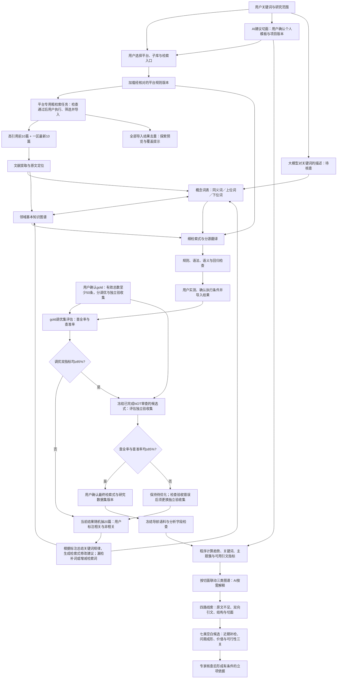

# AI4S 研究决策平台：首版产品设计

版本：V0.9｜更新日期：2026-09-08｜状态：产品方案已更新；检索 API 未接入，当前采用用户人工检索、筛选与导入流程

本次修订：增加双来源知识图谱后台，管理用户导入材料构建的项目图谱与平台收集的成型图谱。用户自愿提交选定版本／子图，经规范化重合率、有效增量、来源及质量审核后发布为共享资产；每份正式接纳的合格贡献可领取一个相邻领域图谱90天使用权限。明确私人／待审核／已发布边界、领域核查、奖励激活与续期、撤回及到期、项目固定版本与受影响判断复核，并同步完善模型复用和验收规则。

保留既有21个平台目录、检索式六道检查、gold有效记录≥50、调优与独立验收双指标≥85%及专家核查要求，延续V0.6成本质量控制、V0.7切面统计导航和V0.8七类空白与三关验证。新增共享图谱不替代检索和证据核查，不自动开放私人缓存。本次仅修改产品方案，后台、贡献审核及奖励机制均未实现或实测。

完整流程：输入方向并确认AI辅助定制的研究切面 → 选择平台与子库 → 执行粗检索并导入 → 全量去重结果用于探索预览，另选高引用前10＋一区最新10构建词表与基础图谱 → 平台专用细检索与用户确认gold → 双指标评估 → 未达标则随机20篇反馈、漏检修复及重新执行验证 → 查全查准均≥85%后确认 → 冻结语料与统计导航 → 四路线索进入七类空白及切面矩阵 → 近期补检、问题成形、价值与可行性三关 → 专家核查 → 候选比较与课题决策。既有原型仍为V0.1；未执行真实检索、引文追踪、外部工具分析、空白验证或指标验收。

## 1. 产品定位与已确认决策

面向已有研究方向、尚未形成具体科学问题的博士生和科研人员，帮助他们基于可复现的文献—专利联合检索，形成有证据支撑、能够在自身条件下开展、可与导师讨论的课题。

第一版以“铁死亡介导癌症放疗抵抗”为贯穿主题。该短语是用户输入的研究方向，不能自动成为平台已接受的因果结论。演示中的记录、关系、候选课题和状态仅用于验证交互；本轮不输出该方向的真实文献综述或创新性判断。

已确认：

- 文献与专利检索共同构成整个平台的数据底座，覆盖全部上层应用。
- 当前没有检索 API：平台生成检索计划和检索式，由用户在外部数据库执行、筛选并回传结果；平台不把生成检索式显示为已执行检索。
- 粗检索前由用户选择一个或多个检索平台，必要时继续选择子库、检索入口和模式；粗检索、细检索与NOT调优均按该平台对应版本的检索规则生成。支持字符串的入口提供可复制检索式，表单入口提供逐行字段与操作指引。
- 粗检索围绕用户关键词进行精准定位，筛选高引用前 10 篇，以及 SCI 或 SSCI 一区期刊中最新发表的 10 篇，形成领域知识构建种子集。
- 种子文献与大模型的关键词描述共同辅助构建包含同义词、上位词和下位词的概念词表；文献支撑领域基本知识图谱，词表与图谱反向生成细检索式。
- 每次生成或修改检索式后必须重新检查规则、语法、语义及受影响的回归项；最终确认前须取得用户在目标平台执行的记录，并完成gold验证。大模型自评“正确”或检索返回非零结果不能替代这些检查。
- 用户选择并确认gold数据集；每个独立声明达标的评估范围至少包含50条去重、完成相关／不相关有效标注的记录，按调优集与独立验收集分开保存。最终检索式在冻结验收集上的查全率和查准率均须达到85%及以上，经过排除词审查后才可确认。指标结论限于该验证集和记录的检索范围。
- 任一指标未达到 85% 时，从当前轮符合抽样条件的检索结果中随机抽取 20 篇文献，由用户标出无关记录及理由；平台据此提出 NOT 等修订建议。查全率不足时同时分析 gold 调优集的漏检记录，补词或撤回误删条件；重新人工执行并回传结果，持续迭代至双指标达标。20 篇反馈样本不代替 gold 验收。
- 以研究项目为工作容器，七个场景共享概念词表、数据版本、证据和判断。
- 首次无数据时，AI只辅助建立用户可编辑的方向切面；粗检索导入后展示探索预览，细检索通过既定确认流程并完成分析字段检查后生成正式导航报告。种子集用于知识启动，不能代表领域统计总体。
- 切面模板归个人保存、跨项目复用；项目继承独立版本。点击切面默认筛选当前结果，只有主动选择“针对该切面补充检索”才生成新的查询任务与数据版本。
- 热点、前沿候选、迁移和衰退信号必须关联统计范围、时间窗、方法与原始记录；共现、引用与机制证据分开表达。CNKI／WoS／Scopus选择只开启引文数据准备入口，实际分析能力由字段与覆盖检查决定。
- 优先走通方向探索、联合检索、证据分析、空白发现、课题论证；竞争合作与持续监测提供关联入口。
- 通常输出3—5个有依据的候选课题，以及1个用户选定课题的详细论证和证据附件；合格候选不足时报告实际数量及待补原因，不为凑数虚构空白。
- 科学价值与个人可行性分别评价，允许给出“当前条件下不建议开展”。
- 导师或合作者核查具体判断，意见与人员身份、证据版本一起保存。
- “尚未检索到证据”“证据不足”“证据相互冲突”必须区分；潜在空白需通过检索覆盖检查和专家核查。
- 空白分为证据／内容、对象／人群、方法、理论／视角、场景／地理／时效、矛盾、技术／实践／政策七类，允许多标签；机制、数据、验证、应用及专利等保留为细分标签，切面取值与空白类型组成可下钻矩阵。
- 作者自述不足、引用关系、图谱断裂及少量突现主题都是待核查线索。原文缺失、导出截断、参数过滤或尚未执行补检不能被解释为研究不存在。
- 首版复用已有提取与统计，用户可选用VOSviewer、CiteSpace或bibliometrix并回传可追溯结果，无需每次同时运行三款工具。图片仅作附件，不作为可复算结果。
- 每条重点候选默认补检最近24个月并单列最近12个月，完成研究问题结构化及价值／可行性检查，再经专家核查。当前用户条件不足与科学价值分别表达；新证据到来时重新核查受影响判断。
- 优化以同一批任务、相同输入与范围的优化前方案为质量基线，逐项比较词表、提取、证据追溯、检索和课题论证；未经对比验证的优化不启用，不靠增加用户核查工作量弥补质量下降。
- 交互步骤及时响应；文献分析、图谱更新与监测分析允许后台批处理。已完成且仍有效的结果复用，新增材料只处理受影响部分；等待中的必要分析不能伪装成完成。
- 以完成一次选题任务的实际模型费用为主成本指标，记录调用量、输入输出量、重试及高能力模型补做费用。先消除重复与规则任务调用，再验证低成本模型分工；不预设未经测量的降本比例。
- 同一用户在有相应访问权限的项目间，可以复用版本匹配的文献级提取；项目相关性、空白与课题建议和导师核查状态分别处理。首版不默认跨用户共享缓存。
- 图谱后台有两条来源路径：用户导入材料构建个人／项目图谱；管理员收集并审核已有成型图谱。前者默认私有，后者按实际授权范围入库；可收集不等于可向所有用户开放。
- 用户自愿选择图谱版本或子图，预览贡献范围后提交。原始全文、课题方案和导师意见不自动共享；未贡献不影响原有研究功能。审核发布的共享图谱资产与私人提取缓存独立管理。
- 规范化后的带条件关系用于重合率比较；低重合还须满足有效增量与质量要求。管理员审核来源、权限、结构和发布，领域审核者核查科学判断；“已入库”不等于“所有关系已证实”。
- 每份正式接纳的独立合格贡献获得一份奖励，用户选定可授权的相邻领域图谱并激活后使用90天。支持在线浏览、检索及在本人项目引用／辅助分析，不包含默认批量下载、再分发或额外模型额度；重复贡献不重复领奖。
- 未发布贡献可撤回；已发布贡献申请撤回后先暂停新增分发，管理员处理下架与项目影响。正式撤回终止关联奖励的剩余时长，已用部分不追溯收费；正常纠错／更新不自动取消奖励。
- 项目引用共享图谱的固定版本，升级由用户选择；错误或授权问题仍需主动标记受影响判断。到期不能通过缓存继续访问受限内容；历史笔记和报告仅在原授权允许范围保留。
- 有新证据或明确修复方案的必要补做在预算内继续；没有新信息的无效重复请求停止并保留进度。用户设置硬预算后，预计超额需说明未完成工作和增量费用，由用户决定继续或暂停，不静默降低质量。

核心价值：让用户回答“为什么选这个题、证据在哪里、我能否开展、什么情况出现时应该修改或放弃”。

## 2. 用户、场景与完成标准

| 角色 | 核心工作 | 主要权限 |
|---|---|---|
| 研究者／项目所有者 | 定义问题、在外部数据库执行检索、筛选与导入记录、确认种子与 gold 集、比较课题、提交核查 | 编辑项目、锁定词表／图谱／检索／验证版本、管理评审授权、导出 |
| 导师／受邀合作者 | 核查关系、提出反证、评议路线与资源条件 | 在授权项目中阅读与评审；修改原始记录需另行授权 |
| 数据管理员（后台） | 管理人工导入、许可范围、规范化和失败任务；维护图谱目录、贡献审核、重合规则、发布／撤回与奖励授权；后续维护连接器 | 仅访问履职所需的提交包和管理数据；不因后台身份默认查看所有私人项目，不替专家确认科学判断 |
| 图谱领域审核者 | 对受邀图谱范围核查机制、因果、争议关系及来源，提出修订意见 | 在被分配的贡献包／图谱版本内核查科学判断；发布权限另行授予，同人兼任时两类审核记录仍分开 |

首版任务完成：候选题对比可解释；选定题有科学问题、可证伪假说、路线、最低验证方案、资源缺口与停止条件；每个关键判断可回溯；未解决事项清晰。导师可以要求修改，无需为了完成流程强制通过。

项目状态：草拟范围 → 检索平台／子库／入口待确认 → 平台规则待核对 → 粗检索待人工执行 → 种子文献待确认 → 词表与基础图谱待核查 → 细检索待人工执行 → gold 验证与迭代 → 最终检索任务包已确认 → 研究数据集已锁定 → 证据核查中 → 候选比较 → 课题论证 → 待导师评审 → 修订／已核查 → 监测中。任一查全查准指标低于 85%、不可计算或验收集失效时，停留在检索迭代阶段。允许回退；平台、入口或规则变更造成的下游过期状态必须明确。“最终检索式”对于多平台项目具体指经过验证的一组平台专用检索式／表单任务及其合并规则。

## 3. 原始四层框架的产品落地

| 架构层 | 首版职责 | 核心对象／输出 |
|---|---|---|
| 数据底座 | 平台与子库目录、检索规则版本、文献与专利人工回传、授权导入、标准化与去重、种子筛选、专利族归并、gold 标注与评估；导航字段、引用快照及真实引文关系导入 | 平台配置、执行日志、原始记录、种子集、gold集、验证报告、分析语料快照与字段覆盖报告 |
| 知识底座 | 基于用户导入材料构建私有图谱，管理平台收集及用户贡献的共享图谱；实体归一、关系核查、切面与词表维护；按授权引用图谱辅助检索与研究 | 个人图谱、贡献包、共享资产及版本、重合报告、图谱使用授权、概念／切面版本、主张、证据和来源链 |
| 智能中台 | 查询规划、按平台编译与校验、筛选辅助、结构化提取；程序统计、主题聚类与跨期比较；AI辅助切面定制、结果解释、证据综合、空白审查与课题生成 | 检索任务、版本化统计与主题簇、切面导航报告及可审计建议；每一步允许人工修订 |
| 服务应用 | 七个场景组成一个项目工作流 | 方向地图、检索工作台、主体网络、证据图谱、候选对比、课题决策包、监测收件箱 |

贯穿四层：身份与授权、来源许可、版本管理、任务恢复、成本配额、审计和质量评估。AI 输出作为待核查对象保存，不能无痕覆盖源数据。

共享知识路径：用户私有图谱→自愿选定贡献包→规范化比较与审核→发布资产；平台收集的成型图谱→来源及质量审核→发布资产。发布资产经授权进入项目参考层，可辅助词表、切面与候选探索；不会自动成为当前检索命中记录、科学事实或已核查立项依据。贡献与奖励属于可选支线，不阻断主研究流程。

模型执行采用第11节的统一调度：先判定任务是否需要语义推理，再检查权限、有效缓存、输入变化与预算。版本失效表示需要重新判断下游状态，不等于重新调用全部模型；规则编译、指标重算、页面读取及状态更新均不因“智能中台”命名而默认调用模型。

数据底座与知识底座构成持续迭代关系：文献提供术语和领域知识，知识底座决定下一轮查什么、如何扩展与排除；新检索结果及漏检／误检分析再修正词表和图谱。gold 验收集属于独立评估资产，不向词表学习和图谱扩展泄漏。

## 4. 信息架构与关键页面

全局左侧导航：项目概览、方向导航、文献—专利检索、证据图谱、空白与候选、课题论证、竞争与合作、持续监测。顶部始终显示项目名称、当前数据版本与状态。主区域给出当前任务；详情区承载来源与核查信息。

“证据图谱”下增设我的图谱、共享图谱库、我的贡献与使用权限入口；后台工作区仅向获授权管理员／领域审核者显示。后台资产发布状态、关系科学核查状态、用户使用权限分别呈现。

| 页面 | 用户问题 | 核心内容 | 主要交互与结果 |
|---|---|---|---|
| 项目概览 | 我要解决什么，受哪些条件限制？ | 初始方向、问题边界、研究期限、数据／实验／计算／方法条件、当前进度 | 保存范围与约束；显示受影响的课题可行性 |
| 方向导航 | 该把宽泛方向收敛到哪里？ | 首次切面定制；发文趋势、关键词共现／突现、前沿候选簇；主题、引文、知识／证据三类图谱；切面规模、变化、迁移及衰退信号 | 点击切面筛选已有结果，统计下钻到记录与方法；主动补充检索才建立新查询；CNKI／WoS／Scopus引文面板按字段可用性启用 |
| 联合检索 | 如何为所选平台生成并验证检索任务？ | 平台多选、子库／入口选择、规则卡、平台专用粗／细检索式或表单指引、人工导入、双组种子、gold、随机20篇反馈、NOT 与双指标评估 | 先选平台，再分别生成／复制查询或逐行填写指引；按平台回传；比较增量与误检；按既定验证口径达标后确认任务包 |
| 证据图谱 | 如何学习领域知识并验证某条关系？ | 领域基本知识图谱与研究证据图谱两种视图；概念层级、带条件主张与支持／反对证据 | 由节点或关系生成新查询；回到来源核查；将通过核查的术语写回词表版本 |
| 图谱库与我的贡献 | 哪些图谱可辅助研究，贡献能获得什么？ | 私有／共享来源、版本及授权、贡献预览、重合与审核结果、相邻领域目录及奖励期限 | 选择贡献子图、提交／撤回、查看理由、激活或续期权限、按版本引用；未授权内容不显示详情 |
| 图谱后台 | 哪些资产可发布、如何审核和维护？ | 双来源收集、结构映射、重合报告、科学核查、发布与撤回、领域邻接及奖励账本 | 管理员按职责审核与发布，领域审核者检查指定关系；发放／到期／撤回均留记录 |
| 空白与候选 | 哪些缺口仍存在且值得研究？ | 七类空白×用户切面矩阵；作者不足表、双向追踪、结构线索；三关检查卡及3—5题比较 | 下钻原文与分析依据、回传外部结果、发起近期补检、结构化问题、比较价值／可行性并提交专家核查 |
| 课题论证 | 如何把题目变成可执行研究？ | 问题、假说、路线、最低验证、资源缺口、风险、停止条件、证据附件 | 编辑与保存；提交导师评审；按意见修订；导出 |
| 竞争与合作 | 谁与问题相关，可以合作什么？ | 学者／机构／企业／申请人；论文合作与专利共同申请网络 | 从主体到作品及角色；记录合作候选及理由 |
| 持续监测 | 哪些新信息改变了原有判断？ | 新论文、新专利、新团队、新路线、原结论变化；影响范围 | 查看新增与旧版差异；加入待筛选池；触发再核查 |

视觉：中文科研工作台，克制的青绿色主色；状态用文字与颜色共同表示。默认先展示关键判断与待办，再展开出处与方法。图谱提供键盘可操作的关系列表；窄屏折叠为上下结构。

## 5. 文献—专利联合检索作为共同底座

### 5.1 当前运行方式与人工交互

当前模式为“平台辅助制定策略＋用户人工检索与筛选＋结果导入后分析”，无检索 API。用户输入关键词、研究对象、年份、语言、文献类型与纳排标准，并选择实际使用的平台、子库与检索入口。平台将关键词结构化为初始概念清单 `CV_v0`，读取对应规则版本，生成平台专用粗检索式或表单填写指引；由用户到外部执行。未选择平台时只能生成逻辑草稿，不显示“可直接执行”。

用户回传数据库导出文件、记录清单及有权使用的摘要／全文；首版支持结构化导入模板及常见文献导出格式，至少保存稳定标识、标题、作者、年份、来源、摘要可用性和筛选决定。引用次数、期刊分区及时间信息由用户提供可核验出处。平台可按已导入字段排序和查重，最终种子纳入与相关性标签由用户确认。

方向导航增加按功能检查的导入字段：发表日期、文献类型、作者／索引关键词、标题／摘要文本可用性、引用计数及其来源日期、被引参考文献与匹配结果。保留原始字段并分别统计缺失、解析失败和导出截断情况。最低书目字段可导入不代表所有导航分析可用；具体门槛见第9.3—9.5节。

人工执行日志保存：平台、子库／集合、实际入口与模式、规则版本、原样执行的检索式或表单条件、字段和过滤条件、执行时间与时区、命中总量、实际导出量、排序规则、导出文件、是否截断、人工筛选人及原因。平台自动改写查询时同时保存生成式与实际执行式。仅上传筛选后的相关文献时，可用于知识构建，但不足以评估整个检索结果的查准率；必须保留筛选前记录及误检标签。

状态明确区分“检索式已生成”“待用户执行”“已导入部分结果”“人工执行记录完整”“验证完成”。缺少结果文件或执行记录时不能自动显示已完成。未来 API 可替换人工执行环节，但复用相同日志、快照与验证规则。

#### 5.1.1 平台选择：先确定在哪里检索

在粗检索前设置必经的“选择检索平台”步骤，支持按语言、学科和文献／专利类型筛选并多选。每个选择项是一条独立的目标配置；不根据用户的学科自动选中或执行所有数据库。可以保存个人常用组合，但每个项目需明确采用哪些平台。

每个平台卡片显示：名称、适用内容分组、用户填写的访问条件、规则核对状态、计划输出方式。平台选定后补充以下配置：

| 配置 | 交互与约束 |
|---|---|
| 平台与实际入口 | 记录官方网站或机构入口、界面名称与当前模式；普通、专业／高级、自然语言或语义检索分别建规则配置 |
| 子库／内容集合 | 平台含多个子库时继续选择；例如Web of Science具体集合，以及ProQuest、EBSCOhost实际检索的数据库。不能只保存平台品牌名称 |
| 权限与可导出范围 | 用户选择可检索、仅部分可访问或暂不可访问；记录机构访问范围，不收集账号密码；不能访问的平台可留在计划中但标为未执行 |
| 字段与范围 | 用户确认标题、摘要、主题、关键词、全文等目标字段及年份、语言、类型；界面只显示该配置已确认支持的选项 |
| 规则版本 | 显示官方依据、适用入口、核对日期、已确认能力与缺项；规则未核实的功能不能生成“已适配”结果 |
| 项目用途 | 标为本次验证任务包中的平台，或仅用于补充发现；在调优前确定，不能因未达标临时改成补充平台以绕过验收 |

同一个数据库经不同宿主访问时可有不同语法；同一家供应商的不同产品也应分别配置。学科分组仅帮助浏览，不限制跨组选择。ProQuest与EBSCOhost是两个独立选项；SCI／SSCI收录和期刊一区属于后续种子筛选属性，不是可套用于所有平台的通用检索字段。

#### 5.1.2 平台目录与适配要求

下表为首版产品目录和规则维护任务。资料核对日期为2026-09-08。“已查阅部分官方规则”只覆盖表中具体能力，不表示已经在用户账号中试运行；“待核对”表示尚不足以生成经核实的完整表达式。所有平台均保留选择入口；未核实的目标先进入规则补齐状态。

| 分组 | 可选平台 | 专用适配重点与本次规则依据 |
|---|---|---|
| 中文 | 中国知网 CNKI | 分别维护实际使用的子库、高级／专业检索、字段代码、精确／模糊和扩展开关；本次未取得足够的当前官方语法依据，字段及复杂运算待核对，不套用其他中文库规则 |
| 中文 | 万方数据 | 绑定实际数据库与检索模式，核对字段、逻辑表达、匹配方式和筛选项；本次未取得足够的当前官方语法依据，详细规则待核对 |
| 中文 | 维普中文期刊 | 区分官网与具体期刊服务入口；已查阅官网高级检索中的AND／OR／NOT、括号、精确／模糊与扩展开关说明；字段映射仍按所选入口核对。[官方高级检索与规则](https://www.cqvip.com/advancesearch) |
| 外文综合／出版平台 | Web of Science（Clarivate） | 选择具体集合；核心合集的字段配置与其他集合分开。核对TI、TS等字段范围和NEAR支持范围；不能将All Fields和Topic当作同一范围。[官方字段说明](https://webofscience.zendesk.com/hc/en-us/articles/26916258216209-Web-of-Science-Core-Collection-Search-Fields)、[运算符说明](https://webofscience.zendesk.com/hc/en-us/articles/20016122409105-Search-Operators) |
| 外文综合／出版平台 | Scopus（Elsevier） | 高级检索使用专用字段如TITLE-ABS-KEY，排除采用AND NOT；邻近W/n、PRE/n分别维护无序／有序规则及组合限制。[官方高级检索](https://www.elsevier.support/scopus/answer/how-can-i-best-use-the-advanced-search) |
| 外文综合／出版平台 | ProQuest | 用户选择实际数据库，按高级或命令行入口生成；已查阅AND／OR／NOT、NEAR/n与PRE/n，字段及过滤项由子库决定。[官方Search Tips](https://www.proquest.com/help/academic/Search_Tips.html) |
| 外文综合／出版平台 | EBSCOhost | 与ProQuest独立配置；记录具体子库、搜索模式、字段和词表扩展设置。本次官方帮助正文未能充分读取，精确字段、邻近和截词规则待核对；不能用其他EBSCO API文档代替网页检索规则 |
| 外文综合／出版平台 | ScienceDirect（Elsevier） | 按高级搜索的真实表单字段输出；支持大写AND／OR／NOT及括号。当前官方说明明确不支持邻近运算；不能照搬Scopus的W/n或字段前缀。[官方高级搜索](https://www.elsevier.support/sciencedirect/answer/how-do-i-use-the-advanced-search) |
| 外文综合／出版平台 | Springer Link／Springer Nature Link | 按高级搜索字段生成；已查阅AND／OR／NOT及引号短语匹配说明，其他能力单独核对。[官方高级搜索](https://support.springernature.com/en/support/solutions/articles/6000080445-springer-nature-link-advanced-search-option) |
| 外文综合／出版平台 | Wiley Online Library | 基础布尔检索有官方介绍；字段、短语、截词和长度上限需补齐实际入口规则，不因页面风格相似复用其他出版社语法。[Wiley官方平台介绍](https://apac.wiley.com/onos) |
| 外文综合／出版平台 | arXiv | 保存网页检索入口、分类、时间与版本口径；本次网页规则未能完整核对。网页表单适配与API查询语法分别维护，不能将API字段串直接显示为网页可用式 |
| 医学／生物 | PubMed | 使用专用字段标签，如[tiab]；MeSH映射、自动词项映射、截词与邻近规则分开管理。邻近检索与星号通配符不兼容，生成前必须检查。[NLM官方User Guide](https://pubmed.ncbi.nlm.nih.gov/help/) |
| 医学／生物 | Embase | 记录实际宿主与入口；Emtree映射、扩展及字段行为需独立配置，不能直接套用PubMed的MeSH标签。已找到官方手册入口，具体编译规则须据实际配置补齐。[官方用户指南](https://www.elsevier.support/embase/answer/embase-user-reference-guide) |
| 工程／计算机／电子 | IEEE Xplore | 区分普通、高级和Command Search；官方资料列出NEAR／ONEAR及其适用入口，不能在所有表单框中无条件使用。[官方Search Tips](https://xplorestaging.ieee.org/Xplorehelp/searching-ieee-xplore/search-tips) |
| 工程／计算机／电子 | ACM Digital Library | 核对所选内容范围、高级搜索字段、特殊字符及表达式长度；本次完整官方语法待核对，不从非官方旧示例推定当前支持 |
| 工程／计算机／电子 | SPIE Digital Library | 已查阅官方指南中的分字段高级搜索和出版／日期筛选；复杂表达式、截词和邻近能力仍需补齐。[官方用户指南](https://proceedings.spiedigitallibrary.org/documents/Training/SPIE_DL_UserGuide.pdf) |
| 人文社科 | JSTOR | 依据官方布尔、字段与邻近说明配置；邻近下拉选项与文本表达分开保存。[布尔规则](https://support.jstor.org/hc/en-us/articles/115004733187-Searching-Boolean-Operators)、[邻近与通配规则](https://support.jstor.org/hc/en-us/articles/115012261448-Searching-Similar-Spellings-Wildcards-and-Proximity) |
| 人文社科 | Project MUSE | 已查阅官方说明：搜索框内不直接解析文本布尔运算符，逻辑通过表单AND／OR／NONE选项表达。应输出逐行填写指引，不能伪造可粘贴的完整布尔式；使用时复核当前界面。[官方Search Help](https://about.muse.jhu.edu/resources/search-help/) |
| 人文社科 | SAGE／Sage Journals | 维护大写布尔运算、括号、短语、通配和邻近规则；长表达式可能需要拆分或改用多行高级搜索。[官方布尔检索帮助](https://journals.sagepub.com/page/help/search/boolean) |
| 人文社科 | Taylor & Francis Online | 核对高级搜索字段、匹配规则、特殊字符和长查询限制；本次完整官方语法待核对，不因与其他出版平台相似就复用其规则 |
| 专利 | 智慧芽／Patsnap | 绑定用户实际使用的区域、产品与网页入口；官方帮助展示布尔运算、TTL等字段及$Wn／$PREn位置算符。按该账号可见的Search Helper再次核对，网页规则不等于API规则。[官方检索说明](https://help.patsnap.com/hc/en-us/articles/212268765-Searching-in-Patsnap-101) |

平台目录按用户指定清单建立，不将出版社全文平台、引文数据库、预印本平台和学科库视为覆盖相同的数据源；选择面板应展示各平台的内容范围与待核验覆盖信息。未查阅完整规则的平台，后续依据可访问的官方帮助或用户提供的当前界面说明补齐；AI只能提取候选规则，不能自行宣布支持某个字段或运算符。

#### 5.1.3 平台检索规则库

规则配置的唯一对象是“平台＋子库／集合＋网页入口／模式＋规则版本”，不是平台名称字符串。每项能力保存支持、不支持、待核对三态；缺失不能当作支持。

| 规则维度 | 必须记录的内容 |
|---|---|
| 字段映射 | 平台真实字段名／代码、前后缀格式、可组合方式，以及实际检索范围；例如主题字段不能默认等价于标题摘要 |
| 逻辑与分组 | AND／OR／排除的准确写法、大小写、默认连接、优先级、括号及表单组配方式 |
| 短语与字符 | 精确／宽松短语、引号、转义、中文分词、连字符、希腊字母、大小写及词形变化 |
| 邻近关系 | 算符、是否有序、距离定义、可用字段、可否与短语／通配组合；同样的数字n不保证跨平台语义相同 |
| 截词与通配 | 支持符号、前／中／后截词、最小词干、扩展上限及禁用组合 |
| 受控词表 | MeSH／Emtree或子库主题词的映射、下位扩展、主要主题等开关；保存用户采用的设置 |
| 范围及限制 | 日期类型、文献类型、语种、专利地域／字段、字符或词项上限、查询拆分与检索历史组合能力 |
| 操作与导出 | 入口定位、输出为字符串还是多行表单、排序与筛选步骤、结果导出格式与已知截断 |
| 规则证据 | 官方URL／用户提供的当前说明、文档日期、核对日期、核对人、适用版本、冲突与失效状态 |

规则优先采用与实际入口一致的当前官方说明；遇到旧手册、当前帮助和界面行为不一致时，标记冲突并以实际入口核查为准。只核实布尔功能时，可先生成使用已确认能力的简化草稿；不能夹带尚未核实的字段或邻近符号。

#### 5.1.4 从共同概念计划生成平台专用任务

生成过程：`CV/KG版本 → 平台无关的逻辑计划 → 所选平台规则版本 → 字段与运算符适配 → 语法及能力校验 → 用户核对 → 人工执行任务`。

1. 从启用的概念词项生成逻辑树，保留概念块、关系条件、排除条目、过滤项及来源ID；粗检索与细检索共用这一步。
2. 为每个目标配置独立转换字段、括号、短语、邻近、截词、日期和排除表达；采用明确分组，不依赖跨平台不同的默认优先级。
3. 平台不支持某项语义时，展示受影响条件、拟替代方案与语义变化；用户确认后才生成改变范围的版本。可改成明确短语、拆分任务或平台原生表单，不能声称这些替代与原条件完全等价。
4. 超过长度／词项限制时，只有在语义可保留时才拆分。拆开的OR分支须记录结果并集，拆开的AND分支须记录交集；不能把所有子查询结果一律取并集。无法可靠组合时保持待调整。
5. 按第5.1.4.1节检查字段、算符、括号／引号、空排除块、上限及禁用组合，并将平台表达式反向解析、核对概念和逻辑是否保留；输出检查报告。语法静态通过不等于平台已接受，更不等于双指标达标。
6. 用户复制到平台执行，或按逐行指引填写；回传实际执行式、表单设置、平台是否改写查询、执行日期、结果数量与文件。遇到报错可粘贴错误信息供修正；没有回传时保留“待人工执行”。

每个生成卡片提供：目标平台／子库／入口、对应规则版本、平台专用式或逐行步骤、入口与字段说明、需手动设置的过滤条件、与共同计划的差异、未解决项，以及复制和执行记录入口。批量生成意味着分别生成多张卡片，不意味着将多个平台表达式拼成一个通用式。

状态按两条线展示：规则与执行状态（规则待核对／已适配待执行／平台报错／执行已回传）和研究质量状态（未验证／未达标／达到限定gold门槛）。不能用“规则已核对”替代“检索质量已验证”。

##### 5.1.4.1 检索式质量检查：生成后必检，修改后重检

检查覆盖粗检索、细检索、NOT调整、平台切换、字段变更和拆分后的每个子查询。目标是分别证明“符合所选平台规则”“表达用户确认的检索意图”“确实在目标入口执行”“在限定gold范围内达到质量门槛”。不能只让生成检索式的大模型再读一遍并宣称有效。

| 检查关卡 | 检查内容与执行方法 | 通过依据／失败处理 |
|---|---|---|
| 1. 平台规则检查 | 核对平台、子库、入口、模式及规则版本，确认所用字段和算符有适用依据；检查官方说明与当前界面的冲突 | 用到的能力均有已核对规则；存在未知能力或规则冲突时保留待核对，不标为已适配 |
| 2. 语法与能力检查 | 采用规则驱动的解析与校验，检查括号／引号配对、布尔操作数、优先级分组、字段前后缀、大小写、字符转义、日期、邻近／通配组合、长度和词项上限；表单检查字段、每行逻辑及界面可表达性 | 每条字符串可被对应规则解析；表单条件完整且可表达。错误定位到词项或表单行；不支持的组合阻止进入已适配状态 |
| 3. 语义一致性检查 | 将平台式或表单配置反向解析成逻辑结构，与用户确认的共同计划逐项比较；核对必需概念、同义OR组、上下位扩展、NOT作用域、字段范围、日期及受控词表开关 | 无遗漏、无擅自增加的必需条件、无未确认的范围变化；发现同一条件被要求且被排除、错误括号或错误集合运算时阻断。平台无法等价表达时明确差异，用户确认修订计划后再生成 |
| 4. 调优回归与误删检查 | 使用已确认种子、调优gold和平台规则测试样例；检查关键正例、近似负例、NOT新增误删、拆分式的并／交集及平台切换前后语义差异 | 保存前后对照；关键正例漏检需解释并修正或形成有理由的范围变更。回归不读取独立验收集；本地模拟只能验证表达逻辑，不能冒充外部数据库命中 |
| 5. 实际平台执行检查 | 无API时由用户在目标入口运行完整式及必要的分块试查；回传实际执行式／表单、过滤项、时间、错误／警告、命中量和结果文件，并核对平台是否自动改写或忽略条件 | 目标平台接受查询，实际条件与确认计划一致，执行凭据和结果可对应；静默改写或忽略条件须核实，报错、未回传或未执行的必要子查询均不能视为有效执行 |
| 6. gold质量验收 | 完成第5.6节有效样本量及独立性检查，在固定结果、gold和查询版本上计算调优与独立验收双指标 | gold有效总量≥50、分组及标签合格、所有规定指标均≥85%；任何门槛不满足均不允许最终确认 |

回归试查优先选择已知可在所选平台找到的种子或调优记录；先确认其收录与元数据，再判断是语法、词项、字段、数据库覆盖还是导出截断导致漏检。不能仅凭数据库有结果认定检索式正确，也不能把零结果直接认定为语法错误。结果量异常变化时显示诊断待办，核查查询改写、过滤条件、范围和来源变化。

必要时生成原式、分块式和加入NOT前后式供用户试查，保留同一入口与尽可能一致的执行条件；比较是诊断线索，不代替最终双指标验收。若字段值、词形扩展或平台索引行为无法通过本地校验确定，检查报告明确标为“须平台实测”。

每次检查生成可追溯报告：查询及任务包ID、文本／表单指纹、CV／KG／平台规则版本、检查项、通过／失败／待验证状态、错误位置、说明、修订建议、执行人、时间、实际运行依据与关联gold版本。用户页面显示“规则与语法”“语义与回归”“平台执行”“gold验收”四组状态，并可展开具体证据。

六道检查不对应六次模型调用：字段语法、逻辑结构比较、集合回归、样本资格和指标计算由确定性程序完成，实际平台执行由用户回传确认。只有新的自然语言歧义或无法由已确认逻辑计划解释的语义问题，才按第11节触发模型辅助；模型意见不替代规则检查、实际执行和gold验收。

处理规则：

- 阻断项包括非法字段／运算、无法解析、未确认的语义变化、平台报错、必要执行凭据缺失、gold不足50条或指标未达标；不能通过点击“忽略”获得最终确认。
- 仅属提示的事项须记录核查结论；影响范围或效果的未决事项须先解决。允许复制标明“待检查”的草稿用于人工排错，但复制按钮不改变校验与质量状态。
- 查询、字段、表单逻辑、NOT、平台规则、过滤项或合并方式发生变化后，检查报告不能沿用。必须检查新版本并取得相匹配的实际执行与质量依据；未受影响的证据保留历史关联。
- 最终状态只能表述为“该版本已在指定平台执行，并在指定gold范围内达到门槛”，不输出脱离平台、日期和样本范围的“永久正确、保证查全”结论。

#### 5.1.5 同一意图的不同输出：语法演示

下例只用`ferroptosis AND radiotherapy`两个词说明适配形式，不是该研究方向的完整检索策略，不包含已验证词表、排除词或质量结论。

| 目标配置 | 对用户展示的输出 | 解释与依据 |
|---|---|---|
| Web of Science核心合集／高级检索／标题 | `TI=(ferroptosis AND radiotherapy)` | 标题字段前缀式；具体配置按[官方字段说明](https://webofscience.zendesk.com/hc/en-us/articles/26916258216209-Web-of-Science-Core-Collection-Search-Fields)维护 |
| Scopus／高级检索／标题摘要关键词 | `TITLE-ABS-KEY(ferroptosis AND radiotherapy)` | 使用Scopus字段；查找范围比仅标题更宽。[官方高级检索](https://www.elsevier.support/scopus/answer/how-can-i-best-use-the-advanced-search) |
| PubMed／标题摘要 | `ferroptosis[tiab] AND radiotherapy[tiab]` | 每个词后附平台字段标签；真实策略另行决定MeSH等扩展。[NLM官方规则](https://pubmed.ncbi.nlm.nih.gov/help/) |
| ScienceDirect／高级检索 | 在“Title, abstract, or author-specified keywords”字段填入`ferroptosis AND radiotherapy`，另行设置年份 | 显示字段选择和框内文本，不输出Scopus的TITLE-ABS-KEY前缀，也不生成邻近运算。[官方字段和限制](https://www.elsevier.support/sciencedirect/answer/how-do-i-use-the-advanced-search) |
| Project MUSE／表单组配 | 生成两条关键词条件及相应AND选择步骤；需要排除时生成NONE条件，按当前界面核查字段与组配关系 | 输出表单任务，不把带AND／NOT的整串式要求用户直接粘入搜索框。[官方Search Help](https://about.muse.jhu.edu/resources/search-help/) |
| 智慧芽／已核对的标题字段入口 | `TTL:(ferroptosis AND radiotherapy)` | 仅演示官方帮助中的标题字段形式；正式专利任务还需用户确认标题／摘要／权利要求等范围，并核对当前账号入口。[官方检索说明](https://help.patsnap.com/hc/en-us/articles/212268765-Searching-in-Patsnap-101) |

这些示例的字段覆盖不同，不能按命中量直接比较平台优劣。通用排除意图也需转换：Scopus采用其AND NOT规则；Project MUSE采用表单NONE；其他目标按各自规则配置生成。不得执行简单的字符串全局替换。

#### 5.1.6 分平台回传、种子筛选与gold验证

每个回传批次关联平台配置ID、查询ID、规则版本、子查询ID、实际字段／过滤项、执行记录与原始文件。同一文献跨平台去重后保留所有命中来源。多平台报告同时展示单平台结果和按既定并／交集规则形成的最终文献结果，专利另行按智慧芽既定口径处理。

双85%门槛沿用第5.6—5.8节：调优前确定验证的是单平台任务，还是所选多平台组成的联合任务包。单平台声明达标时须单独验收；联合任务包按其最终去重结果验收，并分别展示各平台贡献及未执行项，联合达标不等于每个平台单独达标。纳入该任务包的必要平台未执行时，不能显示任务包已完成。

平台覆盖不足导致的未检出与语法失效分别记录。不得在看到漏检后偷偷缩小gold范围；如确需建立平台适用的独立评估范围，先固定范围与gold版本，并注明它与原项目指标不可直接比较。移除／新增平台或改变字段、规则、子库和并／交集方式，会创建新的任务包版本并使原质量确认失效。

高引用前10篇仍要求统一引用指标来源和统计日：即使候选文献来自多个平台，也不混用各平台被引数直接排名。一区最新10篇仍使用固定的分区体系、年度、学科类别和发表日期，不能假定每个平台都具有原生“SCI／SSCI一区”筛选。平台无相应字段时，用户补充可核验的引用和分区资料后，在导入结果池中筛选；arXiv记录只有关联并核实正式发表版本后，才可能纳入一区期刊组。

随机20篇调优绑定本轮实际被评估的结果池：单平台调优从该平台池抽样；联合任务包调优从去重后的联合池抽样，并保留每篇命中的平台。用户提出排除建议后，只更新受影响的平台规则输出，逐平台重新执行；不能把一条NOT表达直接复制给所有平台。

### 5.2 粗检索：建立双组种子文献

粗检索目标是围绕关键词精准定位主题，取得适合建立领域基本知识的起始材料。“粗”指启动阶段，不表示已覆盖全领域。平台使用规范概念、必要同义表达、短语及用户选择的检索字段形成初始式；用户自行执行和筛选主题相关文献。

从同一已记录范围的相关结果池中分别产生两组：

| 种子组 | 筛选规则 | 必须保留的依据 |
|---|---|---|
| 高引用组 | 按引用指标降序选择前 10 篇；本版将“引用率最高”默认落实为同一来源、同一统计日的累计被引次数最高 | 被引次数、统计来源和日期、排名、相关性决定；并列时按发表日期降序、稳定标识排序 |
| 一区最新组 | 先筛选 SCI 或 SSCI 收录且符合所选一区标准的期刊文献，再按发表日期降序取最新 10 篇 | 收录信息、分区体系、分区年度、学科类别、分区依据与发表日期 |

若业务改用年均被引率，须另外确认公式、论文年龄算法和统计日期，并重新生成排名；不能混用不同引用数据库的数值。一区筛选由项目配置明确采用 JCR Q1 或中科院一区等口径，不把这些标签互换；多学科类别的采用规则也需固定。信息缺失标为“待核验”，不能由大模型猜测。

“最新”默认按首次正式在线发表日期排序，缺失时使用正式出版日期并标记回退；预印本不自动作为已在一区期刊发表的文献。时间窗以用户确认的范围为准，不预设未经确认的“近两年”。以上均为产品筛选口径，实际记录需由用户核验。

两组分别保留 10 个名额及筛选理由，合并时按文献去重并保留双组标签，因此唯一文献数可能少于 20。某组不足 10 篇时展示缺额及原因，由用户选择扩大范围或确认不足，不能伪造补齐。没有完整排序范围时只能标为“已导入结果中的前 10”，不能标为数据库全量前 10。

这组文献形成 `SeedSet_v1`，用于术语发现与基础知识构建；不限制后续细检索只搜高引用或一区期刊，也不直接充当独立 gold 验收集。高引用与一区身份仅是种子选择依据，不直接提升某个科学判断的证据等级。

### 5.3 概念词表：文献提取与大模型描述共同辅助

平台从 `SeedSet_v1` 提取关键词、定义、别名和概念层级，同时让大模型给出用户关键词的含义、范围、常见歧义及可能的相关概念。模型描述以“待核查建议”单独显示，与文献中有出处的定义区分；没有文献或用户核验依据的模型描述不能写成已证实领域知识。

概念词表至少保存：`concept_id`、`term_id`、规范名称、确切词项、词项类型（同义词／上位词／下位词等）、所属概念、语言、定义与范围、歧义、来源文献及定位／模型来源、审核状态、检索字段适用性和版本。

- 同义词归到同一概念，可在相同概念块中以 `OR` 合并。
- 上位词用于扩展范围，下位词用于细化对象；二者通过显式层级关系连接，不能当作完全等价的同义词任意替换。
- 主题起始概念包括“铁死亡”“癌症”“放疗”“放疗抵抗／敏感性”；具体层级与词项需通过种子文献核查，不由标题直接拼出完整机制链。
- 用户逐项接受、修改或拒绝建议，保留理由；确认后由 `CV_v0` 生成 `CV_v1`。只有已启用词项进入正式查询，未核查词项可保留为探索建议。
- 用户手工修改检索式中的语义词项时，平台先同步词表并生成新版本，再重新生成检索式，保证每个词都能追溯。

关键词说明、候选术语与领域关系共用可追溯的文献提取产物。同一输入范围已有有效解释时直接展示；不会为每个词项、每次页面展开或每次平台切换重复调用模型。用户明确修改词义或研究范围时，只对受影响概念重新分析，未变的原文证据继续复用。

### 5.4 领域基本知识图谱及其对检索的反馈

基于种子文献中的摘要／全文构建领域基本知识图谱 `KG_v1`：节点覆盖概念、研究对象、机制、模型、方法、干预与终点；关系区分同义映射、上／下位、作用关系、研究方法和应用场景。每条关系携带来源 ID、原文定位、适用条件、提取方式和核查状态；摘要不足或全文不可用时保留缺项。

概念词表回答“这个概念有哪些叫法、范围是什么”；基础图谱回答“概念之间如何关联、领域使用哪些模型和方法”。二者共用概念 ID。词表新增规范概念可建立图谱节点；图谱发现的桥接概念和关系只能先产生词表候选，经用户核查后进入新版本。大模型可辅助组织图谱，但不能为其补造事实关系。

基础图谱面向领域知识学习，不宣称完备；细检索结果持续补充后，可在同一底层对象上形成面向具体主张的研究证据图谱，并沿用第 6 节的充分性、直接性、冲突和专家核查规则。

用户后续导入的有权处理材料可增量构建同一私有图谱。用户也可按第6.1—6.8节引用有权使用的已发布图谱版本作为参考层；外部关系先保留原有条件、出处及核查状态，经用户核查的术语才写入词表新版。共享图谱中没有关系不能证明研究空白，其已有关系也不计作本轮实际检索命中；补检与gold要求保持不变。

文献级实体、定义、关系候选、实验条件及来源定位采用共同结构化提取产物，避免词表页、基础图谱页和证据页各自重读同一全文。跨文献综合与项目判断另行执行；合并提取是否影响完整性必须通过第12节对比验收，不能为了合并调用而压缩掉反证或必要条件。

用户选中节点、相邻关系或路径时，平台生成三类新查询：完整关系的精准式、相邻关系的分步式、覆盖上／下位概念和替代机制的扩展式。不会把路径上的所有节点强制放入每条 `AND` 查询，也不会因图谱中缺边就断言不存在研究。

数据流可追溯为：`种子／新检索记录 → 证据片段 → 概念与关系 → CV/KG版本 → 新检索式 → 用户回传结果 → 漏检／误检分析 → 新CV/KG版本`。纳入知识学习的记录标记发现路径，不得来自仍声明独立的验收集。

### 5.5 细检索：共同知识生成分源检索式

平台读取已确认的 `CV_vn` 与 `KG_vn`，按问题生成必需概念块、可选扩展块、关系查询和候选排除块。概念内部通常用 `OR`，必需概念块之间用 `AND`；图谱关系负责提示分步补检、替代机制和遗漏的术语表达。

每条检索任务保存查询 ID、任务包 ID、目标平台配置 ID、规则版本、目的、词表与图谱版本、概念／词项／关系 ID、必需和可选块、字段、过滤条件、排除词、字符串或表单输出、拆分与合并方式及变更理由。按第5.1.3—5.1.4节分别适配目标平台；未经核实的字段／邻近符号标为待确认，不能假定各平台通用。

用户执行细检索并回传筛选前结果与标签。平台展示相对上一轮的新增、遗漏、误检及图谱覆盖变化，并由这些变化提出词表修订建议。细检索同时建立并冻结用户选择的 gold 数据集，按第 5.6—5.7 节反复调优。

联合检索工作台按“选择平台／子库／入口 → 核对规则与生成粗检索任务 → 人工执行与导入 → 双组种子确认 → 词表／图谱核查 → 各平台细检索与 gold → 20篇反馈与调优 → 最终任务包确认”组织步骤。每一步显示输入版本、用户待办和产物；用户可返回前序步骤，但变更后须将受影响的后序指标与确认状态标为过期。

文献的高引用和一区最新筛选仅适用于粗检索种子构建。专利继续使用共同概念与图谱生成独立查询，用户人工检索并按公开件或专利族口径导入；不套用期刊分区规则。文献与专利分别验证，不能用文献达标代替专利达标。

### 5.6 gold 数据集：由用户选择并确认

用户在“gold 数据集”页选择已有标注集，或从专家推荐、既有综述、引文追溯、独立宽检索及人工标注记录中建立参考集。仅来自当前检索式结果的 gold 集标为“受当前查询限制”，不能支持独立查全验收。

**数量硬门槛：gold有效记录总数至少50条（≥50）。**有效记录必须属于预先确认的评估范围，具有可核验标识与依据，完成用户确认的相关／不相关标签并通过去重。未标注、待定、未解决的标签争议、缺乏可判定依据、重复和范围外记录均不计入50条；不能靠重复导入、自动生成记录或AI猜测标签补齐。

数量与分组口径：

- ≥50指一个固定评估范围内“gold调优集＋gold独立验收集”的有效记录总数；不是每个分组都必须50条。页面必须同时显示总量、两组各自样本量与正负例数，不能把总量50写成独立验收集已有50条。
- 调优集和独立验收集均须有已确认的相关与不相关记录，按冻结纳排标准覆盖主要主题和易混淆情形；分组比例在调优前固定。总量达50不自动说明每项指标的分母足够或评估充分，应另展示实际分母和不确定性，必要时扩大样本。
- 文献与专利分别建立满足≥50有效记录的gold，不能以两类相加满足门槛。专利按预先声明的公开件或专利族单元去重计数；族口径下同族多件只计一个单元。
- 多个平台验证同一个联合任务包时，可以使用该范围内统一的≥50条gold，不要求为每个平台重复收集一套。若另行声明某个平台在独立范围内达标，该范围自身也必须满足数量、标签和独立性条件。
- 粗检索种子文献和20篇反馈样本不自动成为gold；经用户标注、核验和分组后才可计入调优部分，不能据此填充独立验收集。

未达到50条时允许保存和继续标注，并可显示清楚注明“样本不足、非验收”的诊断指标；不允许显示验证达标或启用最终确认。数量门槛检查与标签、独立性、双指标检查都必须通过。

平台保留记录 ID、文献／专利类型、去重单元、相关／不相关／待定标签、标注依据、标注人、发现路径、纳排标准、语种／时间范围、版本及分组。用户确认标签和范围，关键分歧由导师或第二位标注者核查；AI 标签不能直接成为 gold 真值。

gold页面增加“有效记录数／最低50条”“调优集与验收集数量”“相关／不相关／待定数量”“重复与无效记录”“还需补充条数”以及每项未计入原因。更换验收集、撤回标签、调整范围或重新去重后实时重算；一旦有效总数低于50或分组不再合格，原确认标为需重新验证。

需明确区分：

| 数据集 | 用途 | 与验证的关系 |
|---|---|---|
| 知识构建种子集 | 高引用与一区最新文献，用于学习词表和基础图谱 | 可进入调优集，不能继续作为独立验收证据 |
| gold 调优集 | 分析 FN／FP，修改词表、图谱和排除词 | 可多轮使用；指标用于开发判断 |
| gold 独立验收集 | 在候选最终检索式冻结后验收 | 不用于术语提取、图谱学习或 NOT 调整 |

在调优前冻结 gold 的分组与标签，同一论文不同版本和同一专利族按组分配，防止跨组重复。用于知识构建的种子及其重复版本不能分入独立验收集。验收前隐藏验收记录及错误模式；若验收失败后查看它们并调整检索，原验收集须转为调优数据，另建独立验收集。

仅选择已知相关文献时只能评估正例检出，无法计算查准率；系统提示用户补充经标注的不相关记录。未标注或待定记录不能自动算作不相关。关键标签争议、重复或缺失尚未解决时保持“验证未完成”。

### 5.7 查全查准评估与双 85% 门槛

每次评估绑定固定的 gold 分区 `U` 与同一检索式产生的结果 ID 集合 `R`。只在 `U` 内统计混淆矩阵：TP＝相关且被检出；FN＝相关但未检出；FP＝不相关但被检出；TN＝不相关且未检出。

- 查全率（Recall）＝`TP / (TP + FN)`。
- 查准率（Precision）＝`TP / (TP + FP)`。
- 文献与专利分开计算；专利统一采用事先声明的公开件或族口径。调优集与独立验收集分别展示，不能合并掩盖未达标。
- 分母为零时显示“不可计算”，不能赋值为 100%。依据未四舍五入的原始比值判断是否达到 85%，同时显示 TP／FP／FN／TN、样本量与 95% 区间；门槛针对点估计，区间用于展示不确定性。

最终确认的硬门槛：对第5.1.6节预先固定的单平台任务或联合任务包，第5.1.4.1节检查无未解决阻断项，第5.6节gold有效总数≥50且标签和分组合格，调优集查全率≥85%、查准率≥85%，冻结候选式／任务包在独立验收集上查全率≥85%、查准率≥85%。任一数量或质量条件不满足、指标不可计算，或存在验收泄漏／关键标签未定，均不得启用“确认最终检索式”。必要平台未完成执行、存在语法错误或未确认的语义变化时也不能确认。不保证任意范围都能达标；达不到时保持“待优化”，记录原因，不自动降低阈值或改gold标签凑数。

指标范围必须写明：“在版本为 G 的 N 条已标注验收记录上，查全率为 X%，查准率为 Y%。”gold 之外的新检索命中不因缺少标签而计为 FP，也不能忽略其存在而声称全量结果查准率达标；另显示未评估命中数和覆盖比例。若要声明全量检索结果查准率，需进一步标注全量结果或进行记录了抽样方法的相关性评估，并与 gold 指标分开展示。

系统根据 FN 提示可能缺少的同义词、上下位词、旧术语、关系分步检索或数据源覆盖；根据 FP 提示歧义词、字段或范围问题。用户核查后更新词表／图谱、重新生成检索式，再人工执行与导入，形成逐轮对比。每轮只使用调优记录诊断；不能通过把已知 gold 文献 ID 直接并入检索结果人为提高命中率。

任一指标未达到 85% 即进入第 5.8.1 节的随机20篇反馈流程；指标不可计算时，先补齐 gold 标签、执行记录或结果集，使指标可计算，不能靠抽样反馈替代缺失的验证依据。若独立验收失败，仍返回该反馈流程；已经查看并用于调整的验收数据按第 5.6 节转为调优数据，下一次最终验收必须使用新的独立验收集。

### 5.8 NOT 排除审查与最终检索式确认

最终确认前必须审查误检来源，一般通过 `NOT` 排除明确的非目标含义或范围。排除词先进入词表的排除条目，记录歧义、排除理由、字段、适用查询、来源误检记录和用户确认，再写入候选检索式。

每个新增 `NOT` 都进行前后对照：排除了哪些记录，减少了多少 FP，是否同时丢失相关记录及增加 FN，对查全率和查准率分别造成什么影响。优先采用能够明确限定含义的排除条件；不能仅因记录出现某词就排除涉及跨领域比较、阴性结果或反对证据的相关研究。平台语法不支持预期排除时，需记录实际执行方式，不能把后置人工筛选冒充为检索式本身的效果。

确无安全且必要的排除项时，允许记录“已审查，无适用 NOT”并保留理由；仍必须满足双 85% 门槛。加入 NOT 后即使查准率提高，只要查全率跌破门槛就不能确认。最终冻结的是确切执行并通过验收的检索式及排除条件，验收后再改一个词也需新版本验证。

确认页集中展示：各平台／子库／入口、规则版本、最终式或表单步骤、拆分与合并规则、CV／KG／gold／结果版本、六道检查报告与人工执行凭据、gold有效总量及调优／验收各组正负例数量、数量门槛状态、混淆矩阵、分平台及联合指标的适用范围、NOT误删清单、剩余盲区。用户确认后生成只读检索任务包和研究数据集快照。若仅文献已达标，显示“文献检索任务包已确认；智慧芽专利待验证”，不能显示“双源检索已确认”。研究立项仍需后续证据与专家核查，检索指标达标不等于课题成立。

#### 5.8.1 未达标时：随机20篇—用户反馈—检索式再调整

本流程对文献检索按每轮 20 篇执行。抽样的作用是发现误检原因、辅助迭代；检索质量门槛始终来自前述 gold 评估。文献与专利分别计算指标，不能将专利混入这 20 篇文献的反馈批次；专利调优使用单独记录的抽样批次与计数单元。

| 步骤 | 平台操作 | 用户操作 | 留存结果 |
|---|---|---|---|
| 1. 展示未达标原因 | 并列显示查全率、查准率、分母、漏检／误检数量和版本，指出哪一项低于85% | 查看指标及限定范围 | 本轮评估记录与未达标状态 |
| 2. 随机抽取20篇 | 从当前版本的筛选前、去重后的已导入文献结果中，排除仍受保护的独立验收记录及其重复版本，均匀随机、不放回抽取20篇 | 查看抽样范围与样本；不能挑选“容易达标”的文献替换 | 抽样批次、结果版本、候选池ID与数量、随机种子、20篇ID、抽样时间 |
| 3. 用户标注 | 展示标题、摘要、来源；有权限时提供全文定位；提供相关／无关／待定三种标签 | 勾选无关文献并填写原因；对其余记录逐篇或批量明确确认相关，信息不足的标为待定 | 每篇标签、理由、标注人、时间和批次关联 |
| 4. 生成修订建议 | 从无关记录归纳歧义词、非目标对象和范围，形成带出处的候选 NOT／字段限定；同时检查调优 gold 的 FN | 接受、修改或拒绝建议；确认哪些遗漏概念应补入 | 排除候选、补充词项、受影响关系、用户决定与理由 |
| 5. 更新知识与检索式 | 更新词表和必要的图谱范围／歧义注释，生成新版本分源查询；显示前后差异及误删风险 | 核查查询语法、NOT 范围及可能受影响的相关记录 | 新 CV／KG／查询版本、变更记录 |
| 6. 人工重新执行 | 显示待执行式和结果回传模板；保留旧版指标，不预测或冒充新一轮结果 | 在原数据库执行新版式，导入筛选前结果并记录命中／导出量 | 新执行日志与结果快照 |
| 7. 重新评估 | 按冻结调优 gold 重新计算双指标；调优达标后冻结候选式并进行独立验收 | 检查误删与剩余漏检，必要时补充人工核查 | 本轮混淆矩阵、双指标和与上一轮的差异 |
| 8. 继续或确认 | 任一指标仍低于85%时返回第2步；双指标通过规定验收后启用最终确认 | 继续反馈，或确认确切执行并验收通过的最终式 | 可追溯迭代历史／只读最终检索包 |

抽样边界：

- 可抽样文献不足 20 篇时全部纳入，明确显示实际数和缺额原因，不补造或重复文献。同一批次不放回；跨轮遇到同一文献时保留既有标签与修订历史。
- 只有部分结果被导入时，抽样范围只能标为“已导入结果”，并记录截断；不得声称来自数据库全部命中。只导入用户已筛选的相关文献时，要求补回筛选前结果，不能从纯相关列表推断误检情况。
- 用户没有勾选的记录仍为未标注，不能自动认定相关；“未发现无关文献”也须用户明确确认已审查。待定项不进入已判定相关／无关的分母，显示已审查数与待定数；不能将20篇中的少数已判定记录冒充20篇完整评估。
- 本轮同一查询和候选池的抽样批次冻结，避免反复重抽直到出现满意的结果。池、查询或抽样规则变化时建立新批次并保留原因。
- 反馈记录仅用于调优；若补充进 gold 调优集，须用户确认并生成新的 gold 版本，同时在同一新版 gold 上重算可比较的历轮指标。不能静默修改 gold 标签或分母。

两种失败应对分别设计：

| 未达标情形 | 20篇反馈之外的必要操作 | 修订约束 |
|---|---|---|
| 查准率不足 | 根据已确认无关记录识别歧义、非目标对象、字段问题，提出 NOT 或更明确的限定 | 不把单篇文献ID排除伪装成通用语义检索优化；加 NOT 后重查 FN |
| 查全率不足 | 检查 gold 调优集中漏检的相关文献，补充同义／上位／下位词、拆分过严的 AND 关系、撤回误删 NOT 或补检来源 | 从已检出的20篇中无法发现所有未检出文献；不能承诺只加 NOT 就能提高查全率 |
| 两者均不足 | 将误检与漏检原因分别映射到词表、图谱范围和查询块，再生成候选式 | 以两项指标共同判断，不用查准率上升抵消查全率下降 |

“从20篇中有17篇相关”只能表示该反馈样本的相关比例为85%；不能据此断言查全率≥85%，也不能替代独立 gold 上的查准验收。页面将“反馈样本相关比例”“gold调优指标”“gold验收指标”分开展示，并注明样本量与适用范围。

迭代按双指标达标条件结束，不设自动降低门槛的出口。用户可保存检查点、暂停或修改研究范围；这些状态均不等于最终检索式已确认。若多轮没有改善，展示受限来源、词义歧义、标签分歧等原因，允许补材料和专家介入后继续。

20篇用户反馈按完整批次汇总后，先由程序归并标签、计算FN／FP差异并匹配已有建议；只有新增错误模式、证据或明确修复方案需要语义分析时才触发模型。逐篇勾选、重复提交同一批次和再次查看相同指标不触发模型；无效重复停止与必要补做按第11.7节处理，不影响原有双85%要求。

#### 5.8.2 两个底座在反馈轮中的职责

- 数据底座保存筛选前结果、随机样本、用户相关性反馈、漏检／误检清单和评估结果；原始来源内容保持原样。
- 知识底座将反馈转换为有来源、有适用范围的歧义条目、排除条目、补充概念和关系范围注释；用户确认后更新版本。文献对当前问题“无关”不意味着其中知识是错误的，不能据此删除其他语境下有效的图谱关系。
- 新版词表与图谱反向生成新检索式；新查询的实际回传结果再进入数据底座计算双指标。不能仅在平台界面隐藏20篇中的无关记录，就宣称外部数据库的新检索式已变好。
- “接受排除建议”“生成新版检索式”“已人工执行”“验证达标”“最终确认”分别保存为独立操作和状态，避免尚未执行就沿用旧版达标标识。

### 5.9 可复现数据集与版本锁定

文献按 DOI、PMID、源 ID 和经人工确认的模糊匹配去重；预印本与正式发表版本建立关联，保留来源。专利保留申请／公开标识及日期、优先权、申请人、发明人、分类、原始族定义与族归并版本。以公开件计数和以族计数分别显示。法律状态只展示来源及查询日期，不由模型臆测。

跨源关联属于主题或技术关系，不能把文献和专利合并成同一种记录。标题、摘要、全文与权利要求的可用性分别标记。不能访问全文时，明确只做了摘要层面的提取；保留原始授权边界，不承诺获取所有全文。

快照至少包含：来源清单、人工执行日志与原始导出文件、双组种子及排名依据、概念词表与基础图谱、逐源检索式、纳排标准、筛选前结果及决定、去重／专利族映射、gold 标签与分组、每轮20篇抽样的候选池／随机种子／样本ID／用户反馈、逐轮混淆矩阵、NOT 排除审计、最终确认人与版本清单。改变检索范围生成新版本；旧报告仍可重现。

“覆盖检查完成”表示完成了事先定义的范围检查与双指标评估，不表示证明不存在遗漏。查全查准达标状态必须带有数据集、来源和日期范围；新来源、新研究范围或新 gold 版本会触发重新验证。

## 6. 证据模型、知识图谱后台与共享规则

一条可核查主张＝主体＋关系＋客体＋适用条件＋测量终点。癌种、实验模型、干预、剂量／时间、对照、终点和结果方向按来源实际提供的粒度记录；缺失明确标为未报告或未提取。

| 维度 | 状态示例 | 使用规则 |
|---|---|---|
| 检索状态 | 未执行／执行不完整／范围内已完成 | 限定“尚未检索到”的适用边界 |
| 证据充分性 | 尚未检索到／证据不足／达到预定义支持条件 | 不因记录数量多就自动充分 |
| 证据方向 | 支持／反对／无明确方向／相互冲突 | 冲突需先比较条件是否可比 |
| 证据直接性 | 直接／间接／无法判断 | 与充分性、方向分别保存 |
| 核查状态 | AI 提取／用户修订／待专家核查／专家已核查／需重新核查 | 核查对象是特定主张及其版本 |

“证据不足”与“相互冲突”可以同时存在，底层不能用单一互斥标签覆盖全部情况。页面可显示主要状态，但同时列出各维度。

三条强制表达规则：

1. 尚未检索到证据：说明在哪些来源、截至何时、采用哪版检索、针对哪个判断未发现证据；检索未完成时显示“检索未完成”，不显示“没有证据”。
2. 证据不足：说明已有证据缺少什么，例如模型局限、干预／对照不足、只有间接关联或重复验证不足。
3. 证据相互冲突：并列支持与反对片段、实验条件及可比性说明；不同模型中的差异先作为条件差异，不能自动认定矛盾。

专利证据单元注明来自摘要、说明书、实施例或权利要求。权利要求表达的保护主张不自动变成经验证的机制结论；实施例也需按实际方法和结果核查。

不展示没有校准依据的“创新度 92 分”或“证据可信度 95%”。首版使用分维度理由、核查状态与可展开的出处。

### 6.1 知识图谱后台：双来源与资产边界

后台统一管理图谱来源、领域、版本、结构、来源依据、授权、核查与发布状态。首版采用人工收集和审核导入成型图谱，不承诺已经接入某个外部知识库或自动定期采集。用户导入文件后的图谱构建沿用第5.4节提取与证据规则；两条路径只有在权限及质量检查后才形成可供其他用户使用的发布资产。

| 对象／来源 | 默认可见范围 | 进入共享库的条件 |
|---|---|---|
| 用户导入材料构建的个人／项目图谱 | 用户及项目已授权成员；构建完成不等于贡献 | 用户选定贡献范围、确认可分享的内容与用途，提交独立版本，经重合及质量审核发布 |
| 用户待审核贡献包 | 贡献者、被分配的管理员和领域审核者 | 校验与审核完成，明确接纳范围和奖励资格后正式发布；其余部分仍私有或退回 |
| 平台收集的成型图谱 | 收集与审核工作区；未明确授权时不对研究者开放 | 确认来源、版本、可存储／展示／派生分析及再分发范围，完成结构与必要科学核查 |
| 已发布共享图谱资产 | 仅当前有效权限覆盖的用户；可公开的目录说明也需允许公开 | 按资产及版本授权使用，保留原出处和贡献归属；不连带开放源文件、私人缓存或完整项目 |

成型图谱入库至少记录名称、维护方／贡献来源、领域、取得方式、原始版本及日期、文件指纹、实体与关系模式、规模、可追溯依据、授权凭据与限制、更新方式、核查缺项。授权未知或不允许向其他用户提供时可以登记为待核对资料，不进入奖励可选目录。原文不可分享时仅使用允许提供的元数据／关系及出处链接，不因转换成图谱就扩大可用范围。

“成型”描述其已有组织结构，不赋予科学权威。缺少原文定位的外部关系保留其实际来源粒度与限制；不能补造页码或复制其他关系的“已核查”状态。共享库可以按领域分成多个资产，项目私有图谱、待审核包及发布图谱之间通过版本链接追溯，不直接共用可被任意改写的对象。

### 6.2 自愿贡献与提交包

用户在“我的图谱”选择整个版本或子图，系统生成贡献预览：节点、带方向／条件的关系、证据与出处、拟分享的片段和附件、领域及版本说明、贡献者展示信息、授权用途和撤回／奖励规则。原始全文、课题假说及方案、用户资源、导师意见默认不包含；仅选择图谱不代表这些内容可公开。受保护gold验收内容及标签不得进入贡献包。

用户确认可贡献范围后提交，后台只获得审核所需包内容。系统保留确认文本版本、用户身份、提交时间与内容指纹；提交后冻结，修改需生成新版并重新检查变化。用户拥有文件访问权不自动说明可共享全部内容，分享依据不清的部分标为待补或剔除，不以勾选代替缺失依据。

允许部分接纳：审核明确可接纳子集、剔除理由及相应重合率和质量报告，回到用户预览确认后再发布；不得无提示改变用户原意或开放范围。用户可以不贡献、取消提交或拒绝部分接纳，原研究流程和已有私有图谱不受影响。

贡献状态：草稿→已提交／检查中→待补充／管理员审核／领域核查→待发布→已发布；另有拒绝、未发布撤回、撤回处理中和已撤回。每次退回有明确原因和可修订项，发布状态与关系科学状态分别保存。

### 6.3 重合率、有效增量与质量准入

比较对象为拟接纳的有效贡献关系与库中相关领域已发布图谱的规范化关系合集，包含用户已发布的历史贡献；后台比较范围与版本固定，发布前检查并发新增以避免两份相同内容同时领奖。不得以平台全库规模作分母稀释重合率，也不拿其他用户私有图谱作未经授权的比较来源。

先归一同义词、实体标识、关系类型与方向、单位及适用条件，保留原表达和对齐依据。一条关系按“主体＋关系＋客体＋适用条件／终点”识别；同名不同对象不强合并，不同实验条件不直接视为相同关系。相同关系的新证据单独记录为证据增量，相反证据保留冲突／纠错线索，不用改写关系措辞制造新颖性。

| 报告项 | 首版口径 | 放行限制 |
|---|---|---|
| 有效关系总量N | 拟接纳包中结构完整、来源可追溯、去重后的待比较关系数；无效项和剔除原因另列 | N为0不可计算；有效规模及完整性须满足预先公布规则，零散或错误关系不能充数 |
| 已确认重复D与待定U | D为在相关库合集内有等价关系的数量，每条最多计一次；U为对齐／条件等价性尚未解决的数量 | 待定不能当作确定新增；来源或解析缺失不能让重合率虚假降低 |
| 关系重合率 | 已确认重复比例D/N；另展示将全部待定视为重复的保守上界(D＋U)/N | 自动低重合判断以未四舍五入的上界低于规则阈值为准；必要对齐与质量问题仍须解决，不能仅靠一个百分比通过 |
| 有效知识增量 | 已确认新增关系、适用条件、证据及重要纠错分别列明，提供代表实例 | 有增量不等于有价值；须检查适用范围、研究意义、可信依据和重复拆分 |
| 辅助指标 | 节点重合、证据复用、来源覆盖、缺失／冲突／未对齐比例 | 用于解释，不能单独替代关系比较或科学核查 |

阈值、最小有效规模、质量要求、领域匹配规则及对齐版本由管理员配置，经试点校准后向贡献者公开适用规则；未配置和验证时显示“准入规则待完善”，不虚构统一行业数值或自动授奖。提交时绑定规则与库快照；变更导致结论变化须说明并给出复核路径，不能为了通过单个包临时调低标准。

正式贡献准入同时要求低重合、足够有效增量、来源／授权合格及所需质量审核完成。高重合但补充重要反证、证据或纠错的内容可走“图谱修订”入口，经核查后更新资产；不自动套用本轮低重合贡献的奖励。普通更新或重复版本不重复记为独立贡献。

拆包、重复提交、改名、复制库中关系后再上传均按规范化内容及增量来源查重。结果对用户展示足以理解的比例、本人条目和理由；若比较资产未向该用户授权，不泄露其受限关系或证据正文，只提供获准公开的信息及复核入口。

### 6.4 管理员审核、领域核查与发布

管理员检查来源和分享依据、结构完整性、实体规范化、重合报告、有效增量、冲突与缺项、拟发布范围和奖励资格。涉及机制、因果或争议判断的关系交由相应领域审核者核查证据与条件；同一人兼任时也分别记录管理审核和科学意见。AI可以定位疑点、提出对齐建议，不能代替这两类审核人的身份或决定。

领域核查记录具体关系、版本、依据、核查者及意见。尚不充分或存在争议的关系可在审核确认表达准确、状态明确后作为有限用途线索保留，不标为已证实；明显错误关系修正或排除。资产“审核发布”表示符合目录收录与使用要求，不能覆盖第6节关系充分性、方向、直接性与核查维度。

发布生成不可静默覆盖的资产版本，保存与来源图谱、贡献子集、规范化映射及审核记录的对应。奖励只在贡献正式发布且资格确认后生成一次；部分接纳按最后确认子集重新计算。发布失败保留待发布状态，重复操作不重复发奖；收集外部图谱入库不产生用户贡献奖励。

### 6.5 相邻领域目录与90天奖励

“相邻领域”指与用户已确认研究方向／切面共享概念、方法或研究问题且有合理迁移联系的领域，不等同于图中任意相邻节点。系统优先按已维护的领域关系与规范概念匹配提出候选及理由，语义不明确时按需辅助；管理员确认领域联系和平台可授予的范围，用户从当前可授权目录中选择一个图谱资产。没有合适或可授权资产时奖励保持待领取，不用无关图谱替代。

| 权益环节 | 规则 |
|---|---|
| 奖励产生 | 每份正式接纳的独立合格贡献生成一份领取凭证，关联贡献与审核版本；重复提交／发布重试不再生成 |
| 激活 | 用户选择一个相邻领域图谱并确认权限后生效；记录开始和结束时点，基础有效期为连续90天；激活前不消耗时长 |
| 允许使用 | 在线浏览、检索关系，以及在本人项目内按许可引用、组织笔记和辅助分析；使用范围受该图谱实际授权限制 |
| 不随奖励自动提供 | 批量下载、再分发、原始全文访问、贡献者私人内容、模型调用额度；现有模型预算与计费继续适用 |
| 再次合格贡献 | 可选择另一相邻领域图谱，或给原资产续期90天；有效期内续期从原到期时点衔接，已到期则从重新激活起算 |
| 到期 | 停止新的浏览、检索及把受限内容送入模型；允许保留的既有笔记／报告注明图谱版本和访问期限，受限正文不能通过缓存或项目副本继续读取 |

激活及续期前再次核对资产已发布、可授权及授权可覆盖承诺期限；不满足时保留待领取／待选择。不同奖励时段分开记账，以便撤回某次贡献只终止其关联的未使用时长，不清除其他独立贡献、已有许可或非奖励权限。奖励只授予用户本人；项目共享、邀请导师和导出报告须重新判断接收者权限及图谱派生内容的分享范围，不通过项目邀请转授整个图谱。

权限按“当前用户＋资产／版本＋操作＋有效时段＋来源许可”核验。目录说明、检索片段、下载附件、向量召回、图表详情及模型上下文均执行相同边界；后台定时更新状态只是辅助，实际请求也检查到期，不能等待批任务才停权。没有到期任务运行也不能继续访问。

### 6.6 撤回、纠错与版本影响

| 事件 | 图谱及研究记录处理 | 奖励处理 |
|---|---|---|
| 未发布贡献撤回 | 直接退出审核与发布队列，保留必要的提交／撤回记录；个人图谱保持原状 | 尚未正式接纳，不生成奖励 |
| 已发布贡献申请撤回 | 先暂停所涉贡献内容的新增分发与新授权，管理员核对范围、下架或发布去除该贡献的版本，标记受影响项目 | 申请处理中标明待处理；正式撤回后取消该贡献未领取凭证及剩余使用期，已用部分不追溯收费 |
| 正常纠错或版本更新 | 发布差异和新版本，保留来源映射及原版状态，必要时提示受影响判断复核 | 不自动取消奖励，也不因普通更新重复授奖 |
| 明显错误、来源或授权问题 | 暂停有问题内容的使用／分发，管理员处理并提交所需领域复核；必要时隐藏受限正文，保留允许保留的来源标识和处置说明 | 按问题及关联贡献作可审计处理；若最终撤回则执行撤回规则，不默默扩大到其他独立奖励 |

撤回按贡献关系及证据出处追踪：合并资产中只移除或限制该贡献支持的部分；同一关系若另有独立、可用来源，可保留对应来源版本，不把其他贡献一并删除。下架暂停可能涉及整资产时标明实际影响，并在审核后恢复不受影响部分。已导出的内容无法保证远程收回，产品不作此承诺。

项目固定引用所采用资产版本；普通更新展示新增、修改、撤回及冲突差异，由用户决定是否采用新版，保留既有决策历史。即使未升级，旧版被发现错误或授权问题时仍传播到有关证据、检索词表、空白候选及决策包，标记需复核；固定版本不是继续使用失效权限或错误依据的理由。

撤回、到期或权限收紧后，服务端阻止新读取、检索与模型输入，并使相关内容缓存／索引的访问资格失效。进行中的任务在取用材料及交付输出时复核权限，受限输出暂停展示并说明原因；已发送给外部处理方的输入不能假称可瞬时召回。历史笔记和报告按当时明确的派生保留范围处理，需遮蔽内容时留下允许的来源标识、版本及限制说明，不无痕改写科研结论。

### 6.7 用户入口与后台页面

| 页面 | 主要内容与操作 |
|---|---|
| 我的图谱 | 私有版本、来源覆盖与科学状态；选择子图并预览贡献内容；贡献入口不默认勾选 |
| 贡献预览与进度 | 显示拟共享关系／证据／附件、授权说明、重合解释、缺项及审核历史；补充材料、确认接纳子集或撤回 |
| 共享图谱库 | 目录按领域、来源、版本、覆盖、核查及授权过滤；区分可使用、可领取、已到期和不可授权；未授权详情不泄露 |
| 我的使用权限 | 每份贡献对应奖励、可选相邻领域及理由、激活时间、到期日、续期时段和撤回关联；展示模型费用另计 |
| 后台收集／导入 | 外部图谱登记、字段映射、来源与许可、解析质量和发布版本；未核对项明确阻断相应操作 |
| 后台审核台 | 提交包队列、规范化对照、重合及增量报告、授权检查、领域核查和部分接纳；拒绝／退回理由可追溯 |
| 发布与权限管理 | 发布差异、领域邻接目录、奖励凭证与账本、撤回下架及影响清单；敏感操作保存管理员身份与理由 |

用户可从共享图谱的一条关系进入本人项目参考层，查看真实出处并提出补检；受限证据只显示允许的信息和缺项。图谱之间的跳转受目标权限控制，获得一个领域的权限不自动获得所有相连图谱。浏览、勾选、排序、查看审核状态及激活权益使用程序，不逐次调用模型。

### 6.8 与研究证据、gold和成本规则衔接

图谱库用于概念发现、方法借鉴、跨领域联系及已有知识定位。引入共享关系后仍需检查本项目的对象、条件和来源：不能把成熟图谱直接当作本项目验证集、完整文献覆盖或专家核查。用于生成新检索语义时建立词表／查询新版本并走第5节检查；用于潜在空白时遵守第7节三关及专家流程；其节点、边不混入第9节实际文献计量语料。

贡献包过滤受保护gold内容与标签，保留可识别的来源与数据使用角色。使用共享图谱前检查本项目可识别的验收来源暴露；已经进入生成／调优的材料不能继续作为独立验收。外部图谱溯源不足时标记无法确认独立性，按第5节重新建立可独立评估的验收安排，不显示“已证明无泄漏”。跨用户比较及审核不披露他人gold身份或私人研究内容。

规则校验、规范化后的集合比较、计数、版本检查、授权及奖励发放使用程序。实体歧义、条件等价和相邻领域解释才按需调用模型，保留判断依据；不可用较低费用模型自报高置信度替代质量审核。已发布且有许可的规范结构可作为共享资产复用，私人提取缓存保持隔离；项目相关性、空白与导师意见不随资产跨项目传播。模型上下文需要的图谱片段必须同时满足用户权限和来源允许的处理范围，禁止先发送后补权限检查。

## 7. 潜在空白与候选课题

### 7.1 七类空白与分类规则

本模块把“检索和阅读发现的线索”逐步转成“有条件、可追溯、可核查的研究问题”。七类是本产品的组织方式，允许交叉，不声称是所有学科唯一的分类标准。每条候选至少记录问题陈述、分类理由、所属切面、现有研究、缺少什么、已知反证、可能遗漏及验证状态。

| 主分类 | 关注的缺口 | 必须排查的替代解释 |
|---|---|---|
| 证据／内容空白 | 某问题缺少直接、充分或可重复的证据，内容、机制、数据或验证仍不完整 | 间接证据已存在；所需内容藏在其他术语或补充材料；单篇未报告不代表全领域缺失 |
| 对象／人群空白 | 特定对象、癌种、模型、人群或亚组覆盖不足，已有结论外推待验证 | 分类或同义词漏检；对象不可比；该对象差异是否具有研究意义 |
| 方法空白 | 既有测量、识别、分析、实验设计或验证方法不能解决明确问题，或迁移尚未得到检验 | 方法已以不同名称应用；迁移缺乏前提；没有优于现有方法的合理预期 |
| 理论／视角空白 | 现有解释、理论框架或观察视角无法充分处理某现象，或理论边界未检验 | 只是换名叙述；原理论已覆盖；新视角缺少可区分、可检验的推论 |
| 场景／地理／时效空白 | 特定使用场景、地区、制度环境或时间条件下的适用性、更新性缺少证据 | 覆盖或语言偏差；既有结论可直接迁用；研究周期、收录时滞或数据不可比 |
| 矛盾空白 | 可比条件下出现未解释的相反结果、结论或理论预测 | 对象、剂量、方法、终点和时间差异；研究质量问题；不把条件差异直接认作真实冲突 |
| 技术／实践／政策空白 | 科学认识转为技术方案、真实实践、实施或政策评价时尚缺可验证环节 | 方案已用于实践但未以论文呈现；专利与学术来源脱节；实施成本、资源或价值不成立 |

一条候选可指定主类与若干附加类，保留分类依据。原有机制、方法、数据、验证、应用、专利标签通过映射表作为细分标签保留，例如数据／验证可关联证据类，机制可关联证据或理论类，专利可关联技术／实践类；不进行强制一对一转换，也不丢弃原标签历史。专利白空间继续独立核查专利来源，不等于可专利性或实施自由结论。

### 7.2 四路线索与作者自述不足表

| 来源通道 | 输入与处理 | 输出与限制 |
|---|---|---|
| 原始文献的局限与展望 | 优先查看introduction中宣称的未解决问题，以及discussion、limitations、future research；兼容无独立标题的相关段落 | 作者自述不足表与重复方向；作者观点须绑定发表时间，不自动代表今天仍未解决 |
| 双向引文追踪 | 从核查后的奠基文献候选向前查施引文献，从最新高相关论文向后查参考文献 | 后续解决情况和理论源头延伸表；引用边只证明引用，解决与否需比较正文 |
| 文献计量结构 | 第9节统计及外部工具的共现、聚类、突现、时区与趋势结果 | 断裂带、新兴薄弱方向、方法迁移等结构线索；须排除字段和参数造成的假象 |
| 用户切面分析 | 项目切面定义、文献归类、已有证据及上面三路线索 | 按切面取值和七类空白组织矩阵；未知格与真实低覆盖分开，避免制造无意义的组合课题 |

作者自述不足表按“原始不足条目”逐行保存：文献ID及版本、研究／数据集标识（可识别时）、发表日期、章节、页码／段落或可复现定位、原文片段、中文归纳、作者主张的不足、适用对象与条件、建议后续工作、空白类型、切面、提取／人工核查状态、后续解决证据和截至日期。introduction中的研究动机还需对照同篇结果与讨论，避免把该论文已经解决的问题再次列为未解决。

先复用已导入文献的有效提取；新的章节或提取要求才触发必要补做。只取得摘要时可以保存摘要明确陈述的线索并标明材料范围，不能推测全文中的局限或宣称已完成章节核查。候选进入重点论证前，相关原文及必要后续研究缺失时列为待补材料，不通过缩减阅读范围伪装完成。

归并重复方向时保留原条目到主题的映射，同时列出提及文献数、可识别的独立研究数、时间跨度及条件差异。综述转述、同一研究多篇发表和重复引用不算独立证据；无法判定独立性时显示未知。归并可由AI辅助并供用户拆分／合并，频繁出现仅增加核查优先级，不直接提升空白真实性或价值。

### 7.3 双向引文追踪与“是否已解决”核查

无API阶段由平台生成追踪任务卡，用户在实际可用的WoS／Scopus入口执行并回传。前向任务以与候选相关、已有贡献依据的奠基文献为起点，查看后来引用它的研究；后向任务以最新高相关论文为起点，核查参考文献中的理论、方法或机制源头。候选种子需用户确认，不能直接用引用前10代替。必要时展开下一层，按新增相关材料继续，不因固定层数或无新导入就声称已覆盖全部引文链。

每次追踪保存种子文献ID、前向／后向、平台／子库／入口、执行日期、过滤条件、结果总量、导入数量、导出截断、文献列表、引用边及匹配状态。只有参考文献时可以展示后向链和语料内已知施引关系，不能冒充已在平台执行完整前向检索；只有引用计数时仍显示待回传明细。Scopus的“View cited by”和“View references”、WoS的“Times Cited”和“Cited References”对应不同方向与范围，访问及计数口径须随任务记录。[Scopus官方说明](https://service.elsevier.com/app/answers/detail/a_id/11423/)、[WoS记录详情说明](https://webofscience.zendesk.com/hc/en-us/articles/26916215746321-Core-Collection-Full-Record-Details)。

平台建立“旧问题—后续研究—解决状态”表：比较研究问题、对象、条件、方法、对照、结局与证据，标注已解决、部分解决、仍缺证据或无法判断。表中保留支持解决和支持残余缺口的双向依据；不能因后续论文引用了旧文就认定填补，也不能因作者没有再次提及局限就认定消失。部分解决时改写剩余问题及适用边界，生成候选新版本。

新发现文献进入待筛选池，去重后关联正式语料或补充来源，并记录资格与范围。追踪任务不能绕过既定检索确认或gold独立性；扩展原验证范围时须按第5节更新任务包与验证，单次引文追踪不自行获得双85%标识。

### 7.4 外部计量结果与结构空白线索

首版采用已有统计能力与外部分析结果导入。用户按需要选择工具，不要求每条候选运行全部工具，也不默认安装、操控软件或已完成其分析。平台提供字段准备清单、待执行说明与结果回传入口；格式或版本未适配时显示待适配，可先保存附件，不能显示导入已验证。

| 工具 | 本产品使用的分析结果 | 官方依据与导入边界 |
|---|---|---|
| VOSviewer | 关键词共现、聚类及相关网络，用于检查主题间联系 | 需实际节点、边和词项归并依据；桌面输入格式与Online网络展示格式分别适配。[官方手册](https://www.vosviewer.com/download/f-23t2.pdf)、[Online文件说明](https://app.vosviewer.com/docs/file-types/) |
| CiteSpace | 聚类、突现与时间／时区相关视图，用于识别变化与潜在线索 | 时间切片和突现参数属于结果定义，必须记录，不把不同设置的结果直接当作同口径比较。[突现说明](https://citespace.podia.com/glossary-burstness)、[时间切片说明](https://citespace.podia.com/blog/b026e45b-1011-4670-91d2-07c7f9bb4ea0) |
| bibliometrix／Biblioshiny | 年度产出、趋势主题、主题图谱及演化等结果 | 依据实际数据源、版本和可用字段适配，不承诺任意“全记录”文件都可直接使用。[官方功能说明](https://www.bibliometrix.org/biblioshiny/) |

结果包至少关联原始导出文件与来源、数据快照、工具及版本、输入格式与转换过程、节点类型、词表归并、时间片、计数／归一化方法、阈值、剪枝及聚类／突现参数（不适用项注明）。保留实际节点、边、簇成员或词频时间序列及文献ID映射；解析检查记录缺项、未匹配和删除数量。图像可以辅助阅读，但不能代替支撑判断的可追溯数据。仅有图片时允许人工登记待核查线索，禁用自动结构空白判定。

| 结构线索 | 生成条件 | 必须补做的核查 |
|---|---|---|
| 高频聚类之间的断裂带 | 在固定语料与方法下，两个有足够研究量的相关主题簇连接稀少，记录规模、边数及采用的判定规则 | 检查阈值、剪枝、术语归并与导出缺失；回查原始关系、代表论文及交叉检索，判断两个方向是否存在有意义联系 |
| 近3年突现但总量仍少 | 以明确截止日的最近36个月为观察窗，连同更早基准、逐期总量、突现起止与强度展示；“少量”口径预先记录 | 不完整时段、样本不足及词名变化不能冒充新兴主题；补查同义词与最新研究，不能仅靠新词认定前沿或优质空白 |
| 成熟方法与应用场景无共现 | 已有方法成熟度依据和明确场景定义；在可追溯语料中未观察到该组合关系 | 补查替代名称、正文实际应用和迁移前提；成熟不能仅由簇大判断，无共现不能证明方法未被使用 |

低连接、低数量和零共现统一进入“结构线索待验证”。检查合理的参数变化是否使线索消失，保存敏感性结果；稳定存在也只说明值得进一步检索。图上缺少节点或关系不能证明现实没有相关研究，解释仍需独立调查。[CiteSpace作者的图谱解释说明](https://citespace.podia.com/blog/ebd6a2fa-d6d7-4312-a5a0-50daac583962)。

WoS／Scopus／CNKI的全记录导出均按字段实测，不能仅凭文件名认定包含参考文献。CiteSpace官方FAQ描述的CNKI导出格式不含参考文献，可用于关键词共现但不足以支撑文献共被引；这不等于CNKI所有产品都无引文能力，其他入口仍须核对。[CiteSpace官方FAQ](https://citespace.podia.com/faq)。

### 7.5 用户切面×空白类型矩阵

矩阵行采用当前项目切面取值，列采用七类空白，可切换一个切面或用户明确选择的少量交叉维度，例如“癌种×模型”。每格显示纳入研究数、相关证据、线索数、待补材料与验证状态，点击后下钻文献、作者不足条目、图谱依据和候选。规模与占比沿用第9节去重、多标签分母和未知处理规则。

无记录格显示“尚未检索到／待核查”，并区分未执行、覆盖不足、语料内未检出或缺少分类字段。已有研究但缺关键条件、只有间接证据、条件可比而结果冲突分别展示；同一格允许同时含证据不足和冲突。不是所有维度组合都有研究意义，不自动穷举交叉格生成候选或付费模型分析。

切面筛选、矩阵计数和候选排序零模型调用；用户选择有意义的格子后可复用既有线索，主动发起“分析该组合”或“补检索”。修改切面定义时更新受影响映射与矩阵，旧版候选保留定义及状态，不能将重新归类形成的空格当作新空白。

### 7.6 候选验证三关

三关分别保存结果、依据、缺项、责任人、更新时间和版本，可并行准备，但不能用一关通过替代另一关。输出限定为“截至某日、在已检查范围与条件下仍存在的缺口”，不承诺绝对的真空白。

| 检查卡 | 必须完成的工作 | 通过与未通过处理 |
|---|---|---|
| 近期补检：是否已经被解决 | 以实际复核截止日为锚点，默认检索最近24个月并单列最近12个月；收窄问题同时保留必要同义词／替代术语，结合引文追踪与前期全时段语料，核查相关新文 | 有执行回传、覆盖说明及解决状态证据；已解决则排除或改写残余问题，部分解决生成新版候选；缺材料／检索未完成保留待核查，零命中不自动通过 |
| 问题成形：能否具体研究 | 用适用的PICO加研究设计与场景条件，或“对象＋变量＋条件＋可观察结果”，写出明确问题、关键比较／判据和最低验证思路 | 能解释研究对象、未知点、怎样观察并区分答案；非干预问题可用适合框架，不强填无意义的干预／对照；只有“探索一下AI”仍待完善 |
| 价值与可行性：是否值得且能开展 | 写明服务读者／受益者、实际决策或知识贡献、理论依据、数据／实验／方法条件、资源缺口、期限、最低验证和停止条件 | 价值依据和当前可行路径分别成立才进入推荐；价值不足可排除／重构，条件待落实保留待补，当前用户不可行但有科学价值可暂存而不否定领域价值 |

近期窗口保存精确起止日期、日期字段和时区；上线时依真实复核日期滚动，不写死本次设计日期。最近24个月是默认复核窗口，近12个月是重点检查区间，并不替代更早文献、非英语来源或必要专利／实践材料。更窄检索不能仅使用原作者措辞，否则容易漏掉换名解决的工作。对于技术／实践／政策候选，按问题需要补充专利及可核验实践／政策材料，注明实际覆盖；本轮不承诺新增专用数据库接入或自动法律判断。

近期补检复用第5节平台规则、六道检查、人工执行和gold流程。若声明新范围检索达标，需有该评估范围的合格gold及双85%结果；不得机械沿用原宽范围指标，也不把24个月窗口内文献不足50篇当成领域没有研究。gold最低50条是独立评估要求，非每条线索或每次引文任务的命中数量要求；无法验证的新范围显示未验证，不能为完成三关虚标覆盖已检查。

PICOS术语说明：常用PICOS中的S指研究设计（Study design）。本产品将场景／地理／时间另设字段，以保留用户要求的场景约束而避免混淆；基础机制或理论问题可切换对象—变量—条件框架。[PRISMA解释文](https://pmc.ncbi.nlm.nih.gov/articles/PMC2707010/)。

“无人做”的替代解释清单至少包括：问题不重要、已有研究换用其他名称、数据无法获得、方法不成立、研究周期未完成、实践已有但未发表、发表或数据库覆盖偏差。逐条记录适用／不适用／未知和理由，不把模型推断视为排除依据；只补做影响候选判断的必要检查，不制造与问题无关的核查负担。

### 7.7 状态、比较与专家核查

状态流：发现线索 → 待原文／结构核查 → 三关验证中 → 待专家核查 → 可作为立项依据／需要修订／暂存／排除。三关各有未开始、进行中、已通过、需补充或未通过状态；检索覆盖是近期补检卡中的独立门槛。用户可以早期查看和编辑候选，未通过的条目以待验证模板展示，不能混入已推荐清单。

专家核查定位到候选版本、证据、检索截至日期、三关报告与适用条件，核查缺口是否仍有依据、问题是否可研究、价值与可行性是否成立。三关和必要覆盖检查未通过时不能标为“可作为立项依据”；专家意见可要求补充或改写，不能通过一句同意绕过缺项。核查通过不等于绝对原创或研究必然成功。

候选比较采用并列维度：科学问题、所属空白类型／切面、现有证据与反证、近期解决状态、潜在贡献与受益者、数据可得性、实验依赖、理论与方法基础、期限匹配、主要失败条件和专家意见。未知单列，不使用无校准的创新分数。通常组织3—5个有依据的候选供比较；符合条件不足时报告实际数量及原因，不为凑数生成“优质空白”。用户选定后进入第8节论证，继承全部检查与未解决项。

新论文、新全文、引文明细、分析参数或切面变化可能改变线索；新近证据填补缺口时，相关候选、三关和已核查立项依据创建新版本并标记需复核。引用计数变化本身不自动改判是否解决。到达用户设置的复核日期而尚未回传新检索时显示“需更新近期补检”，不把旧结论滚动为当前有效。

### 7.8 关键页面与候选证据包

空白与候选页顶部显示数据、切面、分析版本与检索截至日期；左侧按七类、切面、来源通道和验证状态过滤；主区可切换切面矩阵、作者不足表和候选卡列表。候选详情依次展示“问题与缺口—现有研究及反证—四路线索—三关检查—专家意见”，让用户先看到依据再作决定。

操作包括核查原文、拆分／合并重复不足、创建前向／后向追踪任务、导入外部分析包、查看参数与原始关系、发起近期补检、编辑研究问题、填写资源与价值依据、比较候选及提交核查。无全文、只有图片、无引用明细或检索未执行时给出对应待办，保留已完成成果；用户确认不能代替缺失材料。

候选证据包导出分类与切面映射、作者不足表、双向追踪日志、结构线索及方法参数、补检式与执行／验证记录、解决状态对照、问题框架、价值／可行性及专家历史。外部结果和原文只在许可允许范围导出。图谱截图与AI归纳附来源和限制，不单独作为立项附件中的已核查事实。

原型提供三个“待验证候选问题模板”：①不同模型中铁死亡相关表型与放疗反应的条件差异；②铁死亡相关测量能否支持放疗反应研究；③干预时序是否改变相关实验结果。模板不是文献检索所得创新课题，不包含真实推荐排序。

## 8. 课题决策包与导师评审

每份决策包包含：范围和数据版本、候选对比、选择理由、科学问题、可证伪假说、现有证据与反证、技术路线、最低验证方案、资源与期限、风险、停止／转向条件、待核查项、可复现附件及评审历史。

空白依据继承第7节候选证据包：七类标签与切面映射、作者自述及后续解决对照、引文追踪日志、结构线索、近期补检截至日期、三关状态和专家意见。条件未落实的候选只能导出为待验证讨论稿，不因进入课题论证页而自动获得立项依据状态。

最低验证方案写明对照、测量终点、重复与分析策略的制定要求，不由原型编造实验参数。以该主题为例，需区分铁死亡相关表型与非特异性细胞损伤，具体判定和实验设计交由来源核查及领域专家确定。

评审针对具体主张、候选或方案版本，可选择同意该判断、要求补证、条件性认可或否定，并记录理由。专家身份由实际账号／邀请确认，不能由模型生成。“用户已选题”和“专家已核查”是不同状态。

共享默认只读、限定项目与版本、可撤销。发送邀请由用户主动操作。下载版保留来源链、未解决项和评审状态；导出不等于核查通过。原型仅模拟评审，不发送邀请或建立真实共享链接。

## 9. 方向、主体网络与监测

### 9.1 导航定位与三阶段状态

研究方向导航主要基于用户实际回传的检索结果，生成热点、前沿候选与文献图谱，并按自定义切面分析规模、变化、迁移及衰退信号。所有结论限定在声明的数据库、检索范围、纳排口径和时间窗内。“导入记录中的规模”不能直接改写为整个领域的规模；覆盖检查通过也不代表穷尽全球研究。

| 阶段 | 可展示内容 | 状态与进入条件 |
|---|---|---|
| 首次使用、尚未导入 | AI辅助切面草案、定义、候选词和所需数据清单 | “待数据验证的分析框架”；无发文曲线、真实热点排名或前沿结论；用户可先完成切面确认再进入检索 |
| 粗检索结果已导入 | 在实际导入并去重的语料上形成趋势、关键词和主题簇探索预览 | “探索预览”；注明筛选、导出截断、字段缺失和覆盖限制；只有种子时只展示种子概览，不推断方向趋势 |
| 细检索及验证完成 | 以冻结导航语料生成正式报告，按字段门槛开放各分析模块 | 绑定已确认检索任务包、gold资格及双85%验证、纳排记录和分析质量报告；不满足某模块字段条件时该模块显示无法分析，不填补虚构结果 |

导航状态单独记录为“待定制切面／待导入／探索预览／统计处理中／正式报告／新版本待分析”。后台未完成时可查看旧报告，但必须显示其快照与待更新状态。检索gold达标验证相关性，不能替代年份、关键词和参考文献等分析字段的完整性检查。

首次尚未导入时，若用户已有某共享图谱权限，可以查看其带来源的领域知识并辅助定制切面，界面注明“共享图谱参考”。这不产生本项目检索统计，不能将图谱覆盖、节点数或其原有计量结果冒充用户当前范围的热点／空白结论；正式导航仍绑定实际导入语料。

### 9.2 首次切面定制与日常操作

用户输入研究方向后，AI基于方向描述和已有概念词表提出可编辑切面。以“铁死亡介导癌症放疗抵抗”为例，可建议癌种、机制、模型、干预、测量终点和研究阶段；这些是组织资料的候选维度，不代表已发现对应证据或证明机制。每个切面展示“含义、包含／排除范围、候选取值、对应概念词、文献归类依据与待确认项”。用户接受、改名、修改定义、增删取值或自建切面后保存。

个人方向模板可跨项目使用；项目首次继承生成独立切面版本。之后修改个人模板只提示可更新，不覆盖进行中的项目；项目修改也不自动反写个人模板。用户可主动保存为新个人模板版本。导入数据后展示取值覆盖率、歧义与未归类记录，由用户修订定义或词表映射，再生成新分类版本。

文献归类优先采用已确认术语映射与规则。需要语义判断时按文献批量辅助，保存原文依据与待核查状态；缺乏材料保留“未归类”，有歧义保留“待确认”。切面支持一篇文献多标签；计数在单个取值内按文献去重，汇总明确标签可重叠，不能将各取值数量直接相加当作总量。每个占比展示分母及未归类占比；不因排除未知记录而夸大覆盖或迁移。

默认点击切面、切换取值或组合筛选只作用于当前语料，更新计数与视图；不修改已确认研究范围、不自动生成查询，也不调用模型。用户主动选择“针对该切面补充检索”时，展示继承条件、扩展词及范围差异，确认后建立新的检索计划，沿用平台适配、六道检查、人工执行与gold流程。新结果作为新版快照保存，原范围与原报告保留；扩大检索造成的数量增长另标为范围变化。

### 9.3 分析语料与字段门槛

统计基于该阶段全部实际导入、去重且符合声明纳排口径的文献，固定记录清单和排除理由。高引用前10＋一区最新10是知识启动种子，不能替代导航语料。若用户只导入按引用排序的前若干条、仅相关筛选结果或部分年份，应明确标记选择偏倚／局部覆盖；能描述已有记录，但不能据此发布无保留的领域趋势。筛选前检索池、纳入分析池、种子集与gold角色分开保存；受保护验收材料仍按第5节及第11节隔离，不进入词表、图谱或导航语义生成上下文。

| 功能 | 必需数据与检查 | 不足时的表现 |
|---|---|---|
| 发文趋势与切面规模 | 稳定文献ID、发表年／日期、类型、来源；检索命中量与实际导入量、时间覆盖、筛选及去重口径 | 缺日期记录单列；导出截断或时间覆盖变化显式提示，只显示可解释的局部计数 |
| 关键词共现 | 每篇文献的词项集合、词项来源、归一化词表版本；区分作者关键词、索引词与文本提取词 | 不把缺关键词当作“无相关主题”；文本提取作为单独、注明方法的数据通道 |
| 关键词突现 | 按固定时间片的词项文献频次、各片文献总量、足够观测时段与方法参数 | 时段或样本不足则显示“无法判断突现”；不把任意频次上升标为突现 |
| 主题簇 | 已声明的标题／摘要／关键词文本，或足够完整的引用网络；语料覆盖、方法及模型版本 | 资料不足时不强制聚类；簇成员、代表文献和未分配记录均可查看 |
| 切面迁移与衰退信号 | 固定切面定义与分类规则、可比时间片、文献归类依据，以及跨期主题簇对应关系 | 定义或导出范围变化时先提示不可比；无法建立稳定对应时不输出迁移结论 |
| 引用排名／引文网络 | 分别需要来源明确的引用计数／实际引用边；门槛见第9.5节 | 计数缺失不当作零；有计数无引用关系时仅开放排名 |

冻结导航语料快照记录：查询任务包与结果版本、平台／子库、执行及导出时间、纳排与去重规则、记录ID清单、文本／字段覆盖、词表与切面版本、分析时间窗、方法配置和不完整项。多平台合并时保留来源映射；重复文献只计一次，来源特有关键词与引用计数保留出处，不能直接混加不同数据库引用总量。

文献和专利分别统计。专利按明确的申请／公开时间及专利族口径分析，不能将专利数量并入论文发文曲线。无新回传数据时不宣称已掌握最新领域变化。

### 9.4 指标计算与解释规则

程序承担统计、聚合、聚类、跨期比较与绘图；AI按需解释已生成且可追溯的分析结果，不生成计数真值。方法、参数、样本适用条件和版本均须保存并在试点验证；首次界面展示方法默认值，正式报告冻结后不得为了得到“前沿”标签临时改阈值。

| 分析 | 计算与展示 | 判断边界 |
|---|---|---|
| 发文趋势 | 按固定年份／时间片计数，同时展示切面文献量和占分析语料的比例 | 完整年份与当前不完整年份区分；零基期不计算常规增长率；发表和收录时滞单列，不自动外推全年 |
| 热点 | 在已声明窗口内按规模、占比和近期活动强度呈现，显示指标值与排序依据 | 标为“当前语料中的热点”；体量大不能直接认定有创新价值 |
| 关键词共现／突现 | 共现以同篇文献中词项出现计数，同词重复不重复计频；突现采用经验证的时间序列检测方法，记录基准、强度、起止与参数 | 显示词项来源及归一化映射；共现只说明同时出现，突现只说明活动变化 |
| 前沿主题簇 | 聚类后关联近期增长、关键词突现、成员变化及代表论文，输出可下钻的“前沿候选”及理由 | 单个新词、新簇或一次高增长不自动成为前沿；AI簇名回到成员文献核验，材料不足保留待判断 |
| 切面规模与变化 | 同时展示取值文献数、份额、跨期增减、分类覆盖与未知项变化 | 多标签重叠与分母明确；量和份额变化分开解释，不把归类补齐当作研究增长 |
| 主题迁移 | 在固定定义下比较词项、成员与簇结构，记录跨期簇对应、分裂／合并及匹配不确定性 | 簇编号、布局或名称改变不等于主题迁移；无法稳定匹配只呈现结构差异 |
| 潜在衰退信号 | 对可比的连续完整时段检查文献量、份额、活动及主题变化，并列出覆盖和分类变化等替代解释 | 只标记待核查信号，不宣布领域已经衰退；数据不足显示“无法判断”，不显示“没有衰退” |

每项判断附“范围与数据质量—指标及变化—代表记录—方法和限制”。AI解释不得将相关性图谱升级为机制证实，也不得以模型记忆补齐缺失的年份、引用、关键词或前沿证据。用户可由图表直接下钻到贡献该指标的记录、原始字段及来源文件。

### 9.5 CNKI、Web of Science与Scopus引文分析

用户选择CNKI、Web of Science或Scopus后出现“准备引文数据”入口，显示所选子库、可用导出材料、所需字段与缺项。实际导入并校验后逐项启用能力；首版其他平台保留通用导航功能，引文适配作为后续扩展。V0.8将Scopus纳入适配范围以支持第7.3节双向追踪，具体格式、版本与实际账号导出仍需核验。平台名称或机构账号存在本身不能证明已取得引用数据。

| 能力 | 启用要求 | 产品表达 |
|---|---|---|
| 高被引文献 | 有来源、采集时间和计数口径的引用快照，缺失值与零分开 | 按来源在已导入记录中排名；跨年比较可另按发表年分组并说明方法；不将本平台排序冒充数据库官方“高被引论文”标识 |
| 奠基文献候选 | 有可定位的历史、概念、方法或机制贡献说明；有引用资料时补充结构与传播依据 | 从分析语料与真实参考文献节点发现候选，缺失文献可提出补检；高引用只作线索，不能将前10自动认定为奠基文献；最终需用户／专家核查贡献及适用范围 |
| 直接引文图谱 | 真实“施引文献→被引文献”边及出处，标识符匹配或原始参考文献文本可追溯 | 区分语料内节点、外部参考文献节点与未解析引用；显示已匹配和未匹配比例，局部网络不标为完整网络 |
| 共被引分析 | 同一施引文献的参考文献集合可用且覆盖满足方法要求 | 程序按同被引用计算关系；参考文献缺失时禁用或明确限定局部范围；共被引不等于直接互引或机制关联 |

不同数据库引用计数和语料内入度分列，不能相加，也不能把语料内被引次数标作全球被引次数。解析失败的参考文献保留原文与待匹配状态；匹配歧义不强行合并。网络稀疏可能来自导出不足，不用于自动认定学术影响小或技术空白。

官方资料核对：WoS导出标签中TC表示引用次数、NR表示参考文献数量、CR表示参考文献内容，但并非每次导出都包含全部字段；仅有TC或NR不足以构造真实引用边。[WoS导出字段说明](https://webofscience.help.clarivate.com/en-us/Content/export-records.htm)。具体格式、字段选择及导出数量约束依入口而异，Fast5000等导出不能因记录量大就被视为包含完整引文资料。[Marked List导出说明](https://webofscience.zendesk.com/hc/en-us/articles/20135824927505-Saving-and-Exporting-Marked-Lists)、[检索结果导出说明](https://webofscience.zendesk.com/hc/en-us/articles/20135124532113-Search-Results)。上述为2026-09-08查阅的文档依据，尚未在用户账号实测。

CNKI当前子库的参考文献、被引计数和引用关系导出字段及访问条件仍待官方依据与实际样本核对。本版先定义导入契约与待准备状态，不承诺某一导出格式包含完整引文；规则未核实或字段未回传时明确说明缺项。

### 9.6 三类图谱与关键页面设计

方向导航页面按三阶段复用同一入口。首次使用展示方向输入、AI切面建议及逐项确认；有数据后，顶部固定显示探索／正式状态、语料快照、平台范围、时间窗、导入与纳入数量及质量提示。左侧为切面筛选和未归类入口；主区先展示发文趋势与热点／前沿候选，再展示图谱；右侧详情承载记录、指标、方法与证据。

| 联动视图 | 节点与边的含义 | 下钻与联系 |
|---|---|---|
| 主题图谱 | 关键词、主题簇；共现关系、簇成员关系与跨期对应 | 查看突现时段、成员、代表论文与归类依据；选中文献可跳到另两种视图 |
| 引文图谱 | 文献节点；直接引用或明确切换的共被引关系 | 查看原始参考文献、匹配状态、引用来源与候选奠基贡献；无引文数据时展示准备入口 |
| 知识／证据图谱 | 概念、机制、方法和有条件主张；带来源的语义关系及支持／反对证据 | 沿用基础知识／研究证据子视图、来源定位和核查状态；与既有证据图谱页面共用数据 |

三种视图共享文献ID、切面与筛选范围，各自显示关系图例和数据覆盖。主题共现边、直接引用边、共被引边和科学主张边不能合并成一种“已证实关系”。从主题或引文视图打开机制关系时必须进入证据核查流程，继续区分“尚未检索到证据”“证据不足”“证据相互冲突”。

主要操作：保存切面视图、查看计算依据、请求AI解读、针对该切面补充检索、比较历史版本、导出导航报告。点击过滤、排序、切换图谱和布局不触发模型；只有用户请求解读或确认需要的新语义分析才建任务。筛选变化后原解读保留旧范围标签，不显示为当前结论。导出包括图表、指标表、方法参数、语料／切面版本与限制；导航提示潜在空白仍需补检索和专家核查才能成为立项依据。

### 9.7 主体网络与持续监测

主体网络：学者与发明人、机构与申请人保留角色；同名异人和更名有置信依据及人工确认。合作边明确是共同发表、共同申请或其他来源关系。“相关团队”不自动等于“可联系合作”；原型不编造学者排名。

监测绑定已保存的查询、主题或课题版本。当前由用户重新执行检索并导入增量，平台比较版本变化；未回传新结果时显示“等待人工更新”，不承诺已自动追踪外部数据库。新增内容先进入待筛选池，再评估影响。后续接入自动监测时，通知只有新信息显著影响覆盖、主张、候选可行性或专家意见时触发；普通新增可聚合为摘要。源异常显示监测不完整，不能显示“没有变化”。

已核查主张的证据或条件发生变化后创建新版本并标记需重新核查；旧版意见保留。不要用新增证据静默改写历史决策。原型提供一次模拟新反证事件，不创建真实定时任务。

## 10. 首版范围与后续建设

| 阶段 | 范围 | 进入下一阶段的条件 |
|---|---|---|
| 本轮：产品方案修订 | V0.9增加双来源图谱后台、自愿贡献、重合与质量审核、相邻领域90天奖励和撤回／到期／版本规则；保留既有研究与成本质量门槛；原型仍为V0.1 | 以真实可授权图谱和贡献样本验证准入、审核、奖励与权限边界，再启用共享机制 |
| 可验证首版 | 无API人工检索与稳定导入；双组种子、词表／图谱；六道检查、gold与20篇反馈闭环；个人／项目切面、全量结果统计与三类联动视图；引文分析按数据条件启用 | 一次真实选题任务完成；查询检查与实际执行确认；gold有效总量≥50并合格分组，调优与独立验收双指标均≥85%；导航指标可复算、缺项不误判、关键判断可追溯；模型优化经同口径质量与费用验证 |
| 后续扩展 | 授权文献／专利 API、多来源并发、复杂实体消歧、大规模网络、批量项目、高级协作与自动监测 | 基于实际失败案例、使用频率、授权与成本决定，不将 API 接入作为首版人工流程的前提 |

首版不承担自动证明创新性、替导师批准课题、自动认定法律可实施性、生成无出处的成熟度和竞争排名。

空白模块首版优先走通“已有材料复用→作者不足表→候选关联→三关→专家核查”，并提供双向追踪及外部计量结果回传；具体格式按真实试点逐个适配。软件自动操控、所有工具版本的通用解析及自动政策库接入不作为首版完成前提。工具缺项时保留待补状态，不靠模型伪造可用结果。

图谱后台首版范围为人工收集与格式适配、贡献预览、规范化重合报告、两类审核、资产发布、有限领域目录、90天权益账本和撤回处理。准入阈值、有效规模及领域规则须用试点校准后配置；未完成时允许保存与审核草稿，不上线自动奖励。暂时无可授权相邻图谱时显示待领取，不影响私人研究任务；自动大规模采集、批量商业分发和更复杂积分体系留待真实使用验证。

## 11. 最小技术与数据设计

建议以模块化服务与后台任务队列开始：前端项目工作台；应用服务处理权限／项目／版本；当前任务执行器处理导入、解析、提取、查询生成与评估，外部检索等待用户执行；关系型数据库保存规范化对象与版本；对象存储保存许可允许的原文、导出文件及快照；全文／向量索引辅助分析。检索连接器和自动监测留为后续扩展接口。

初期可用关系表表达证据图，不因页面有图谱就先建设独立图数据库。模型任务经统一调度入口判定规则、缓存、增量、模型路由、输出校验与预算，再决定是否发起请求；记录输入模板、模型与版本、实际费用、输出和核查状态。文献内的共同结构化提取与跨文献综合判断分步运行；源ID必须经过校验才能写入正式引用。

新增后台图谱资产服务与审核工作区，仍可基于现有关系表、对象存储和任务队列实现。私有、待审核及发布资产采用明确权限域；资产使用授权、项目成员权限、管理员审核分工和原文许可分别检查。检索／向量索引不能将私有节点放入公共召回空间；允许共享的资产索引也须按当前授权过滤，不以“搜索不到详情页”代替内容隔离。

核心对象：Project、ResearchConstraint、SearchPlatform、PlatformTarget、PlatformRuleVersion、RuleEvidence、ConceptVersion、KnowledgeGraphVersion、SearchPlan、QueryBundleVersion、CompiledQuery、SearchRun、ManualImportBatch、SourceRecord、CitationSnapshot、JournalQuartileRecord、SeedSetVersion、PatentFamily、ScreeningDecision、GoldDatasetVersion、GoldLabel、EvaluationRun、RandomSampleBatch、RelevanceFeedback、QueryIteration、ExclusionAudit、FinalQueryApproval、DatasetSnapshot、Entity、ClaimVersion、EvidenceUnit、GapCandidate、TopicCandidate、DecisionPackageVersion、Review、MonitorSubscription、ChangeEvent。每个派生对象记录上游 ID 与版本；模型内容记录是否曾接触验收数据。

图谱资产对象：`GraphAsset`与`GraphAssetVersion`记录双来源、所属领域、发布范围、原版本、内容指纹、来源粒度及状态；`GraphLicenseRecord`明确展示／检索／模型处理／导出／派生保留条件与期限；`GraphContribution`保存私有来源版本、用户选定包、确认文本和最终接纳子集。`GraphNormalizationMap`记录实体／关系／条件对齐，`GraphOverlapReport`绑定比较库快照、N／D／U、阈值与质量规则版本、增量及未对齐依据；报告不向未授权用户暴露被比较资产正文。

`GraphAdmissionReview`和`GraphScientificReview`分别保存管理员发布审核与具体关系科学核查；`DomainAdjacency`记录领域联系、依据、管理员确认及版本；`ContributionReward`保存唯一贡献凭证、待领取／已领取／撤销状态。`GraphAccessGrant`与`RewardLedgerEntry`分别保存用户、目标资产／许可版本、允许操作、激活与终止时点、续期来源和每次调整；同一贡献只可兑换一次，激活、发布、撤回重试均须幂等。

`ProjectGraphReference`固定项目采用的资产版本、关系ID及来源；`GraphWithdrawalRequest`、`GraphChangeImpact`记录撤回范围、处置理由、影响项目、需复核判断及奖励时段。撤回一份贡献不能删除另有独立来源支持的关系，也不能撤掉同用户其他合法授权。权限状态以服务端有效时点为准，索引／缓存存有数据不代表允许返回。

平台适配对象：`SearchPlatform`保存目录及分组；`PlatformTarget`保存平台、子库、入口、模式与访问范围；`PlatformRuleVersion`保存字段／运算能力、核对日期、状态及`RuleEvidence`官方依据；`CompiledQuery`保存生成文本或表单步骤、差异、检查结果和引用的规则版本；`QueryBundleVersion`固定参与平台、子查询、并／交集方式与验证范围。检索规则以可版本化配置与确定性校验维护，大模型提出逻辑计划和候选解释，不能绕过规则库自由编造语法。

导航对象：`ResearchFacetTemplate`保存个人方向切面及版本；`ProjectFacetVersion`保存项目继承、定义、取值、纳排与词表映射；`DocumentFacetAssignment`保存文献多标签、规则／模型来源、定位及未知／待确认状态。`NavigationCorpusSnapshot`关联检索快照，固定分析记录、范围及字段覆盖报告；`BibliometricAnalysisRun`记录时间片、计数分母、方法／模型版本、参数、任务状态与输出；`TopicCluster`及`TemporalClusterLink`记录成员、代表文献、跨期对应、分裂／合并与不确定性。解释报告绑定这些对象，不以图布局作为分析结果。

引文对象：既有`CitationSnapshot`仅承载计数及来源日期；新增`CitationEdge`保存施引ID、被引ID或原始参考文献、来源与快照，`ReferenceMatch`保存解析／匹配依据、歧义及人工修订。区分外部节点与语料内记录；去重后保留原始引用出处。`FoundationalCandidate`保存候选贡献说明、支持文献、可用引文依据和用户／专家核查，不由排名字段自动赋值。

导航依赖另外记录：语料清单、日期／关键词字段、词表、切面定义、分类规则／模型、聚类方法、时间片和引用来源快照。切面过滤只创建视图状态；改定义或取值映射生成新分类／分析版本；主动补检才改变查询范围。正式报告保留冻结结果，输入变化后创建新分析并标注可比性；固定旧定义重算后才能进行同口径跨期比较。

空白对象扩展：`GapTaxonomyVersion`记录七类及旧细分标签映射；`AuthorLimitation`记录章节原文、范围、日期和核查状态，`LimitationCluster`记录重复不足归并及独立研究关系；`CitationTraceRun`记录种子、方向、平台执行和覆盖；`ExternalAnalysisPackage`记录工具版本、文件、参数、解析及语料映射；`StructuralGapSignal`记录结构数值、阈值、敏感性与替代解释。文献与分析成果共用已有ID，避免另造无法回溯的数据副本。

`GapCandidate`增加多类标签、切面版本、来源条目链接和残余问题；`GapValidationCard`分别承载三关状态并引用近期`SearchRun`／`EvaluationRun`，`ResolutionAssessment`保存原问题与后续研究的已解决／部分解决／仍缺证据／无法判断对照；`ResearchQuestionFrame`保存框架类型、对象／变量／条件、研究设计、场景及结局。卡片、候选与专家意见分别版本化，状态放行由服务端校验，不能只靠前端勾选。原文提取可复用，候选是否仍空白与是否可行必须绑定本项目及核查截至日期。

空白依赖覆盖原文／章节版本、独立研究归并、引文方向与执行范围、外部文件指纹与参数、切面定义、补检截止日、用户资源和专家意见。三关通过后任何影响判断的输入变化使对应卡片待复核，并传播到候选及决策包；仅标签排序、页面布局或与该候选无关的引用计数变动不触发全文重提取。独立验收材料同样禁止进入空白生成与模型优化上下文，不能通过追踪或外部包绕过隔离。

新增`QueryCheckReport`与`QueryCheckItem`保存六道检查的版本关联、检查类型、状态、阻断级别、位置、预期／实际结果、修复建议和依据；实际平台执行记录关联`SearchRun`。`GoldDatasetVersion`增加有效总量、最低数量50、调优／验收数量、各组正负例数、未计入原因及资格检查状态。`FinalQueryApproval`绑定检查报告、实际执行、gold资格与指标版本；这些条件通过后才允许确认，不能只靠前端按钮状态控制。

反馈迭代对象至少记录：`RandomSampleBatch` 保存结果版本、候选池、抽样方法、随机种子、样本ID、实际数量与时间；`RelevanceFeedback` 保存记录ID、相关性标签、无关原因、标注人和修订历史；`QueryIteration` 关联旧／新 CV、KG、检索式、gold、执行结果、指标、采纳／拒绝的建议与停止原因。前后指标只有在相同验证范围与 gold 口径下才能直接比较。

关键依赖：平台、子库、入口、采用的规则版本或任务包合并方式变化，触发受影响查询重新生成及验证；种子变化触发词表／基础图谱复核；词表、图谱或NOT变更触发新检索式；查询、结果或gold变化使旧达标状态失效；快照变化使相关主张待核查；主张变化影响空白和课题；用户约束变化使可行性重评；导师意见绑定具体版本。旧规则与历史确认保持可回溯；发现旧规则有缺陷时额外标注需复核，不能静默改写历史。导入或解析失败可按平台／批次恢复，保留成功结果。独立验收数据不进入模型词表提取与图谱构建任务的上下文。

上述词表／图谱变更指影响已采用检索语义的概念或基础知识关系变化，先创建待核查的新查询版本，不覆盖旧式。主题图布局、切面视图过滤、显示名或引用计数变化不属于检索语义变更，不触发查询重生成；用户主动扩展范围时按切面补检流程处理。

共享资产普通更新不会自动替换`ProjectGraphReference`；用户采用更新后才建立相关词表、查询或分析新版。已知错误、撤回及许可变化无需等待用户升级就标记引用对象及受影响判断，必要时立即收紧访问；科研复核状态与授权可访问状态两条链独立更新。奖励发放、权限校验、索引失效和审核状态变化本身不需模型调用。

### 11.1 调用控制原则与质量基线

优化目标是降低一次完整选题任务的实际模型费用，并保持同输入、同范围下各项质量不低于优化前基线。调用次数和token量是诊断指标，不能单独作为成功标准；减少请求但导致更长上下文、更多重试或更多人工核查，不算已证明降本。

基线在评测前固定：任务类型、材料与权限范围、提示模板、模型配置、提取要求、来源版本、检索计划和质量标准。现阶段没有端到端实测基线，不能宣称已经实现“不降性能”或某个节省比例；基线建立与验收见第12.1节。

执行顺序：

1. 任务若可由已确认规则、模板或结构化数据完成，直接执行程序逻辑。
2. 需要模型时先核对用户权限、输入指纹、分析要求与已完成任务；有效结果直接复用，同一在途任务合并等待，避免重复请求。
3. 输入有变化时按依赖定位受影响的文献、片段、概念或判断；生成最小但充分的分析任务。
4. 对实际需要的模型任务选择已通过基线验收的路由，检查预计费用及预算，再发起请求。
5. 校验输出完整性与来源映射；不合格时依据明确原因修复或升级，记录全部费用。未完成必需检查的输出不能标为完成。

### 11.2 逐步骤调用策略

下表定义调用触发条件，不承诺每个任务固定只需一次请求；长材料、复杂推理和必要补做按质量要求拆分。无模型步骤也必须执行原有检查。

| 步骤 | 默认执行方式 | 何时需要模型 | 复用／控制规则 |
|---|---|---|---|
| 页面浏览、进度、权限、固定字段核实、导出排版 | 程序与模板 | 用户提出未解决的语义问题时另建任务 | 打开页面、返回上一步、下载已有报告本身零模型调用 |
| 研究范围访谈 | 已确认字段、缺项检测和固定核实问题用规则；保留个性化追问入口 | 解释新回答、识别范围矛盾或形成必要追问 | 同一语义输入复用；仅确认“是／否”且无新背景时不重新生成通用解释 |
| 首次研究切面定制 | 复用用户个人模板、已确认定义与词表；保存和勾选用程序 | 首次提出切面草案、新方向或实质性定义变化需要语义建议 | 同批切面合并建议；接受／删除选项不逐项调用；无数据不生成统计结论 |
| 文献切面归类 | 已确认术语映射与归类规则优先 | 规则无法解决且材料充分的语义归类或歧义处理 | 以文献、切面定义及材料版本复用；新增或受影响部分批量处理；保留未知与待确认 |
| 导航统计与图谱 | 程序完成时间聚合、词频／共现／突现、聚类、引用计数与网络构建 | 簇命名或用户请求跨指标解读时使用必要指标、成员与代表文献 | 计数不交给模型；筛选、布局、时间窗切换不调用；嵌入如使用则另记成本并按文本及配置复用 |
| 导航解释与奠基候选 | 读取已完成分析和有效解释；候选审批用人工 | 新语料／范围需要综合解释或核查候选贡献的语义依据 | 绑定快照、切面、时间窗及方法；相同输入复用；缺失引用不生成边，旧解读不套用于新筛选 |
| 平台选择与规则适配 | 规则库编译、解析及表单模板 | 需要把新自然语言意图转换为逻辑计划，或辅助整理新的官方规则候选时 | 同一逻辑计划按多个平台编译不逐平台调用；规则最终以核实依据为准 |
| 记录导入、稳定ID去重、计数与种子排序 | 程序 | 无法规则解决的实体歧义可按需辅助并待核查 | 排序、去重和重新上传已有文件不重做文献分析 |
| 关键词解释与概念建议 | 复用已确认词表和有效解释 | 新概念、词义歧义或范围改变需要解释 | 批量提交相关概念；不对同一词在每个页面重复说明 |
| 文献提取 | 文本／版面解析先执行；语义提取按文献或足够完整的片段组织 | 首次材料、新全文、新版本或新的提取要求 | 一份可追溯结构化产物供词表、图谱、证据共用；失败单元独立重做 |
| 基础图谱与证据关联 | 实体ID合并、边存储和可视化用程序 | 跨材料关系、实体歧义、条件可比性等需要推理 | 增量更新受影响概念与关系；图布局和图谱浏览零模型调用 |
| 图谱贡献与重合检查 | 用户选包、字段校验、已确认映射下的集合比较和N／D／U计算用程序 | 实体／关系／条件等价性仍有歧义时对必要候选辅助 | 复用有权访问且版本匹配的规范化映射；待定不当新增；不将每条关系都交给模型重复比较 |
| 图谱审核与相邻领域 | 管理员／领域审核者决定；已有领域映射与目录过滤用规则 | 待解决的科学疑点或领域联系解释需要辅助 | 相同证据与领域配置复用，AI不代审核通过；比较受限资产时不把其正文回传贡献者 |
| 发布、奖励、激活与撤回 | 发布事务、凭证去重、90天时段、当前权限及影响定位用程序 | 仅受影响科研判断需要新的语义复核时另建任务 | 查看目录、领奖、续期、到期、撤回和版本提示零模型调用；不因奖励增加模型额度 |
| 六道检索检查 | 规则校验、集合比较、用户执行确认和指标计算 | 已确认逻辑计划仍无法解释的新语义歧义 | 不把六道检查实现为六次模型自检；新版本执行必要程序检查 |
| gold标签、抽20篇与指标 | 用户判定真值；程序抽样、计数与计算 | 不为生成gold真值调用模型；可解释用户提出的规则疑问 | 不把验收标签或错误模式发送给生成、调优与模型路由任务 |
| 20篇反馈与查询调优 | 程序汇总FN／FP及已采纳／拒绝建议 | 批次完成后出现新错误模式、证据或明确修复方向 | 相关问题合并分析，建议去重；重复无效循环不再付费生成相同建议 |
| 竞争网络与趋势 | 结构化主体、关系与年份聚合用程序 | 实体歧义处理或用户需要跨来源解释 | 图表刷新和筛选零模型调用；新解释绑定数据版本 |
| 空白与候选课题 | 复用证据、范围、资源和既有候选 | 证据充分时生成或修订候选，进行复杂综合判断 | 使用已验收的高能力路径；只重做受影响候选，不为每次排序重新生成 |
| 作者局限／展望提取与归并 | 复用文献级提取、章节定位和已核查条目；重复ID与计数用程序 | 新材料、缺少所需章节提取或跨文献不足归并需要语义判断 | 按原文及字段版本复用，优先补缺而非重传全文；独立性未知保留未知，不以频次代替真值 |
| 双向追踪与外部结果导入 | 任务模板、用户回传、文件解析、去重、节点边映射及参数检查用程序 | 引文匹配歧义、结构线索解释或后续研究解决状态比较 | 单纯创建追踪卡、上传重复包、转换格式和画图不调用模型；无明细不补造引用边 |
| 空白矩阵与三关 | 规则统计、日期窗口、状态与依赖检查；复用已核实资源 | 用户请求组合分析、结构化新问题、比较解决情况或进行价值／可行性综合判断 | 不穷举每个格子调用；多条共享同一材料时共用提取；三关不是三次模型自评，人工标签不由AI生成 |
| 课题论证与导师评审 | 模板组装、意见保存与版本比较用程序 | 首次论证、实质性意见或关键证据改变 | 格式编辑不触发推理；人类核查意见和身份不由模型模拟代替 |
| 持续监测 | 人工回传后先去重、比较记录和依赖 | 新材料可能影响现有判断，需要语义分析 | 无新内容不调用；新增来源先提取，再对可能受影响判断分析，不能仅靠关键词未命中认定无影响 |

### 11.3 缓存、复用与权限边界

文献级缓存保存与特定项目判断分离的实体、定义、关系候选、条件、证据片段及原文定位。若提取本身以特定研究问题为条件，缓存也必须带该问题与范围标识，不能冒充通用文献分析。

有效复用至少匹配：用户身份及当前访问权限、原文内容指纹与来源版本、可用材料范围（摘要／全文／补充材料）、解析版本、任务类型、提取字段与模式版本、提示模板版本、模型与可辨识的模型版本、影响输出的参数、语言及领域配置。项目综合还需匹配研究范围、资源约束、CV／KG、证据版本和评审输入。

导航任务额外匹配语料快照、筛选范围、切面定义与归类版本、关键词来源与归一化版本、时间片／分母、分析方法与参数、主题簇及跨期对应版本、引用数据来源日期。程序统计缓存与语义解释缓存分开；切换条件只计算或读取新统计，用户未请求新解读时不自动补做模型分析。词表变化只使相关归类和分析失效，不重提取未变的原文。

空白判断缓存额外匹配候选问题与类型、原文不足条目及归并版本、前向／后向覆盖、外部分析包与参数、三关输入、复核截至日期及资源。先前的“尚未解决”不能仅凭文本相同无限复用；到期无新材料时程序提示待更新，不付费重复生成相同判断。外部工具、转换、存储及新增人工核查耗时另列，与模型费用共同进入同等任务质量成本比较。

- 同一用户跨项目复用前重新检查目标项目是否有权访问相应原文及派生内容；不能因为内容指纹相同就绕过访问限制。私人缓存不默认跨用户共享，已有授权撤回时阻止后续读取。
- 上述默认隔离适用于私人提取缓存；审核发布的共享图谱按第6.1—6.8节作为独立资产授权，不能直接开放贡献者缓存。共享结构及对齐结果仅在资产许可允许时复用，当前用户、操作、版本和期限每次检查；授权撤回／到期同步阻断图谱片段、索引命中和模型上下文，不靠旧缓存延长权限。
- 只将完成且通过规定校验的模型结果作为可复用成果；失败、截断、未完成输出不标成成功缓存。缓存携带来源、完整性、原有核查状态及适用范围，不自动升级为专家确认。
- 文献提取可复用，但项目相关性、研究空白、课题建议、资源匹配和导师核查状态分别绑定项目与版本；不能将一个项目的“已核查”传播到另一个项目。
- 原文更新、摘要补齐全文、提取要求变化或已知模型／提示缺陷使受影响缓存失效。模型版本无法识别时标记复用不确定性；已知供应商行为变化须重新评测，不将名称相同当作结果永远一致。
- 语义相似问题只用于寻找候选成果，不作为自动命中依据。需按确切条件检查后才复用，避免把相似癌种、模型或干预误认为同一问题。
- 全程记录数据用于种子、调优或独立验收的角色。缓存命中也须检查独立性；曾进入模型知识提取或优化调参的数据不能继续声称独立验收，受保护验收材料不得通过缓存进入生成上下文。
- 区分本系统的结果缓存与供应商可能提供的输入缓存：前者省去请求；后者若可用，仍是实际调用并依实际账单计费，不能重复计算节省。

### 11.4 增量重算与失效传播

“需重新检查”和“需重新调用模型”分别记录。程序先更新依赖与状态，确认内容和语义确有变化才建立模型任务。

| 变化 | 必须更新 | 可继续复用／不应调用模型的部分 |
|---|---|---|
| 页面切换、排序或可视化布局 | 页面呈现 | 文献提取、词表、图谱判断和报告内容 |
| 点击切面、切换时间窗或图谱 | 视图过滤及必要程序统计，注明解释适用范围 | 不改变查询和研究范围；未请求新解读不调用模型；原版报告仍可查看 |
| 切面仅改显示名 | 展示标签与版本说明 | 定义和映射未变时归类、指标及文献提取复用，不将改名视作迁移 |
| 切面定义／映射或聚类方法变化 | 受影响文献归类、统计、簇对应和解读有效性；跨期比较标注不可比或按固定规则重算 | 无变化的原文字段提取；不自动修改已确认查询，补检另建任务 |
| 补齐关键词、日期、引用计数或参考文献 | 对应字段质量、时间／词项统计或引文网络；受影响候选与解读待更新 | 原文未变时不重做全文提取；单纯引用计数更新不改写机制证据 |
| 新平台或平台语法版本 | 对应平台编译与检查，执行及检索质量状态 | 未变的文献提取与共同研究意图；不逐平台重新解释领域 |
| 修改gold标签或数量 | gold资格、历轮可比指标及确认状态 | 文献提取与图谱内容；指标重算使用程序，不读取验收内容调优 |
| 新导入重复文献 | 来源映射与去重记录 | 版本、材料和要求一致的文献提取 |
| 同篇摘要升级为全文 | 新增材料及相关语义提取、覆盖与证据状态 | 仍适用的已有定位与字段；不得将摘要分析当作已分析全文 |
| 新文献或专利 | 新材料分析、相关实体／关系与受影响判断 | 无依赖变化的其他文献提取；影响筛选本身需满足基线质量 |
| 修改词义、NOT或研究范围 | 受影响概念、逻辑计划、查询检查和检索验证；必要时更新相关判断 | 与项目无关且仍有效的文献级事实提取 |
| 修改个人资源条件 | 可行性规则重评，必要的方案修订及评审状态 | 原始科学证据；已知资源不足可用规则直接说明 |
| 新反证或导师实质性意见 | 相关主张、空白、方案和核查状态 | 未受影响部分；保留原版意见，不静默覆盖 |
| 补齐局限／展望原文或新增后续研究 | 相关不足、解决状态、候选三关及专家核查有效性 | 已成功解析且未变的其他章节；只重做有关候选综合 |
| 外部工具参数、词项归并或边数据变化 | 对应结构线索、敏感性及矩阵；必要时重核候选 | 作者自述原文与无关候选；图变化不自动改变科学证据方向 |
| 近期复核到期但没有新检索回传 | 标记近期补检需更新，保留历史截止日和报告 | 不自动检索、不重复调用模型，不将旧结论标作最新有效 |
| 共享图谱发布普通新版 | 展示差异；用户选用后更新项目引用及受影响对象 | 项目原版及历史判断保留，不自动全量重算 |
| 共享关系纠错、撤回或许可变化 | 当前访问资格、缓存／索引过滤、受影响证据与候选复核、关联奖励处置 | 未受影响的私人提取和其他合法授权；权限变动本身零模型调用 |
| 奖励激活、续期或到期 | 使用权限、时段账本和界面状态；到期停止受限内容新取用 | 不重新构建图谱；允许保留的历史笔记／报告按原许可处理 |

依赖图不确定时选择扩大核查范围或采用已验证的完整路径，不能为了少重算而遗漏可能影响结论的材料。即便某个派生内容可复用，其“是否仍经核查”的状态也要重新判断。

### 11.5 输入组织、输出控制与后台批处理

输入优先使用结构化任务说明、已确认研究条件、当前必要证据与未解决问题。对话历史保留用户决定、修改及理由；已经重复附带的证据按ID去重后在本轮实际输入中提供必要内容。ID只能用于追溯，模型看不到的正文不能假定它已知。

同一份材料的词表、关系和条件提取尽量共享一次完整分析的结构化输出；跨文献比较另行输入足够的支持与反对材料。不能单纯为节省token把全文任务降成摘要任务，也不能只选择支持原假说的片段。

- 长文按章节、方法、结果、表格与补充材料组织可追溯片段，保留必要上下文和跨段引用；先记录覆盖清单，再组合分析。不能盲目截断字符数而遗漏关键实验条件。
- 优先复用结构化提取和原文片段，摘要只作导航；当判断依赖详细方法、反证或跨段信息时补入原文。检索片段策略也需进行覆盖与最终质量对比。
- 同用户、同权限及相同任务要求的非交互材料可批处理，保留逐材料ID与错误隔离。批次不能超过实际能力限制；合批只在完整性、来源对应和时延通过验证后启用。
- 批量失败只重做失败单元；不把已成功文献全部重传。批次内漏项、错配和跨文献关系混淆均属于失败，不得作为成功缓存。
- 输出使用必要字段、来源定位及理由的结构化格式，去除重复叙述；按任务配置合理输出预算。检测到截断或缺字段时补做、拆分或升级，不能靠缩短输出省略必要内容。
- 用户交互先展示已有有效成果与真实任务状态；后台分析完成后更新受影响内容。配置并测量可接受时延，不能让交互任务等待无期限凑批。

### 11.6 模型分工、升级与回退

第一阶段保持既定语义任务的模型能力，通过程序替代确定性工作、有效缓存、输入去重和增量任务消除浪费；变更任务合并或上下文策略仍需质量验收。第二阶段才评估较低成本模型，按具体任务、输入规模与难度启用，不能一次性将全平台换成更小模型。

| 任务类别 | 路由原则 | 失败处理 |
|---|---|---|
| 确定性任务 | 无模型，使用已验证规则与程序 | 修复规则／输入，不调用模型替代计数或编译真值 |
| 边界清晰的结构化语义任务 | 低成本路径在同类基线与独立质量评测通过后启用；否则保留基线路径 | 输出缺失、来源不匹配、适用范围超出验证范围或出现已知困难模式时补做或升级 |
| 复杂条件比较、冲突综合、潜在空白、课题与路线论证 | 默认保留已验收的高能力模型路径 | 材料不足时请求补材料或保留待核查；不能用更强模型“补造”证据 |
| 无法判断质量或异常输入 | 采用已验证的完整路径，或明确保持未完成 | 不用模型自报置信度作为放行依据 |

升级触发来自字段与来源检查、已知失败模式、任务边界及经过独立评测的路由规则；不能将“输出JSON合法”视为内容正确，也不能仅凭低成本模型自己说“有信心”跳过必要检查。来源定位能核实片段存在，不自动证明科学判断正确。

模型路由版本绑定适用任务、验证数据版本和验收结果。低成本路径出现不满足质量的情况时停用受影响路径，恢复基线配置；修复后重新验证。重试、升级与高能力补做费用全部计入原任务，不能只比较首次便宜调用。

### 11.7 重复请求、失败重试、无效循环与预算

每个语义任务用用户／权限范围、输入、任务要求及版本建立幂等标识。相同任务已完成则读有效结果，正在运行则返回同一进度；刷新、重复点击和回传相同数据不新增请求。改变实质输入才建立新版本，显式要求重新生成需留下理由和费用记录。

失败分开处理：临时连接或限流错误按可配置的有限重试与退避执行；原始请求是否已计费未知时先检查任务状态，不能立即复制提交。鉴权、预算、非法输入等确定性错误先解决原因，不盲目重试。结构化输出局部损坏时先做不会改变内容含义的程序处理；需要补充语义时仅重做受影响部分，并重新校验。

必要补做与无效循环的边界：

- 有新证据、新的用户反馈、新的错误模式或明确的修复方案，且预算允许时继续分析。
- 相同输入、相同错误、相同候选建议的重复请求被拦截；无新增信息且历轮无改善时保留检查点，展示缺少什么或需要何种修复，不付费反复生成相同建议。
- 无改善判定基于记录的质量指标、已尝试方案和输入变化，可在试点中校准；它只是暂停重复推理，不代表研究任务通过验收，也不自动放弃必要分析。
- 恢复时从失败或变化节点继续，保留成功结果与审计记录，不从头重跑整条链。

没有硬预算时仍控制重复调用和重试，不虚构费用上限。用户配置项目硬预算后，在发起请求前计算已结算费用、进行中预留额度与本次预计费用；并发任务共享同一预算账本，避免分别检查都未超限、合计却超额。

可按供应商已知计费单位、任务输入和允许的输出／重试边界作保守预估；无法估算或费用可能突破剩余额度时保留待确认状态。实际账单回传后结算并释放剩余预留。费用信息缺失时标记未知或估算，不能当作零费用。

达到预算边界时保存已完成成果，显示剩余必要工作、预计增量费用及不确定性，让用户选择增加预算继续或暂停。不得通过静默换模型、减少必要证据、取消检查或伪造完成状态来压低费用。因基础设施失败未完成的任务同样如实记录。

### 11.8 成本计量与用户交互

核心成本口径：从一个固定输入与范围的选题任务开始，到达到既定完成标准的全部实际模型费用。范围变化产生新版本并分列费用；共用文献提取按实际发生项目记一次费用，复用项目另记命中，不将同一笔费用重复相加。账户汇总能与供应商账单对账。

共享图谱构建、规范化、审核辅助和发布索引费用记入平台资产／贡献任务账本，项目使用发生的检索及语义推理费用记入项目；同笔费用不重复相加。后台维护、领域人工审核与存储等另列，共享复用不能通过把费用转给管理员而宣称总体降本。图谱奖励仅改变访问权限，不抵扣模型费用；同等任务成本对照须保持来源权限和参考图谱范围一致。

每条调用记录：项目／任务／阶段／版本、触发原因、模型及配置、输入与输出用量、供应商提供的计费细项、计价规则与生效时间、币种、预计／实际费用、缓存及批处理情况、排队与执行时间、完成状态、失败原因、重试和升级关联。计费细项互斥归类，避免将供应商已计入输出的项目再次计费。未提供实际用量时明确标为估算或未知。

同时记录未调用事件的原因：规则完成、有效缓存命中、合并在途任务、无相关变化、预算暂停或无效重复拦截。这些可解释调用量变化；不能据此直接声称节省了某个金额，金额仍需与同口径基线比较。

成本看板按完整任务、阶段和模型展示：实际费用、预留费用、估算／未知部分、调用量、输入输出量、重试／升级费用、缓存命中，以及交互响应和后台完成时延。OCR、嵌入、存储、外部数据库等非大模型费用若发生，单独列出，避免把模型费用转移到别处后宣称总体更便宜。

降本率仅在基线与优化方案完成相同工作、质量验收通过且费用可比时计算：`(基线任务费用－优化任务费用) / 基线任务费用`。基线为零或费用未完整取得时不报告比率。失败或暂停任务的费用保留，不通过只选成功低成本案例美化结果。

用户侧只呈现有助于决策的信息：哪些成果已复用、哪些材料正在分析、还需哪些核查、已发生费用及预算；高级明细提供逐阶段账本。普通查看操作不发起模型请求。涉及超预算时给出具体待完成工作与费用预估，确认只针对增量任务，不要求重复批准已授权范围。

### 11.9 数据对象与实施顺序

在既有对象上增加：`ModelTask`、`ModelCallAttempt`、`TaskDependency`、`AnalysisCacheEntry`、`ModelRouteVersion`、`BudgetLedger`、`CostEstimate`和`QualityBenchmarkRun`。分别保存语义任务与幂等标识、每次请求及账单、上游依赖、缓存权限与指纹、路由资格、预留／结算、预估和质量成本对照。一次业务任务可以包含零次、一次或多次实际请求，必须分别统计。

实施按可验证的阶段推进：

| 阶段 | 实施内容 | 启用条件 |
|---|---|---|
| 建立基线 | 为真实模型任务补齐费用、用量、时延与失败记录，冻结代表性工作流及质量标准 | 能对同输入任务进行可信的质量与成本对比 |
| 消除重复 | 规则任务不调用、相同任务幂等、固定核实模板、历史证据去重、有效结果复用 | 规则一致性与基线质量通过，未增加人工工作量 |
| 增量与批处理 | 文献提取共用、依赖失效定位、必要上下文组织、后台批量及失败单元恢复 | 长文、反证、增量和跨项目权限场景验证通过，交互时延不退化 |
| 分任务低成本路由 | 对适用任务配置候选模型、质量检查与高能力补做 | 含失败补做在内的总成本下降，独立质量验收通过；否则不启用 |
| 持续监控 | 检查费用异常、质量漂移、缓存污染和版本变化；保存可恢复的基线路径 | 发现退化可按任务类型停用优化并回退，不影响其他已验证路径 |

现有访谈流程的固定核实、通用背景重复生成和历史证据重复附带，作为优先审计的调用触发点；是否取消某次语义辅助仍按质量对照决定。本轮只修改产品设计，不改动已有实现，不把代码推导的请求数量作为已测费用基线。

## 12. 验证计划与验收标准

以下是拟定验收标准，不是已取得的测量结果。

| 验证内容 | 方法 | 通过要求 |
|---|---|---|
| 主流程可用 | 让目标研究者独立完成范围、检索、证据、候选、论证操作 | 能完成并解释选择理由；记录所有阻断与误解 |
| 首次切面与导航分阶段 | 无数据、仅种子、粗检索结果和细检索确认四种输入状态 | 无数据只提供可编辑框架；仅种子不输出领域趋势；粗检索标探索预览；正式报告须绑定确认与分析质量状态 |
| 个人模板与项目切面 | 修改个人模板、项目定义、取值及同篇多标签，加入未归类记录 | 项目独立版本不被覆盖；未知／待确认保留；单值去重、多值重叠与占比分母可解释 |
| 切面过滤与主动补检 | 点击切面、组合筛选，再主动发起切面补检 | 默认只过滤当前快照且零模型调用；主动补检建立新查询并走完整检查，不将范围扩大当作领域增长 |
| 种子偏倚与导入缺失 | 对比全量分析池与高引用／最新种子；截断某年导出或删除关键词字段 | 统计来自声明的全量纳入池；偏倚、缺失和导出限制可见；禁用不满足条件的模块，不因gold通过而放行全部分析 |
| 指标复算与时间可比性 | 用人工可复核的固定小语料核对年度计数、词项频次、共现及切面占比；加入零基期和不完整年 | 计数与分母一致、来源可下钻；零基期和缺失不伪造增长率；不完整年不直接触发衰退判断 |
| 突现、前沿与迁移 | 构造时段不足、新簇、改名、分裂／合并和分类规则变化 | 突现依方法与样本门槛；新簇不自动成为前沿；改名不算迁移；跨期对应及不确定性可查看，不可比时停止定性结论 |
| 引文能力门槛 | 选择CNKI／WoS／Scopus但无导入；仅计数；真实参考文献；参考文献部分解析失败 | 分别显示待准备、仅排名、可用局部图；有计数无边不生成网络；未匹配与外部节点可见；未核实格式保留待核对 |
| 高被引与奠基候选 | 高引用但无贡献说明、低引用但有贡献来源、计数来自不同库 | 排名口径分列且不冒充官方高被引标签；奠基候选有贡献依据并需核查，不自动将前10认定为奠基文献 |
| 三类图谱语义 | 同一对文献／概念分别出现共现、引用和机制主张 | 边类型、图例、数据覆盖和核查状态清楚；共现或引用不自动升级为科学证实；支持／反对证据仍可追溯 |
| 导航更新与费用 | 更新引用快照、切面定义或语料，重复查看和导出旧报告 | 原报告可追溯，新版范围和失效项明确；只处理受影响任务；浏览零模型调用，语义解读及嵌入等费用可核对 |
| 双源底座 | 用户在可访问数据库执行并回传检索式、原始结果和筛选记录 | 无 API 也能完成流程；每源日志齐全，导出截断与缺源可见，快照可复现 |
| 平台目录与选择 | 检查用户列出的全部平台并选择单个或多个目标 | 20个文献平台与智慧芽均可选择；ProQuest／EBSCOhost分开；缺少必要子库／入口时不能标为已适配 |
| 平台规则生成 | 同一概念计划分别选择WoS、Scopus、PubMed、ScienceDirect和智慧芽 | 字段与运算符依据目标配置生成；不会跨平台原样复用；每条任务可追溯规则及词表版本 |
| 表单与不支持能力 | 将排除条件发往Project MUSE，或将邻近条件发往ScienceDirect | 前者提供经核对的表单NONE步骤；后者指出不支持邻近并要求确认替代，不生成伪可执行式 |
| 规则未知与查询报错 | 选择规则未补齐的平台，或回传真实平台语法错误 | 显示待核对／报错；不虚构字段、自动忽略条件或宣称已执行 |
| 检索式语法检查 | 输入缺括号／引号、缺操作数、非法字段、超长式及不支持的算符组合 | 定位具体错误并阻止标为已适配；修复后对新版本重新检查 |
| 检索式语义检查 | 删除必需概念、改变OR组括号、扩大NOT作用域、制造自相矛盾条件或错误集合合并 | 与确认计划的差异可定位；未获确认的语义变化和逻辑矛盾阻断最终确认 |
| 平台实际有效性 | 本地检查通过但无实际执行；平台忽略条件／自动改写；返回非零或零结果 | 无执行不能显示有效；忽略或改写需核查；非零不自动通过、零结果不自动判语法错误 |
| 回归与报告失效 | 修改已检查检索式或NOT，造成关键调优正例漏检；更改平台规则版本 | 检查报告绑定原版本，新版须重检；误删有前后对照；不能调用独立验收记录调优 |
| 长式拆分与合并 | 构造OR分支和AND分支超限的查询 | 仅在语义可保留时拆分；分别按记录的并／交集恢复；不能一律取并集 |
| 分平台与联合验收 | 构造联合包达标但单个平台未达标，以及必要平台未执行的情形 | 前者只声明联合范围达标；后者任务包不能确认；文献指标不能替代智慧芽专利指标 |
| 平台版本变化 | 切换平台、子库、检索入口、字段或采用新的规则版本 | 生成新任务版本，清晰标出变更；旧指标保留历史，新版重新执行验证 |
| 粗检索双组筛选 | 检查高引用前 10 与一区最新 10 的排序、分区与日期依据 | 分组分别符合已选口径；去重保留双标签；缺额和待核验项显式展示 |
| 词表与基础图谱 | 从种子生成同义／上位／下位词和关系，再由节点／路径生成细检索式 | 每个启用词及关系有来源与审核状态；模型推测不写成文献事实；CV／KG 与查询可追溯 |
| gold 独立性 | 检查种子、调优与验收分组及标签来源 | 无跨组重复或知识学习泄漏；只有正例时不能显示查准率达标 |
| gold数量边界 | 构造49条、恰好50条、导入50条但去重／排除待定后不足50条的情形 | 按有效数≥50判断；49条阻断最终确认；50条仅通过数量关卡，仍需标签、分组、执行与指标检查 |
| gold计数与分组 | 两种来源合计50但各自不足；总量50却把验收量误写50；跨组重复或缺少正／负例 | 文献／专利各自计数；明确调优与验收各组数量；重复不重复计入，不合格分组不允许验收 |
| gold资格失效 | 从已达数量门槛的gold中撤回标签、排除记录或更换验收集，使有效总量不足50 | 重算有效数及各组状态，原确认标为需重验，不能保留达标标识 |
| 双 85% 门槛 | 分别构造未达标、恰好达标、不可计算和四舍五入边界情形 | 调优与独立验收的查全率、查准率均以原始比值≥85%才允许确认；低于门槛或不可计算时阻断 |
| NOT 误删 | 比较加 NOT 前后的相关／不相关记录及四格表 | 误删可定位；查全率被降至 85% 以下时不能确认；无必要 NOT 时有审查理由 |
| 随机20篇反馈 | 构造指标未达标、候选池≥20与不足20、部分导入、含独立验收重复记录等情形 | 未达标进入抽样；符合条件时20篇且批内不重复；不足时显示实际数；候选池和随机种子可复现；独立验收记录不进入调优样本 |
| 用户标注与排除 | 仅勾选部分无关记录，保留未标注与待定项；接受／拒绝 NOT 建议 | 未勾选不自动算相关；意见有理由和身份；排除建议经过确认与误删对照后才能进入新版查询 |
| 漏检修复与反馈闭环 | 构造查全率低于85%、查准率低于85%以及两者同时未达标的场景 | 分别诊断 FN／FP；更新词表或图谱后生成新式；必须人工执行回传后重算；未达标继续抽样和调整 |
| 样本与验收区分 | 20篇中17篇相关，但 gold 查全率或查准率未达85% | 仅展示反馈样本相关比例85%；最终确认仍阻断，不把抽样结果当作双指标达标 |
| 最终式版本 | 修改已经确认的词表、图谱关联、执行式、结果或 gold | 原达标状态不沿用；旧版及确认依据可查看，新版需重新验证 |
| 证据追溯 | 抽查所有决定立项方向的关键主张 | 均可回到有效来源定位；找不到来源必须阻止标为已核查 |
| 三类状态理解 | 提供无检出、证据不足、条件差异与真实冲突案例 | 用户能正确区分；误判进入产品修订 |
| 空白门槛 | 尝试在未补检、未核查时确认为立项依据 | 系统明确保留待核查状态，不错误放行 |
| 七类与旧标签兼容 | 将一条线索标记证据、对象及方法等多类，并迁移旧机制／数据／专利标签 | 七类可多选且有依据，原细分标签和历史保留；同一候选不因多标签重复计数 |
| 作者不足与原文完整性 | introduction提出问题但同篇已解决；仅摘要；无独立limitations章节；存在后续解决论文 | 对照同篇及后续研究，原文定位可核验；无全文不编造局限，无章节标题不漏掉实际不足段落；未完成显示待补 |
| 重复不足与独立研究 | 多篇综述转述同一不足、同一研究重复发表和独立研究重复发现 | 提及数与独立研究数分开；去重映射可追溯，未知不强判；频繁被提及不自动通过空白核查 |
| 双向引文执行 | 仅有参考文献却声称前向完成；只有计数；施引结果截断；Scopus真实结果回传 | 前向与后向任务分别保存来源／日期／数量，缺明细或截断显式标记；引用边不自动生成“已解决”结论 |
| 外部结果可追溯 | 相同截图但不同阈值、仅图片、未适配格式、记录ID映射缺失、同包重复导入 | 图片仅附件；缺参数／底层数据保留待核查；不支持格式不显示已验证；重复包复用且零模型调用 |
| 假结构空白 | 剪枝制造断裂、术语改名导致零共现、局部导出导致低量、无成熟度依据的方法簇 | 能回查原始关系、敏感性和替代解释；问题未排除时不能认定可用空白；簇大不自动等于成熟 |
| 切面矩阵与未知 | 空格、未分类、未执行检索、多标签重叠和切面定义变化 | 空格不自动认定空白；范围／分母／未知可解释；不会穷举全部组合付费生成候选 |
| 近期补检与解决状态 | 用复核日计算24个月／12个月窗口；新论文已解决／部分解决／材料不全；近检零命中 | 日期可重现、近12个月单列；按实际证据修改或保留候选；零命中不通过，旧宽范围gold不冒充新范围达标 |
| 可研究问题框架 | 临床问题、基础机制问题和仅“探索AI”；混用研究设计与场景 | 按适用框架明确对象、变量、条件和结果；研究设计与场景分列；不强填无意义字段，模糊问题不能过关 |
| 价值与当前可行性 | 无明确受益者／贡献；数据拿不到；有价值但本用户资源不足 | 价值、可行性、未知分别表达；不将冷门自动推荐，不把个人条件不足等同于科学无价值 |
| 三关与专家放行 | 任一卡未完成但用户或专家点击同意；候选不足3个；新证据填补已核查缺口 | 未完成不能成为立项依据；不足按实际数量报告；受影响卡片／意见／决策包待复核，历史可查看 |
| 空白调用与质量 | 重复不足、共享原文、多候选同一补检包、过期无新材料和必要全文补齐 | 只处理新增或受影响内容；不漏必要原文／反证；模型、外部分析费用及人工工作量均可核对 |
| 可行性响应 | 改变实验、数据或期限条件 | 建议更新并展示原因；未知条件不自动通过 |
| 导师评审 | 由导师核查一条关系并提出补证 | 意见定位到版本，研究者可回应与修订 |
| 监测影响 | 加入一条可能改变判断的新证据 | 新版本待核查，旧版及旧评审可查看 |
| 规则任务零调用 | 查看／刷新页面、固定核实、排序、抽样、gold资格及指标重算、按平台编译 | 无新增语义需求时模型调用量为0；原有功能和全部检查仍完成 |
| 幂等与失败恢复 | 重复提交相同任务、刷新在途任务、批次中部分材料失败 | 同一任务不重复发起请求；成功结果保留，只恢复失败部分；每次实际请求均入账 |
| 缓存权限及有效性 | 同用户授权项目复用；无权项目读取；新增全文或提取字段；不同用户相同文件 | 仅符合权限、版本和任务条件的结果命中；无权读取被阻止；私人缓存不默认跨用户共享，已发布图谱只按独立资产授权使用 |
| 项目判断隔离 | 同一文献用于不同范围、资源和导师意见的项目 | 可复用文献提取，不能自动复用项目相关性、空白、课题建议和已核查状态 |
| 双来源与私有边界 | 导入文件构建图谱、管理员收集成型图谱；未贡献用户继续研究；未分配管理员访问私人项目 | 用户图谱默认私有、外部资产未审核不发布；研究流程不以贡献为前提；后台职务不自动获得所有项目权限 |
| 贡献预览与部分接纳 | 选择子图，夹带全文／课题／导师意见／受保护gold；管理员只接纳一部分 | 用户确认范围可复现，默认敏感或不允许内容不随包分享；gold隔离；部分接纳重新出报告并由用户确认后发布 |
| 外部来源授权 | 来源不明、只允许自用、许可不覆盖90天或禁止模型处理的图谱 | 对应分发、激活、模型用途被阻断；可登记待核对但不冒充可授权资产；公开可见不自动等于可共享 |
| 重合率与对齐 | 同义改名、重复拆包、方向差异、条件不同、N为0、部分待定U及阈值边界 | N／D／U与库快照可复算；待定不当确定新增；条件差异有依据；按未舍入上界及完整质量规则判断，不从全库大小稀释重复 |
| 有效增量与规则版本 | 很小的低重合包、无来源新边、高重合纠错、提交后规则／库版本变化 | 低重合不独立放行；规模和质量规则需已配置；修订入口不自动授奖；版本变化及复核理由明确，发布前查重 |
| 受限比较结果 | 用户贡献包与其无权查看的发布资产有重合 | 报告能解释本人条目与审核结果，但不泄露受限图谱正文、私人数据或他人gold信息 |
| 管理审核与科学核查 | 管理员通过来源审核但机制未核查；两条条件可比的关系冲突；同人兼任 | 发布与科学状态分别保存；需领域核查的条目完成相应流程；争议保留依据而不标已证实，兼任留两类记录 |
| 发布与奖励幂等 | 发布失败后重试、同时发布等价贡献、重复激活凭证、普通更新 | 仅正式接纳且合格的独立贡献获得一次凭证；并发查重、发放和兑换无重复；普通更新不重复授奖 |
| 相邻领域与激活 | 无合适目录、无可授权资产、选择一个有效图谱并激活，尝试访问相连的另一个图谱 | 无可用项时待领取不计时；激活后连续90天、一个选定资产；领域理由及管理员确认可查，链接跳转不扩大权限 |
| 续期与撤回时段 | 两次独立贡献续期同一资产，再撤回其中一份；存在其他有效授权 | 每份奖励时段与来源独立；仅撤销关联未用时长，其他授权不被删除；已用部分不追溯收费 |
| 撤回与合并来源 | 未发布撤回、已发布撤回、同一关系有其他独立来源、历史报告已导出 | 未发布直接退出；已发布先暂停新增分发再处理；按来源处置不误删他人支持；历史留允许的标识，不承诺远程回收导出 |
| 到期与缓存旁路 | 权限刚到期、定时任务未运行、旧页面／缓存／向量片段、进行中模型任务、项目成员分享 | 请求时校验并阻断受限新使用；旧缓存或分享不扩权；输出交付再核验，允许保留的历史材料与受限正文分开处理 |
| 固定版本与科研影响 | 用户拒绝普通升级，随后旧版发现错误／授权失效；候选曾引用该关系 | 普通更新不替换项目，但错误／权限通知及受影响判断复核仍生效；固定版本不绕过访问限制或保留错误放行 |
| 共享图谱与gold | 共享来源已进入生成／调优；贡献包含验收材料；外部溯源不足 | 可识别泄漏被阻断或独立性作废；不暴露他人标签；来源不足不声称无泄漏，重新安排可独立验收的材料 |
| 缓存与验收隔离 | 让受保护验收记录命中缓存或进入模型输入；将已学过的种子转为验收 | 泄漏被阻止或验收独立性作废；不能靠缓存绕过gold与模型优化评测的隔离 |
| 增量范围正确性 | gold标签变化、同篇新增全文、一个资源条件改变、新反证到达 | 程序更新必要状态，未受影响提取不重做；影响不明确时核查范围不能被不当缩小 |
| 批处理及上下文质量 | 长文、跨段条件、表格、反证、批次漏项、输出截断 | 来源可定位且内容完整，必要时补做；不能将截断或错配结果缓存为成功；交互任务不无限等凑批 |
| 低成本路径与回退 | 候选模型输出形式合法但内容错误、超适用范围或出现复杂冲突 | 不因自报高置信度放行；必要时恢复基线／升级，质量要求不变，补做费用完整计入 |
| 预算与并发 | 多任务同时接近硬预算、失败后费用未知、必要补做预计超额 | 预留与结算不重复、不漏计；预计超额先保存并提示增量费用；不能静默降质或标为完成 |
| 无效循环 | 相同输入反复生成相同建议；对照新增证据或明确修复方案的重试 | 前者停止重复请求并保留检查点，后者预算内继续；停止不等于任务通过验收 |
| 成本与用量真实性 | 缺usage、重试、模型升级、共享提取和失败任务等情形 | 费用不重复记账也不遗漏；未知不计零；仅在同口径完整账本上报告节省 |

真实试点应补齐：具体癌种／模型边界、研究者实际条件、领域导师、可人工访问的检索来源、引用统计口径、一区体系／年度／学科类别、双组种子、带正负例与独立分组的 gold 集及检索执行记录。API 不作为当前试点前提；缺少标注与回传结果时不能报告已达到双 85%。

导航试点同时冻结用户确认的切面模板、跨期分析规则和适用条件，准备包含日期、关键词、文本覆盖及可用引用资料的完整导出样本。用“铁死亡介导癌症放疗抵抗”这一真实选题任务，从首次定制、粗检索探索到细检索后的正式报告和课题论证走通全程，记录导入缺项、归类修订、方法失效、人工耗时与费用。根据实际阻断和使用价值决定优先建设的字段解析、分类、统计或引文能力；当前文档不将尚未完成的真实任务写成已验收案例。

空白试点继续使用同一真实任务：取得有权限的原文并建立不足表，执行必要双向追踪，回传至少一种适用工具的可追溯分析结果以验证导入路径，再将候选关联切面矩阵、完成近期补检与问题／价值／可行性核查，并由领域导师评议。记录哪些线索因同篇已解决、后续填补、假断裂或不可行而被排除。若真实材料未覆盖所有七类，用明确标为合成的边界样例验证剩余分类功能，不能将样例当作实际研究空白。

图谱贡献试点选择有明确使用范围的成型图谱及用户自愿提交的代表性包，覆盖重复、有效新条件、错误低重合和重要纠错；由管理员／领域审核者形成参考判断，校准准入及领域匹配规则。走通提交、部分接纳、发布、待领取、激活、续期和撤回，再验证项目引用与候选影响。90天到期可在隔离验证环境模拟时钟边界，不向真实用户虚发权限；同时记录误判、复核工作量及平台／项目费用。未取得真实图谱与贡献同意前仅验证明确标注的合成样例，不声称后台已有共享资源。

### 12.1 “质量不下降、成本降低”的对比验收

在启用每项优化前，冻结一组代表性完整任务，保存相同研究范围、输入材料及原文可用性、平台规则、查询和数据版本。分别运行优化前基线路径与候选路径，保留所有结果和费用；外部检索结果尽可能使用同一时点快照对照，无法对齐的来源变化另列，不能归因于模型优化。

覆盖初次分析、重复访问／重复导入、局部修订、新增材料、长文与跨段条件、间接与冲突证据、复杂NOT、关键资源变化、失败补做及模型升级。首次任务和复用任务分别报告成本，整体比较按事先固定的任务组合；不能只用全部命中缓存的场景声称所有任务都同样节省。

| 质量／性能维度 | 比较内容 | 放行要求 |
|---|---|---|
| 词表 | 已标注概念的检出与正确性，同义／上下位关系、歧义及适用范围 | 相对基线逐项不降低；不能仅靠增加泛化词项扩大表面覆盖 |
| 切面与研究方向导航 | 切面定义／归类正确性、未知表达、统计复算、簇与代表文献一致性、迁移可比性、解读依据及引文匹配 | 同语料、切面与方法版本下程序指标一致；语义质量逐项不低于基线；无新增虚构热点、引用边或机制结论；人工修订负担不增加 |
| 文献与证据提取 | 实体、关系、结果方向、实验条件、支持与反对片段、缺失字段表达 | 提取质量不低于基线；关键条件与反证不能丢失 |
| 来源追溯 | 来源ID、原文定位、版本匹配、片段与主张是否相符 | 无新增虚构来源或关键错配；不能将“存在这个片段”等同于“它支持该结论” |
| 检索与gold | 六道检查、gold数量／独立性、调优及验收查全率和查准率 | 保持gold有效总量≥50与既定双85%门槛；同时相对基线不下降，例如基线90%降到86%仍不能算通过 |
| 空白与课题论证 | 证据支持、反证处理、假说可检验性、资源匹配、路线与停止条件 | 按冻结评审标准不劣于基线，关键科学判断不得新增严重错误 |
| 空白来源与三关 | 作者不足提取、独立性归并、前后向覆盖、结构线索真伪、近期解决状态和三关放行 | 使用包含已被解决和假冷门的独立参考案例，逐项不劣于基线；不增加错误放行或漏掉必要原文与反证，不靠新增人工负担弥补降质 |
| 图谱贡献与授权复用 | 实体／条件等价性、重合率复算、有效增量及领域匹配、核查状态和访问边界 | 对冻结参考包逐项不劣于基线；无新增错误接纳、权限泄漏或gold污染；程序规则一致，语义辅助和管理员工作量一并比较 |
| 用户工作量 | 标注、补证、修订和导师核查的时间与操作量 | 不增加；不能将机器省下的步骤转为额外人工任务而宣称不降性能 |
| 交互和后台时延 | 交互响应分布、排队与后台完成时间、失败恢复 | 交互及时性不低于基线或预先确认目标；后台可批处理，但必须满足已确认的等待范围并显示真实状态 |
| 费用 | 实际完成同等任务的全部调用、重试、高能力补做费用及辅助费用 | 质量通过后模型总费用下降；辅助费用和部署维护负担另列，不宣称未经验证的总体收益 |

质量判断采用人工核验的独立参考与冻结评分规则；复杂课题论证可采用不显示模型来源的专家对比评审。模型评分可以辅助定位问题，不能成为唯一放行依据。对随机性较大的输出进行预先定义的重复评测，报告样本量、指标差值与不确定性；统计方法在查看结果前确定，不能把“没有检出显著差异”直接当作证明不下降。

检索任务的gold≥50只是检索验收的最低数据要求，不代表足以验证所有模型优化。模型路由、提示和缓存／上下文策略使用单独划分的开发样例与独立评测集；用于调整策略的数据不能再作为独立评测。研究gold的受保护验收内容也不能被拿来训练、生成词表或反复试路由后继续声称独立。样本量或代表性不足时扩充评测，保留原路径，不降低门槛凑出结论。

放行按任务类型与优化项进行：程序规则须有确定性行为对照，语义任务须通过对应质量比较，端到端任务须通过最终成果和人工工作量比较。任何关键指标退化或证据不足，均不启用该优化；已启用后发现退化则停用受影响路由或缓存策略，恢复基线路径并标记相关成果需复核。

报告将“已验证在这批任务上未观察到质量退化并降低费用”和“尚未验证的优化建议”分开。不对所有未来任务作绝对无退化保证，也不以保持双85%下限替代优化前后质量对比。

## 13. 本轮交付与限制

本次交付：更新后的V0.9产品方案。新增第6.1—6.8节双来源知识图谱后台、贡献预览与重合质量准入、管理员／领域核查、相邻领域90天奖励、激活续期、撤回与到期、固定版本和关键页面；同步更新角色、四层职责、图谱构建与导航衔接、数据对象、权限及模型复用、第12节验收和质量成本对照。既有21个平台、六道检查、gold≥50、双85%、统计导航、七类空白与三关、成本质量要求保留。

本次没有修改已有实现或原型，没有实际收集外部图谱、共享用户材料、审核发布贡献、发放权限、设置定时任务或执行模型评测。重合阈值、有效规模与领域匹配规则尚待真实试点校准，不能视为已配置或已测效果。未执行真实检索及空白验证，亦无已证实降本比例。前版WoS／Scopus、计量工具及PICOS资料依据和CNKI待核对项继续保留；本轮不选定具体外部图谱供应方或假定其授权条件。

既有V0.1对话内原型支持页面切换、模拟检索快照、证据详情、条件差异与冲突辨识、候选选择、资源约束变化、论证草稿编辑、模拟专家核查、模拟监测影响。它尚未实现本方案规定的平台选择、检索式检查、gold门槛、成本控制、统计导航、空白三关及V0.9图谱后台／贡献奖励；“模拟覆盖检查”勾选不能代表gold验收、20篇反馈或空白核查，也无真实图谱共享与使用授权。

原型内所有操作仅在当前预览内存中发生；刷新后重置。没有连接真实数据库、发送消息、执行检索、建立真实专家认证或启用监测。真实来源尚未获取，因此原型不展示伪造 DOI、专利公开号或学者姓名。
