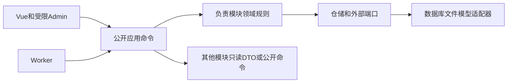
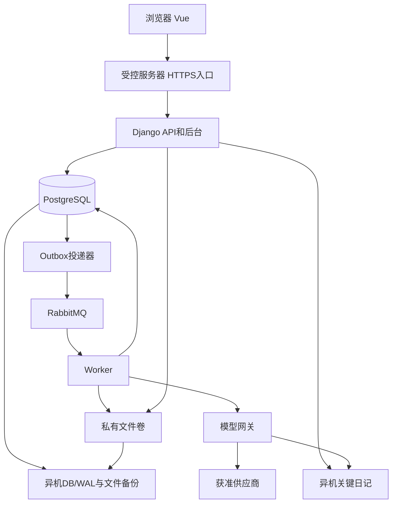

# AI4S技术架构约束

本文固定各模块必须共同遵守的规则。实施细节见[技术方案](./技术方案.md)，依据和权衡见[技术决策记录](./技术决策记录.md)，验收见[验收与实施映射](./验收与实施映射.md)。用户已确认Q1—Q21；本文的细化规则据此制定，不表示系统已运行通过。

## Design Paradigm

采用模块化单体与端口／适配器模式：Vue经同域API提交命令；Django模块独立拥有业务数据，Worker调用相同应用服务；PostgreSQL是业务事实来源，RabbitMQ只发送任务通知。四层是职责映射，不要求四次网络调用。原型与旧MVP不定义本版状态规则。

## Invariants & Rules

### AD-1 — 产品规则与独立子流程 [ADOPTED]

- **Binds:** all。
- **Prevents:** 旧MVP的全局冻结和旧指标规则进入新系统。
- **Rule:** 产品V0.12优先；登录、建项、范围、文献、专利、候选、决策包和贡献按显式依赖推进，requiredDependencies决定局部门槛。不可变历史审批、当前适用性和新版本状态分别保存；新版本不改写旧批准，已知错误追加需复核／撤销事件。

### AD-2 — 数据所有权和唯一状态决定者

- **Binds:** 技术方案§4的全部模块、Admin、Worker。
- **Prevents:** 不同模块写同一对象或另造通过字段。
- **Rule:** 每张业务表只有一个负责模块；跨模块只能调用公开命令或只读选择器。Admin批量动作、任务和HTTP统一走该模块服务，关键状态只读，前端不能直接提交批准／余量；模块导入边界在CI检查。

### AD-3 — 版本、并发和依赖

- **Binds:** API、数据库、任务、报告及缓存。
- **Prevents:** 旧任务覆盖当前结果、历史失真、无关变更全量重算。
- **Rule:** UUID标识、不可变内容version、可变运行revision、输入指纹及显式DependencyEdge同时存在。命令按expected_revision比较，冲突返回409；UTC时点和左闭右开时段统一，钱用Decimal、时长用整数秒。旧结果只能绑定启动时固定版本，不推进已替换或取消目标。

### AD-4 — 权限在每个取用点生效 [ADOPTED]

- **Binds:** API、列表、索引、文件、Admin、模型、导出和缓存。
- **Prevents:** 私人材料越权、过期图谱经缓存泄漏、受限材料外发。
- **Rule:** 身份、项目操作、当前许可、权益、材料用途和内容可用性取交集；缺项或未知拒绝。身份／许可／保护／权益分别由负责模块提供事实，统一授权入口组合；输入与交付两次及实际内容读取均核验。派生正文与源限制绑定，staff不默认有私人读取或外发权。

### AD-5 — gold用途和三态验收 [ADOPTED]

- **Binds:** materials、evaluation、knowledge、models、retrieval。
- **Prevents:** 验收污染、部分导出误判漏检、旧验收无限复用。
- **Rule:** 提取前隔离潜在验收材料，按规范身份簇记暴露史。hit/miss/unknown依据原查询核验；集合逻辑保留unknown。有效Gold总数≥50，正例衡量查全，负例只作误检回归；实际结果查准基于完整ResultPopulationVersion的全量标注或已批准版本策略的固定分层随机样本。调优与独立验收分别封存EvaluationPackageVersion，两阶段查全和查准均≥0.85且其他检查齐备才通过；包内任一材料用于调优则整包永久失去独立性。

### AD-6 — 可靠任务与外部副作用

- **Binds:** execution、models及全部事件消费者。
- **Prevents:** 已受理任务丢失、重复发奖、过期Worker回写和盲目重复付费。
- **Rule:** Task／Outbox与业务变更同事务；消息可重投，Inbox按consumer/event_id去重。事件以stream_id／连续stream_seq排序，业务revision不充当订阅游标；消费者取得完整信封，无关类型推进水位，缺口从EventStore补拉，首次订阅以一致快照水位启动。任务租约＋fencing_token决定合法回写，技术成功不等于业务通过。付费outcome_unknown先对账，不因重投自动发新供应商请求。

### AD-7 — 模型质量与预算 [ADOPTED]

- **Binds:** models、execution、缓存及语义算法。
- **Prevents:** 静默降质、同材料重复付费、并发超预算与未知费用消失。
- **Rule:** 统一网关先检查用途／许可，再查在途和缓存，锁预算预留后组装实际输入清单。每次尝试记录预计／真实／未知费用，币种分列，未知保留额度；独立评测中冻结各项质量指标不低于基线、人工工作量不增加且无新增严重科学错误，才启用降本路由。规则、统计、权限、状态与账本操作不调用模型。

### AD-8 — 发布提交点与奖励资格 [ADOPTED]

- **Binds:** assets、entitlements、execution。
- **Prevents:** 并发发布造成重合过高、外部图谱或普通新版误发奖。
- **Rule:** 普通准入用提交规则，发布重查当前库／当前许可及最终子集ContributionConsent；部分接纳或改说明须贡献者重新确认。所有比较库写操作以GraphCatalogRevision控制行串行提交，指纹不匹配则重算。assets发布事务同步调用entitlements.prepare_eligibility加入同事务，由权益模块写资格及EligibleContributionPublished；assets写Publication与GraphPublished，失败全回滚。Reward按eligibility_id唯一异步创建。

### AD-9 — 权益守恒与时间顺序 [ADOPTED]

- **Binds:** entitlements、assets、权限服务、恢复流程。
- **Prevents:** 暂停仍扣时、续期重叠、转用重发90天、到期定时器迟到扩权。
- **Rule:** 每合格贡献7,776,000秒，单目标消费；同用户同资产FIFO只队首计时。按effective_at结算，整体不可用停表、转用守恒；激活／续期／转用／重排核验许可覆盖完整预计使用区间，延期再核验。先补齐资产可用性水位；迟到事实从最早影响边界追加校正、重建投影，顺序和暂停动作按技术方案§11，未校正不新授访问。队列、余额投影原子提交且按原因防重。

### AD-10 — 检索逻辑与平台表达分离 [ADOPTED]

- **Binds:** retrieval及前端检索工作台。
- **Prevents:** 自由拼接无效语法、拆分后并交集改变、生成冒充执行。
- **Rule:** 规范逻辑树→已核实平台规则编译→反向解析比较；差异须改版确认。粗检索、formal_search、evidence_followup使用不同关卡时点和不适用矩阵；用户实际执行证据独立保存。本地模拟不作命中证明，六关不对应六次模型调用。

### AD-11 — 原始来源、解析覆盖与证据

- **Binds:** materials、knowledge、analysis和模型上下文。
- **Prevents:** 去重删除来源、无全文造证据、空解析当空白。
- **Rule:** SourceRecord与RecordOccurrence分开，文件不可变且有指纹／MaterialAccessDeclaration。上传、任务上下文组装和结果交付三处均核验本地保存、解析、外发、派生保留与导出权限。文字PDF保留页号片段和覆盖；扫描／乱码／复杂内容转人工补录核查，缺失阻断受影响判断。模型提取只建候选，实体／主张／证据经负责模块校验，科学核查另存。

### AD-12 — 可复算分析与候选门槛 [ADOPTED]

- **Binds:** analysis、research、knowledge、projects。
- **Prevents:** 小种子集冒充领域统计、无参数判前沿、补查绕过正式策略。
- **Rule:** 分析绑定DatasetSnapshot、字段、切面、词表、策略及随机种子；每个能力以AnalysisCapabilityAssessment独立给出enabled、blocked或exploratory_only。探索结果持续显示限制，不能进入正式报告。analysis拥有个人模板和独立项目切面，继承复制、升级／另存显式命令，互不自动覆盖且不传递私人模板权限。引文数量与真实边分开，共现与因果分开；七类空白逐证据追溯，必要主检索、补查清单、三关和专家意见分别守卫；补查不授双85%。

### AD-13 — 前后端契约与受控入口

- **Binds:** Vue、Django API、Admin和后台命令。
- **Prevents:** 客户端伪造放行、列表泄漏、重复提交形成多份结果。
- **Rule:** 同域会话／CSRF，匿名登录也检查CSRF；API显式SessionAuthentication／IsAuthenticated，未登录403＋NOT_AUTHENTICATED，权限和CSRF拒绝使用不同业务码。列表先权限过滤、创建／详情／文件都做对象检查。变更以幂等键＋版本命令提交，不能PATCH关键通过／账本字段。长任务持久化受理返回202；前端按任务ID恢复。

### AD-14 — 删除与灾后安全恢复 [ADOPTED]

- **Binds:** operations、全部内容与副作用入口。
- **Prevents:** 旧备份复活被删除内容、重复模型付费或奖励。
- **Rule:** 删除立即本地拒绝访问／处理并补异机日记，双侧可靠才报受理；30天可恢复后清在线正文，备份滚动30天，元数据审计1年且无正文，严格许可优先。其他关键副作用先记异机意图、再DB提交、再完成收据；日记须包含技术方案§14可重放payload／游标／hash链，不能只存指纹。DB和收据均丢失的意图保持待对账。恢复重放后才开放，活动禁止事实与余额不随历史日志过期消失。

### AD-15 — 部署、备份和迁移 [ADOPTED]

- **Binds:** deploy、operations、materials、迁移工具。
- **Prevents:** 同机备份冒充灾备、只恢复DB丢全文、直接沿用旧MVP通过。
- **Rule:** 单受控服务器容器＋独立Worker，异机DB/WAL及文件清单建立共同恢复点；RPO1h/RTO4h需实测，非HA承诺。30天保留上限内按依赖清理完整备份链，实际可恢复范围由清单证明，不承诺完整30天任意点。旧库只读试迁移、旧新ID映射、最终停写切换；重新核验许可／命中／独立性和资格，不做双向实时写入。

### AD-16 — 交付验证分层

- **Binds:** 全部实施阶段和发布记录。
- **Prevents:** 文档或示例完成被称为运行验收。
- **Rule:** 产品S01—S28及技术T01—T37有固定输入、事件顺序、预期和证据产物；另做真实选题、质量费用、容量及异机恢复验收。需求→对象→API→状态→测试逐项映射，设计完成、代码实现、自动测试、真实试点四种状态独立记录。未配置平台／方法／许可／模型基线只阻断对应正式功能，不虚构通过。

### AD-17 — 建项、范围访谈与工作流投影 [ADOPTED]

- **Binds:** identity、projects、knowledge、models、execution和前端入口。
- **Prevents:** 创建半成品项目、模型直接改正式范围、页面步骤与业务真值漂移。
- **Rule:** projects在一个事务中创建Project、ResearchConstraint v1草稿、DependencyEdge、WorkflowProjection和Outbox；幂等键按用户隔离且初始expected_revision=0。规则题同步，模型追问固定输入后异步202；失败保留已答内容。knowledge仅返回权限过滤候选，models仅生成ScopeQuestionSuggestion／ConceptSuggestion，用户接受后projects创建正式范围，knowledge经公开命令创建ConceptVersion。WorkflowProjection由事件和立即重算更新，可重建且不作为批准真值。

### AD-18 — 执行总体、停止决定与分析准入 [ADOPTED]

- **Binds:** retrieval、materials、evaluation、analysis和用户流程。
- **Prevents:** 多次导入混成不明总体、提前停止伪装通过、停止检索自动变正式语料。
- **Rule:** 一个SearchRun可关联多个不可变ImportBatch，只有声明完整并固定去重规则的ResultPopulationVersion可供正式抽样。SearchStopDecision独立记录validated、user_stopped、externally_blocked或scope_superseded；只有validated显示双85%。DatasetSnapshot由materials另行冻结，analysis再逐能力评估；三类对象互不覆盖历史状态。

### AD-19 — 检索方案、追问与显式确认 [ADOPTED]

- **Binds:** retrieval、projects、knowledge、models及检索前台。
- **Prevents:** 题目全AND漏检、推荐批量接受冒充最终批准、未来问题自动同意、假说变成事实。
- **Rule:** retrieval拥有方案与方案访谈，projects拥有范围，knowledge拥有正式概念。按固定输入拆块，追问前提已满足的问题；本轮建议仅绑定已展示ID／版本／推荐快照，原子核验。当前批次必要决定明确处置并显式确认才编译；未知科学关系允许保留，依赖未决问题的任务仍阻断。语义变化新版本重新确认，等价平台转换不重复访谈；SearchPlanConfirmed不能授FormalSearchApproved。

### AD-20 — 批次、分区与组合评估 [ADOPTED]

- **Binds:** retrieval、materials、evaluation、analysis和models。
- **Prevents:** 执行批次与导入文件混同、跨范围混分母、AND误并集、每条子式机械分配50条Gold。
- **Rule:** SearchPlanBatch组织任务，ImportBatch保存某SearchRun的文件。独立评估范围先固定任务／平台／集合树／纳入／去重单元；来源完整后复合总体按并交差运算，unknown不冒充miss。主集与补充集分列、多来源保留。每个声明范围维持Gold≥50与两阶段双85%，独立包不入追问／找词／调优。完整契约见V0.12规范附件。

## Consistency Conventions

| Concern | Convention |
|---|---|
| 模块所有者 | 按技术方案§4；跨模块公开命令／只读DTO，禁止跨模块ORM写入 |
| API及错误 | /api/v1；Idempotency-Key、expected_revision；统一trace_id及中文可恢复阻断说明 |
| 对象与来源 | UUID、不可变版本、指纹、来源链、用途与许可；外部标识另存 |
| 时间与金额 | UTC，左闭右开；Decimal＋币种；整数秒；服务器决定时间 |
| 状态与事件 | 聚合revision与事件stream_seq分开；追加审计、Outbox/Inbox、完整流信封及水位；历史批准与当前资格分列 |
| 科学结果 | 统计配置、数据字段、缺失与人工核查分开；关系显示不能替代证据状态 |

## Stack

这里固定兼容系列，精确补丁／镜像摘要必须在M0依赖锁文件中记录；不是已安装或可直接执行的部署清单。官方资料核查见[核查记录](./reviews/技术资料核查.md)。

| Name | Version |
|---|---|
| Python | 3.12（受支持安全补丁） |
| Django | 5.2 LTS（受支持安全补丁） |
| Django REST Framework | 3.16系列，更新须验证Django5.2兼容 |
| PostgreSQL / Psycopg | 17系列 / 3系列 |
| Celery / Kombu | 5.6系列 / 5.6及兼容补丁 |
| RabbitMQ | 4.3系列；2026-11-30前完成后续支持系列升级检查 |
| Vue / Node构建环境 | 3稳定系列 / 24 LTS且≥24.12.0 |
| pypdf | 6稳定系列 |
| Docker Engine / pgBackRest | 29稳定系列及配套Compose插件 / 2稳定系列 |

TypeScript、Vite和前端库采用核实的官方模板兼容组合，具体补丁由M0锁文件固定；业务模块不得各自选择第二套运行时或数据库访问库。前端图表库只拥有展示职责。

## Structural Seed

共同恢复点包含DB目标点、所有所需文件指纹及日记水位。原文件、模型上下文与输出均在权限域中；日志不含正文。生产不常驻前端Node，不默认部署GPU、独立图数据库或向量服务。

## Capability → Architecture Map

| 产品能力 | Lives in | Governed by |
|---|---|---|
| 登录、建项、范围与关键词协作 | identity、projects、knowledge、models | AD-1—4、6、7、13、17 |
| 检索块、方案访谈与组合评估 | retrieval、knowledge、models、evaluation、materials | AD-3—7、10、19、20 |
| 方向与切面导航 | analysis、projects、knowledge | AD-1、3、11、12 |
| 文献／专利检索与Gold、查准 | retrieval、materials、evaluation | AD-5、10、11、18 |
| 竞争合作、引用网络 | analysis、knowledge | AD-4、11、12 |
| 证据图谱与双来源资产 | knowledge、assets | AD-4、8、11 |
| 空白、候选、定题与评审 | research、projects | AD-1、3、12、13 |
| 贡献奖励及撤回 | assets、entitlements | AD-4、8、9、14 |
| 模型降本、缓存与预算 | models、execution | AD-3—7 |
| 持续监测 | operations、retrieval、analysis | AD-1、6、12；无API为人工回传待办 |
| 安全、恢复与迁移 | identity、operations、全部模块 | AD-2、4、13—16 |

## Deferred

| 项目 | 本版确定的边界／复议触发条件 |
|---|---|
| 检索API、机构SSO、本地模型 | 预留端口，默认关闭；获得实际账号／许可与需求后独立适配，不能影响当前人工流程 |
| 独立图／搜索服务和微服务拆分 | 当前关系库与模块接口足够作为试点种子；容量／查询质量实测不合格才评估，不能牺牲指标换速度 |
| 具体供应商、地域和基础设施采购 | 部署配置项，实施负责人按既定数据边界选择；未验证许可与连通性不启用外发或正式试点 |
| 科学分析及准入阈值 | 已固定字段、审核者、版本和未配置行为；方法审核与真实样例校准后启用，各模块不得自行补数字 |
| 精确依赖和容器补丁 | M0在支持范围内锁定兼容组合与镜像摘要，CI存档；支持终点提前复核 |

## V0.13 增量适用说明（2026-09-23）

用户确认Q1—Q12。完整技术方案第5.4节细化现有权限、版本、候选与成本约束，不重编号AD-1—20：首次范围确认不依赖未产生的纳排条件；正式Gold/评估必须依赖当前确认的纳排版本。模型候选不是用户决定；图谱缺配不得制造来源。日期与多选值为结构化真值，五研究字段文本投影继续兼容M1.1；不同关系类型不得在下游扁平化为同义词。20条反馈仅是诊断标注，不能传递独立验收资格。
