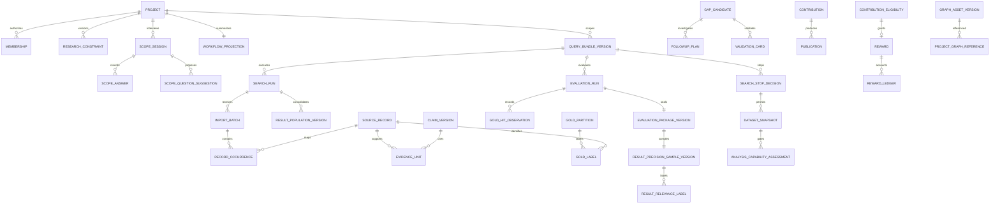

# T07 数据与 API 契约

<a id="module-entry"></a>

> 主责模块：`all`｜计划阶段：M0—M6｜输入：业务对象和公开命令｜输出：稳定DTO、接口及一致性规则。
> 当前按职责维护；历史编号及迁移位置见[章节索引](../章节索引.md)，开发优先使用现行主题锚点。
> 产品规则与技术实现状态分开判断，设计文字本身不等于已交付能力。

## 5. 数据契约与持久化

### 5.1 共同字段与一致性

ID统一UUID；外部DOI、平台编号、专利号另存，不能用作访问凭证。数据库时间采用带时区时间戳并统一UTC，界面按用户时区显示。日期窗口保存原始字段、精确边界及用户时区。数量和时长使用整数；费用使用定点Decimal和币种，不使用浮点金额。所有许可及权益区间采用开始包含、结束不包含。

版本化对象共有`id, object_id, version, revision, project_id/asset_id, input_fingerprint, schema_version, created_by, created_at`。业务内容形成不可变版本；运行状态可按revision更新，变更需追加事件。已批准对象的历史决定不改写，`ApprovalRecord`与`ApplicabilityAssessment`分开。当前指针是可重建投影，不是第二份真值。

`InputRef`至少包含对象类型、对象ID、版本、内容指纹、材料范围（题录／摘要／全文／图谱）、用途角色、来源许可引用和权限版本。`DependencyEdge`保存上游版本、下游版本、用途、必要性、影响类型。语义变化、授权变化、显示变化分别处理，不按“有更新”重跑全部模型。

### 5.2 关键实体关系



上图只表达主要关系。实现必须使用具有所有者和外键约束的具体表，不能用任意JSON引用替代重要资格关系。

| 数据契约 | 必需业务字段／约束 |
|---|---|
| ResearchConstraint | project_id、version、status、core_keywords、object/mechanism/intervention_or_method/outcome/context、year/language/document_type、include/exclude、deadline、resource_conditions、completeness、conflicts、confirmed_by/at；确认后不就地修改 |
| ScopeSession／Answer | constraint_draft_id、decision_tree_version、frontier、session_status、answer_payload、actor、revision；必填完整、矛盾清零和显式确认才可冻结 |
| ScopeQuestionSuggestion | scope_session_id、input_revision、question、reason、target_field、model_task_id、status、accepted_by/at；迟到建议不得覆盖新版会话 |
| ConceptSuggestion | project/scope_version、concept_type、term、source_type/ref、reason、model_task_id、decision、decision_reason、decided_by/at；只有accepted/modified的结果可进新ConceptVersion |
| WorkflowProjection | project_id、projection_version、source_stream_watermarks、current_step、step_states、available_actions、blocking_items、responsible_roles、input_versions、applicability；可从模块DTO／事件重建 |
| RecordOccurrence | record_id、import_batch_id、source_target_id、source_native_id、raw_row、source_date、query_run_id；每个来源出现保留，去重不删原始行 |
| IdentityCluster | canonical_id、成员ID、记录／专利族单元、匹配方法、置信及人工确认；模糊匹配不自动合并不确定记录 |
| FileObject | storage_key、sha256、byte_size、mime、page_count、owner_scope、license_ref、role、status、expires_at、backup_verified_at |
| MaterialAccessDeclaration | file/object、source_license、project_policy、local_store/local_parse/external_model/derived_retention/export裁决、declared_by/at、revision；未知权限按拒绝 |
| EvidenceUnit | source_record_version、file_version、page、text_span／人工定位、quotation、上下文、coverage_status、extraction_version、review_status |
| ClaimVersion | 主体、关系、客体、条件、方向／不确定性、证据引用；共现／引文关系与机制／因果分型 |
| GoldPartition | 范围、去重单元、冻结标签版、分组、材料暴露状态、封存评估ID、退役事件；同研究重复版本不得跨调优／验收分组 |
| GoldHitObservation | record_id、query_run_id、subquery_id、hit/verified_miss/unknown、核验方法、身份匹配、原查询依据、核验人及时间；部分导出缺失不得自动生成verified_miss |
| ResultPopulationVersion | kind（single_run/composite）、evaluation_scope_version、source_population_versions、set_ast、record_unit、completeness_assessment；单执行保留query_run_id、expected_hit_count、imported_count、batch_ids、dedupe_version、stable_id_coverage、export_complete、warnings、fingerprint；只有核验合格的总体可作正式抽样框 |
| PrecisionSamplingPolicyVersion | status、record_type、population_range、confidence_level、margin_of_error、conservative_prior、finite_population_correction、strata、minimum_effective_labels、pending_rule、fixtures、approved_by/at |
| ResultPrecisionSampleVersion | result_population_id、policy_version、sampling_frame、strata、random_seed、sample_ids、weights、required/effective_count、frozen_at；冻结后不换样凑指标 |
| ResultRelevanceLabel | sample_version、record_id、label(relevant/irrelevant/unknown)、evidence、labeler、labeled_at、revision；未判定不自动按无关处理 |
| EvaluationPackageVersion | evaluation_scope_version、composite_population_version、query_bundle_versions/run_refs（旧单式兼容读）、gold_partition、precision_sample、exposure_state、sealed_at、result_refs；独立包内记录一旦被用于调优，整包转调优且不恢复独立性 |
| SearchStopDecision | evaluation_scope_version、query_bundle_versions、stop_type、actor、decided_at、evaluation_refs、unknown_count、coverage_limitations、reason、next_action；只有validated对应正式检索通过 |
| DatasetSnapshot | project/source、version、included/excluded_record_ids、dedupe_version、batch_ids、file_fingerprints、license_summary、frozen_by/at；停止决定不自动创建或修改 |
| AnalysisCapabilityAssessment | dataset_snapshot、capability、status(enabled/blocked/exploratory_only)、field_coverage、sample/time_requirements、normalization/policy/citation/license_checks、blocking_items、recovery_actions、assessed_at |
| ModelUseCasePolicyVersion | use_case_id、阶段／业务所有者、触发动作、许可输入、规则路径、路由及质量基线、费用上界与预算域、校验／降级、状态与发布版本；仅已验收启用可对正式任务调用真实供应商 |
| ModelInvocationDecision | use_case_id／策略版、业务对象及输入指纹、actor／授权域、触发命令、decision、reason_code、复用／关联task、估计上界和预算预留引用；零调用也保留决定，实际付费尝试另存ModelCallAttempt |
| AnalysisRun | 语料ID清单及指纹、字段覆盖、词表／切面／策略版、参数、种子、分母、输入许可、输出位置 |
| Publication | asset_version、贡献来源、接纳子集指纹、贡献者确认ID及说明指纹、规则版、比较库revision、两类审核、许可版、发布事务ID |
| RewardLedger | reward_id、用户／目标资产、event_type、effective_at、duration_delta、remaining_seconds、queue_revision、causation_id |

至少建立以下唯一约束：`(object_id,version)`、`(actor_scope,idempotency_key)`、`(consumer,event_id)`、`(aggregate_id,revision)`、`ContributionEligibility(contribution_identity)`、`Reward(eligibility_id)`、`(reward_id,causation_id,event_type)`。专利族、同论文多版本的分组检查以规范化身份簇为单位；去重变更触发gold资格重核，不静默合并已冻结评估。

常用索引为`(project_id,created_at,id)`、`(project_id,status)`、`(asset_id,version)`、`(upstream_id,upstream_version)`、`(task_status,next_run_at)`及各唯一键。大列表采用游标分页，默认50条、最大200条；大图按邻域和聚类加载，单次视图默认最多500节点／1000边，必须注明显示截取范围，统计仍基于完整固定语料。

<a id="facet-contracts"></a>

### 5.3 领域分面对象与守卫

`SearchStrategyTemplateVersion`、`SearchFacetProposalSet`、`SearchStrategyFacetProposal`和`SearchFacetDecisionVersion`的所有者均为 `retrieval`；`ResearchConstraint`仍归 `projects`，`ConceptVersion`仍归 `knowledge`。检索策略分面命名空间与 `analysis.ResearchFacetTemplate` 隔离，禁止共用数据库表或业务通过状态。对象详细字段、许可和状态机见[领域分面与策略模板](./09-领域分面与策略模板.md)。

建项事件只触发本地候选，不使原子建项事务等待图谱或模型。读接口不得在 GET 中触发付费模型调用。平台模板发布由受权管理员审核，项目模板升级是新决定版本；关闭或撤回模板时保留历史引用并使当前适用性重新评估。错误响应至少区分无已验收模板、无图谱覆盖、无外发许可、预算不足、版本冲突和任务失败。

<a id="optimization-contracts"></a>

### 5.4 调优策略与试验对象

`SearchOptimizationPolicyVersion`由`retrieval`唯一写入，至少含`task_id`（受改任务）、`evaluation_scope_ref`、`scope_fingerprint`、`baseline_bundle_refs`、`baseline_run_refs`、`baseline_population_ref`、`baseline_query_version`（单式兼容）、`baseline_evaluation_ref`、`scope_ref`、`platform_rule_ref`、`tuning_gold_ref`、`precision_method_ref`、`max_recall_drop_pp`、`min_precision_gain_pp`、`confirmed_by`、`confirmed_at`、`revision`。两个阈值须为用户明确提交的非负百分点；空值不可用，客户端不得自行指定已确认标识。`QueryOptimizationTrial`只保存对`evaluation.EvaluationRun`的引用和由该指标算出的比较、平台复杂度报告及决策，不复制可被改写的评估真值。所有指标变化以百分点为单位，使用未舍入原值比较。

接口语义为“读取任务当前基线与建议候选”“确认／改版取舍阈值”“提交候选查询与实际执行引用”“读取试验对比”“确认或拒绝候选”。写命令均要求项目成员权限、幂等键、预期revision、已确认范围和方案版本；首个`NOT`候选比较须有已确认阈值。阈值改版返回新版本，不覆盖既有试验；范围／平台／Gold／查准方法发生变化时返回409及失效原因，先重建基线再确认。响应分开返回“符合调优取舍”“可正式验收”“实际验收通过”三种语义，不以用户确认阈值推断最终通过。

<a id="recall-contracts"></a>

### 5.5 查全评估对象与守卫

`RecallEvaluationScopeVersion`由`evaluation`写入，必需`evaluation_scope_ref`及`scope_fingerprint`引用`retrieval.SearchEvaluationScope`固定版本，其他范围字段只作一致快照，另绑定Gold版本及查询／执行引用；禁止独立改范围；`SourceCoverageObservation`按Gold单元及平台记录`indexed/not_indexed/unknown`、platform_target_ref、子库／访问范围、execution_time_window、observed_at、核验依据、人、时间及conflict_resolution_ref。hit与同一时点not_indexed冲突须裁决；单次DOI零结果不得判未收录。`GoldHitObservation`继续只说明**原式命中**，不与平台收录混用。Gold记录逐条保存discovery_route_refs、discovery_query_ancestors、first_seen_at、exposure_refs、independent_eligibility及`query_conditioned`标识；混合来源不解除其余条目的条件化或暴露状态。

Gold候选导入／标注／冻结、按原式提交逐条命中核验、提交收录核验、读取查全报告均由`evaluation`接口负责；写命令用角色校验、幂等键、预期revision和凭据引用，不能由客户端直接提交最终查全率。报告返回总Gold及两组正负例数、相关正例分母、TP、按已收录漏检／未收录／收录未知拆分的FN、命中未知数、范围级查全率及区间、可计算时的平台内诊断查全率、执行与来源覆盖限制。任何必要命中未知或受保护包暴露均给不可验收状态；独立包失效后新建版本，不覆写历史。

<a id="api"></a>

## 12. API与前端协作

### 12.1 统一接口契约

#### 会话与访问

同域部署Vue与`/api/v1`，使用服务端会话、HttpOnly／Secure cookie和CSRF保护；首版不把长期Bearer token写入浏览器本地存储。邀请为单次、有限时效凭证，激活与项目授权分开；登录限速、会话撤销及密码重置由identity管理。登录采用显式受CSRF保护的Django视图，不能因请求匿名而绕过CSRF。DRF默认配置SessionAuthentication及IsAuthenticated，列表必须先按权限过滤再计数／分页，对象不存在或无权读取均不泄露对象正文与存在细节。

#### 命令与响应

写命令携带`Idempotency-Key`、`expected_revision`、目标version及依据引用；同键同输入返回原响应，同键不同输入409。首次创建返回201，异步202，版本冲突409，输入／门槛不满足422，未登录403＋NOT_AUTHENTICATED，已登录无操作权限403＋PERMISSION_DENIED，CSRF错误403＋CSRF_FAILED，受限对象读取404，超限429，关键基础设施不可用503。错误体统一`code,message,object_ref,blocking_items,responsible_role,recovery_action,trace_id`，界面按业务码引导登录或恢复操作，不把所有403解释成会话过期。此约定适配DRF会话认证默认行为。[DRF会话认证](https://www.django-rest-framework.org/api-guide/authentication/#sessionauthentication)

同步与异步均绑定输入版本。列表返回`items,next_cursor`，任务返回`task_id,status,waiting_reason,progress,output_refs,cost_status`；progress基于实际完成单元，无法估算则显示阶段，不伪造百分比。前端初始每3秒轮询活动任务，页面隐藏后退避，完成即停止；刷新可恢复，不要求长连接或把对话历史作为工作流状态。

#### 端点索引

| 接口／命令 | 负责模块 | 关键输入与输出／守卫 |
|---|---|---|
| GET /projects；POST /projects；POST /projects/:id/members | projects／identity | 列表按用户授权过滤；创建在单事务内写项目、范围草稿、依赖、投影和Outbox，用户域幂等且`expected_revision=0` |
| GET /projects/:id/workflow；POST /projects/:id/workflow/recalculate | projects | 返回可重建工作流投影、阻断项、责任角色和恢复动作；立即重算不改变业务真值 |
| POST /projects/:id/scope-sessions；POST /scope-sessions/:id/answers；/confirm | projects | 引用当前分面决定；五项答案由用户另行提交，过期决定409；规则题同步，模型追问异步返回task_id；projects唯一写建议；确认生成ResearchConstraint新版并传播失效 |
| POST /projects/:id/concept-suggestions；POST /concept-suggestions/:id/accept | projects／knowledge／models | 知识候选按权限返回，模型只处理固定输入；接受后才生成正式ConceptVersion |
| GET /platform-targets；POST /query-bundles | retrieval | 已确认且适用的方案／任务／批次、平台、类型、逻辑树、CV/KG；返回固定版本 |
| POST /query-bundles/:id/compile；/checks | retrieval | 方案确认与批次前提、平台规则版；产出检查项，语义有损回方案重确认 |
| POST /search-runs | retrieval | 固定方案、任务和评估范围版本；原式、条件、日期、凭据；不从生成任务自动创建已执行 |
| POST /imports；POST /imports/:id/files；/finalize | materials | 请求先创建批次，文件流传输，finalize校验完整性并入解析队列 |
| POST /search-runs/:id/result-populations | retrieval | 聚合多个不可变ImportBatch，保存去重、完整性声明和正式抽样总体版本 |
| POST /gold-partitions；/freeze；/labels | evaluation | 范围、分组、标签、证据与revision，已冻结修改建新版 |
| GET /precision-sampling-policies；POST /result-precision-samples；/labels | evaluation | 只能选已启用策略；冻结总体、种子、分层、权重、标签和置信区间 |
| POST /evaluation-packages；POST /evaluations | evaluation | 独立Gold与独立查准样本整体封存；报告绑定方案、任务、范围、查询、执行和暴露状态；范围指纹不一致422 |
| POST /gold-hit-observations | evaluation | 保存实际命中三态及原查询凭据，不以缺失导入推断未命中 |
| POST /query-bundles/:id/approve | retrieval | 必要六关、评估、范围与用户确认；服务端重新核验 |
| POST /projects/:id/search-stop-decisions | retrieval | 四类停止决定绑定方案、任务和评估范围版本；仅validated授予双85%标识 |
| POST /gold-partitions/:id/retire | evaluation | 已封存评估与显式确认，其他活动保护检查 |
| POST /projects/:id/dataset-snapshots；GET /dataset-snapshots/:id/capabilities | materials／analysis | 停止后独立冻结语料；逐模块返回enabled／blocked／exploratory_only |
| POST /facet-templates；POST /projects/:id/facets/apply-template；/upgrade-template；/save-as-template | analysis | 个人模板与项目定义独立版本，显式复制／升级，核验个人与项目两种权限 |
| POST /navigation-runs；GET /navigation-runs/:id | analysis | 正式／预览类型、固定语料、策略；缺字段按面板阻断 |
| POST /claims/:id/reviews；POST /candidates | knowledge／research | 原文和核查意见；AI草案不能设置已核查 |
| POST /candidates/:id/followup-plans；/reviews | research | 清单版本、执行材料、指定核查者；与正式检索状态分开 |
| POST /decision-packages；/:id/reviews | projects | 选定候选、路线、依赖与评审版本 |
| POST /contributions；/:id/consents；/:id/reviews；/:id/publish | assets | 最终子集贡献者确认与两类审核，当前库／权限原子重查；资格准备加入发布事务 |
| POST /rewards/:id/activate；/transfer | entitlements | 目标资产、许可与余量，唯一兑换和FIFO |
| POST /contributions/:id/withdrawals | assets | 立即停新取用；正式处置追加事件 |
| GET /tasks/:id；POST /tasks/:id/cancel；/retry | execution | 所有者范围与错误类别；取消不抹账，未知付费不自动重试 |
| GET /projects/:id/model-usage；GET /model-operations（路径待实施确认） | models／operations | 项目成员查看本项目用量、预留、未知费用与任务状态；运维按角色查看用例汇总、异常和质量趋势，不返回材料正文或受保护标签；读取零模型调用 |
| POST /model-use-case-policies；POST /model-alerts/:id/acknowledge；/resolve（路径待实施确认） | models／operations | 仅授权管理员可发布已验收用例和预警规则；告警关闭须责任人、原因、复测引用；不能直接改账本、质量结论或正式业务对象 |
| POST /projects/:id/delete；/restore | operations | 恢复窗口和许可检查；共享贡献不随私人删除自动撤回 |
| GET /projects/:id/activity；POST /monitor-subscriptions | operations | 版本变化与周期待办；无API不承诺自动检索 |
| POST /projects/:id/search-plans | retrieval | scope_version、input_snapshot、template_version；201草稿与规则拆分候选；固定范围、分面决定、词表与模板版本，展示任务组配、变体及语义差异；项目授权；新语义任务另建Task |
| GET /search-plans/:id | retrieval | 方案、块、任务矩阵、批准与适用性、阻断及恢复动作；读取权限；不从前端“当前步骤”推断可执行 |
| POST /search-plans/:id/revisions | retrieval | base_version、结构化修改、理由；新草稿及影响列表；语义、范围、NOT或纳入变化必经重确认 |
| POST /search-plans/:id/interview-rounds | retrieval | trigger、input_revision、调优回传引用；规则轮次201或模型任务202；用途／许可；无权限材料不得组装上下文 |
| POST /search-interview-rounds/:id/answers | retrieval | question_id/version、快照、逐题答案或本轮批量建议；快照与前提原子核验；未决映射返回明确待答项 |
| POST /search-interview-rounds/:id/pause 或 /resume | retrieval | 当前revision；保留答案及恢复位置；resume先重算前提，不自动批准 |
| POST /search-plans/:id/confirm | retrieval | plan_version、batch_id、decision_snapshot_hash、explicit_confirmation；当前批次必要问题清晰、范围适用；写批准和Outbox同事务 |
| POST /search-plan-batches/:id/activate | retrieval | 批次版本、approval_ref、expected_revision；前提、当前适用性和显式批准；不自动激活后续任务 |
| POST /search-plans/:id/evaluation-scopes | retrieval | 任务、平台、集合树、分区、纳入与去重单元；冻结版本；不跨项目／分区偷合并；变更生成新版 |
| POST /evaluation-scopes/:id/result-populations | retrieval | source_population_versions；复合总体与完整性报告；来源版本齐备、运算保真；不完整只允许探索 |
| 读取最新领域／分面提案（语义命令，路径实施时固定） | `retrieval`只读 | 项目成员权限；返回项目输入指纹、模板版本、建议来源、生成中／可用／降级／待复核状态 |
| 重新生成或补充提案（语义命令，路径实施时固定） | `retrieval` | 幂等键、期望项目 revision、外发许可；先检查本地复用，必要时返回202模型任务 |
| 逐项确认领域和分面用途（语义命令，路径实施时固定） | `retrieval` | 期望提案与项目版本、至少一个核心对象；生成不可变决定版本，不接受客户端伪造来源或审批字段 |
| 读取当前已确认决定 DTO（语义命令，路径实施时固定） | `retrieval`供`projects`／`knowledge`／`retrieval`内部消费 | 仅当前适用版本；包括用户自增、用途、来源、模板与权限指纹；待复核不得冒充已确认 |
| 读取基线／候选；确认或改版NOT阈值；提交及读取试验；接受或拒绝候选（路径待固定） | retrieval | 绑定完整Q0与同范围评估DTO；阈值由用户确认；对象及错误守卫见[5.4](#optimization-contracts) |
| 提交收录核验；读取查全报告（路径待固定） | evaluation | 与原式命中分开；逐记录独立性与冲突守卫见[5.5](#recall-contracts) |
| 提交／核验来源状态；读取来源状态历史（路径待固定） | materials | 人工证据与角色、revision守卫；核验后发布SourceStatusChanged，详见[T03](./03-材料与知识.md#source-status) |

冒号路径表示参数模板，实际OpenAPI在实施时由接口模式生成并纳入CI；本文表格固定语义边界，不冒充已运行接口文档。数据库内部字段不直接作为前端可编辑字段，序列化器禁止提交系统审批、奖励余量及许可决定。

### 12.2 命令例子

```json
{
  "target": {"type": "query_bundle", "id": "示例UUID", "version": 3},
  "expected_revision": 7,
  "action": "approve",
  "evidence_refs": [{"type": "evaluation", "id": "示例评估UUID", "version": 1}],
  "reason": "确认本次指定范围的最终检索策略"
}
```

该示例只说明请求形状，示例UUID不能直接作为测试数据。客户端没有`approved:true`入口；后端在事务中检查权限、目标版本、必要检查报告、评估资格及当前适用性，然后写不可变审批与事件。

<a id="object-vocabulary"></a>

## 对象名称兼容索引

核心对象：Project、ResearchConstraint、SearchPlatform、PlatformTarget、PlatformRuleVersion、RuleEvidence、ConceptVersion、KnowledgeGraphVersion、SearchPlan、SearchBlock、SearchPlanTask、SearchPlanBatch、SearchInterviewRound、SearchInterviewQuestion、SearchInterviewDecision、SearchEvaluationScope、QueryBundleVersion、CompiledQuery、SearchRun、ManualImportBatch、SourceRecord、CitationSnapshot、JournalQuartileRecord、SeedSetVersion、PatentFamily、ScreeningDecision、GoldDatasetVersion、GoldLabel、GoldHitObservation、ResultPrecisionSampleVersion、ResultRelevanceLabel、EvaluationRun、RandomSampleBatch、RelevanceFeedback、QueryIteration、ExclusionAudit、FinalQueryApproval、SearchStopDecision、DatasetSnapshot、MaterialAccessDeclaration、AnalysisCapabilityAssessment、Entity、ClaimVersion、EvidenceUnit、GapCandidate、TopicCandidate、DecisionPackageVersion、Review、MonitorSubscription、ChangeEvent。每个派生对象记录上游 ID 与版本；模型内容记录是否曾接触验收数据。

本段仅保留产品历史名称以供查找，不定义第二份表或写入口；实际所有权以[T00](./00-总体与模块所有权.md)及对应模块为准。ManualImportBatch对应ImportBatch，GoldDatasetVersion对应版本化Gold分区及标签，FinalQueryApproval对应检索批准记录，ChangeEvent对应规范DomainEvent。新实现须声明兼容映射，不能因旧名称重复建真值。

<!-- 历史章节书签保留；当前定位使用顶部模块入口及章节索引。 -->
<a id="22-t15-一级分面接口与版本引用"></a>
<a id="24-t16-检索调优策略与试验接口"></a>
<a id="26-t17-查全评估对象与接口"></a>
