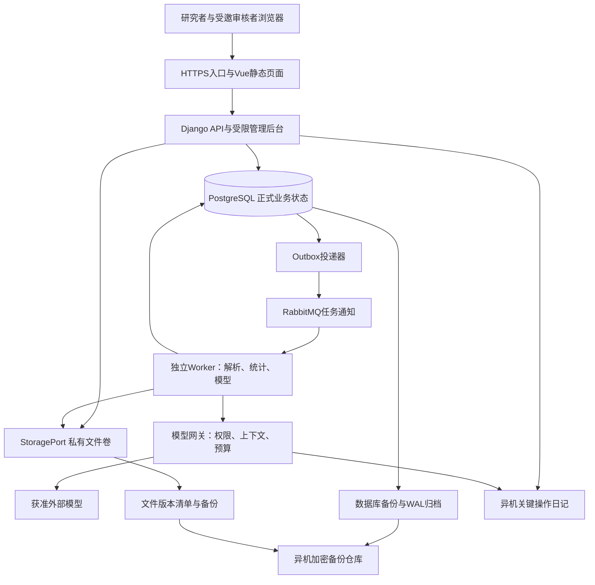
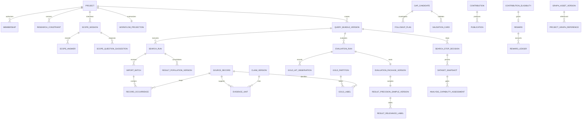
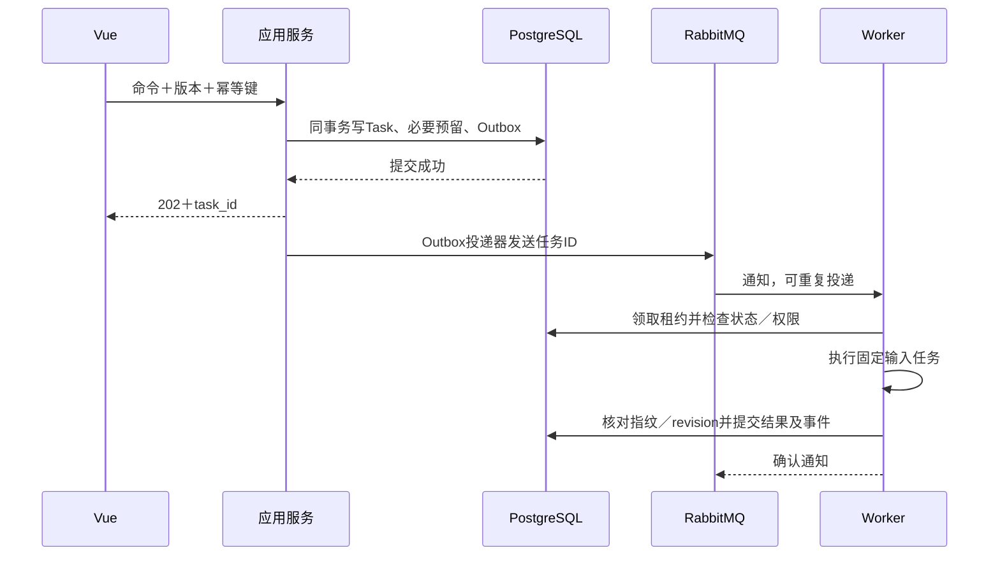

# AI4S研究决策平台：研发实施技术方案

版本：T1.3｜设计基线：产品V0.13｜更新日期：2026-09-23｜状态：主用户旅程技术契约已同步，尚未完成实现或真实试点

本方案采用Vue 3、Django 5.2 LTS、PostgreSQL、Celery与RabbitMQ，构建按业务模块组织的单体应用和独立后台任务进程。面向10个邀请制账号、3人同时操作、每项目2000条题录及200份全文的受控服务器试点。四层产品框架映射为职责边界，不拆成四套独立系统。

产品规则以[产品设计方案V0.13](../../research-platform-design-20260907/产品设计方案.md)为准；[架构约束](./ARCHITECTURE-SPINE.md)固定跨模块规则；[决策记录](./技术决策记录.md)保存选择依据；[验收映射](./验收与实施映射.md)定义需求—对象—接口—状态—测试证据。本文规定实现方式，不把文档同步写成已实现能力。

研发查阅：[模块与数据](#modules) · [导入与业务流程](#business) · [API契约](#api) · [安全与恢复](#security) · [迁移](#migration) · [实施顺序](#implementation)。

## 1. 已确定的实施边界

| 事项 | 本版约定 |
|---|---|
| 用户与部署 | 单套受控服务器、邀请制账号、项目成员隔离；保留机构独立部署的配置边界，首版不建设机构计费或统一身份平台 |
| 主用户旅程 | 登录→轻量建项→范围与概念→拆块与方案追问→显式确认方案及当前批次→平台配置→探索检索→种子与知识构建→Gold与正式检索→语料确认→统计与引文分析；步骤为后端可重建投影，不取代模块业务真值 |
| 外部检索 | 21个平台目录保留；用户在外部平台执行、筛选、导出后回传。规则适配不等于API接入或实际命中 |
| 检索评估 | Gold有效记录总数≥50；Gold正例用于查全，负例用于误检回归；查准基于实际结果全量标注或固定分层抽样；调优与独立验收阶段均须双指标≥85% |
| 全文 | 本地自动提取文字PDF；扫描件、复杂表格及公式保留待人工补录／核查状态，不用空提取冒充完整分析 |
| 模型 | 来源许可和项目设置同时允许才外发；材料受限时可做获准本地解析／统计，依赖外发的语义任务等待，不默认建设本地推理集群 |
| 旧系统 | 选择性复用解析及业务经验，显式迁移；旧通过状态不能直接获得当前版本资格 |
| 性能目标 | 普通查询服务端p95≤2秒；长任务在请求体接收完成后2秒内持久化受理并返回任务ID；上传传输、模型耗时和人工等待单列 |
| 恢复目标 | RPO≤1小时、RTO≤4小时；数据库和文件均需异机可恢复副本，目标须演练验证 |
| 删除与保留 | 私人项目删除立即禁用访问和处理；30天恢复期后清理在线内容，备份滚动保留30天；不含正文的审计元数据保留1年，较短许可要求优先 |

容量数字是验收输入，不是无限项目或任意大小图谱的承诺。实施起始测试集设10个活动项目、合计2万题录与2000份全文；每份全文以≤50MiB、≤300页作为首批样例上限。此为可调整的容量配置，不改变科学纳排或丢弃超限材料：超限进入待拆分／单独导入任务，调整配置后重测。共享图谱初始压测包上限5万实体、20万带条件关系；超过该测试包时不承诺相同性能，由管理员分域发布并进行容量测试。

## 2. 系统组成与部署



主服务器以Linux容器运行入口、API、Worker、RabbitMQ和PostgreSQL；同一后端镜像启动不同进程。前端产物作为静态文件部署，Node仅用于构建。开发、验收和试点使用分开的数据库、文件前缀、队列及供应商配置；测试默认使用合成材料和模型桩，真实材料不得自动复制至开发环境。

初始资源估算为4 vCPU、16GiB内存、200GiB SSD，不属于已测最低配置或采购承诺；解析并发1、模型在途请求2、程序统计并发1为调度起值。入队可多于执行数，按用户轮转，单项目不得长期占满Worker。CPU／内存压力触发排队而非静默减少必要分析。云厂商、地域、域名和模型供应商在部署配置中选定，并先通过实际许可与连通性检查。

数据库、队列及私有文件端口不对浏览器公开。应用只通过HTTPS提供接口；后台管理单独路径并受邀请账号与操作权限控制。数据库／文件仓库是正式数据来源，队列、索引和前端状态均可重建。

## 3. 技术选型及版本治理

| 组件 | 选择与职责 | 版本治理 |
|---|---|---|
| 前端 | Vue 3＋TypeScript；路由、检索表单、证据定位与图谱联动 | 使用官方create-vue起步，Node 24 LTS且≥24.12.0；锁定Vue、构建工具与Node版本，提交依赖锁文件 |
| 后端 | Python 3.12、Django 5.2 LTS；Django REST Framework作为API层 | 固定兼容系列，开工时选择已核实安全补丁；不追随浮动latest镜像 |
| 数据库 | PostgreSQL 17；关系数据、JSONB配置、事务、版本和账本 | 精确镜像摘要与扩展版本纳入部署清单；迁移脚本受版本控制 |
| 后台任务 | Celery 5.6＋RabbitMQ 4.3；任务通知与受控执行 | 锁补丁与配置；业务任务记录在PostgreSQL，不依赖队列保存最终业务状态 |
| 文件 | StoragePort首版实现为私有文件卷；异机备份使用独立仓库 | 不建设公开下载桶；每份内容有指纹、许可、版本、到期日及备份状态 |
| PDF | pypdf适配器提取文字和页号；保留原文件供人工核验 | 固定解析器版本及参数；复杂布局不承诺可靠章节或表格还原 |
| 图表 | Vue组件承载统计图和分批加载的实体关系图 | 可视化组件替换不改变分析结果；布局参数与科学方法参数分开 |
| 备份 | PostgreSQL持续WAL归档／pgBackRest；文件独立增量备份 | 同一恢复清单关联数据库目标点、文件指纹、日记游标；按第15节演练 |

本轮核查的Django 5.2仍为受支持LTS系列；Django REST Framework具有Django 5.2支持记录。采用成熟系列是当前选择，实施锁文件仍须核查补丁与兼容性，不能把本文的系列号当作可直接安装的完整清单。[Django版本表](https://www.djangoproject.com/download/)、[DRF发布记录](https://www.django-rest-framework.org/community/release-notes/)

RabbitMQ起始选择4.3系列，当前社区支持截至2026-11-30；上线跨越该日期前须完成受支持系列的升级验证，不能把4.x理解为长期支持。其余组件支持范围及官方依据见[技术资料核查](./reviews/技术资料核查.md)。[RabbitMQ支持表](https://www.rabbitmq.com/release-information)

前端起步以[Vue官方快速开始](https://vuejs.org/guide/quick-start.html)所列create-vue要求为准；Node下限须同时满足脚手架和Vite，不能仅检查其中一个。

首版不加入独立图数据库、Elasticsearch或单独向量服务。关系表、按权限限定的词项检索及可复算统计先满足试点；嵌入检索通过可选SearchIndexPort增加，只有相应质量基线通过且许可允许时启用，不替代正式平台检索，也不默认扩大模型调用。现有Neo4j只读适配可作为外部图谱输入端口，不能充当未经审核的正式资产库。

<a id="modules"></a>

## 4. 模块、数据所有者与调用方向

| 模块代码 | 对应产品层 | 唯一写入的核心对象 | 对外能力 |
|---|---|---|---|
| identity | 应用公共能力 | User、Invitation、ProjectMembership、AccessPolicyRevision | 身份、项目角色、统一授权裁决 |
| projects | 服务应用 | Project、ResearchConstraint、ScopeSession、ScopeAnswer、ScopeQuestionSuggestion、RequiredDependency、WorkflowProjection、DecisionPackageVersion、Review | 轻量建项、范围访谈与确认真值、八步投影、候选评审授权、决策包状态 |
| retrieval | 数据底座／查询应用 | PlatformTarget、PlatformRuleVersion、SearchPlan、SearchBlock、SearchPlanTask、SearchPlanBatch、SearchInterviewRound/Question/Decision、SearchEvaluationScope、QueryBundleVersion、SearchRun、ResultPopulationVersion、FinalQueryApproval、SearchStopDecision | 查询编译、六关检查、人工执行记录、结果总体、正式确认与四类停止 |
| materials | 数据底座 | ImportBatch、FileObject、MaterialAccessDeclaration、SourceRecord、RecordOccurrence、IdentityCluster、DatasetSnapshot | 不可变导入批次、去重、来源映射、材料用途许可、文件与语料冻结 |
| evaluation | 数据底座隔离域 | GoldPartition、GoldLabel、GoldHitObservation、PrecisionSamplingPolicyVersion、ResultPrecisionSampleVersion、ResultRelevanceLabel、EvaluationPackageVersion、EvaluationRun、GoldRetirement | Gold独立性与命中核验、结果集查准、双85%评估包及退役 |
| knowledge | 知识底座 | ConceptVersion、PrivateGraphVersion、Entity、ClaimVersion、EvidenceUnit、ReferenceMatch | 词表、关系、原文证据与科学核查 |
| analysis | 智能中台 | ResearchFacetTemplate、ProjectFacetVersion、DocumentFacetAssignment、AnalysisPolicyVersion、AnalysisCapabilityAssessment、AnalysisRun、TopicCluster、CitationEdge | 个人切面模板、项目独立切面、逐模块准入、统计、分类、主题及引文分析 |
| research | 服务应用／智能编排 | AuthorLimitation、GapCandidate、FollowupPlan、FollowupReport、ValidationCard、QuestionFrame | 七类空白、四类线索、三关和候选 |
| assets | 知识底座后台 | GraphAssetVersion、Contribution、LicenseRecord、AdmissionReview、ScientificReview、Publication、Withdrawal | 贡献、外部资产、审核、发布与撤回 |
| entitlements | 应用公共能力 | ContributionEligibility、Reward、AccessGrant、RewardLedger、AvailabilityEvent | 唯一奖励、90天额度、暂停转用及FIFO |
| execution | 智能中台公共能力 | Task、TaskAttempt、InputRef、DependencyEdge、Outbox、Inbox、CacheEntry | 调度、幂等、依赖失效和恢复 |
| models | 智能中台 | ModelRouteVersion、ContextManifest、ModelCallAttempt、BudgetLedger、BenchmarkRun | 模型权限、路由、上下文、费用及质量门槛 |
| operations | 应用公共能力 | AuditEvent、DeletionRequest、RecoveryManifest、CriticalJournalRef、MonitorSubscription | 审计、删除恢复、告警及人工监测任务 |

同一模块包含API入口、应用服务、领域规则、数据仓储及测试。模块不能导入另一个模块的ORM模型执行写操作；跨模块命令调用公开服务，查询经只读选择器取得版本化DTO。后台任务也走相同应用服务。CI检查模块导入边界，关键对象通过数据库约束和服务测试再次保障。

`WorkflowProjection`是projects维护的可重建读模型，聚合八步流程的`current_step`、`available_actions`、`blocking_items`、`responsible_role`、`input_versions`、`applicability`及各模块事件水位。各负责模块以业务事务和Outbox同提交，投影消费者幂等更新；影响当前页面的命令成功后可调用只读选择器立即重算该项目，并在异步事件到达后校正。投影不拥有审批、验收或权限真值，丢失时从各模块DTO及事件流重建。

projects编排范围访谈：knowledge仅返回当前用户可访问的概念／图谱候选DTO，models仅运行固定输入的语义歧义任务，只有projects能写`ScopeSession`、`ScopeAnswer`和`ResearchConstraint`。关键词建议在knowledge中以`ConceptSuggestion`保存来源与用户决定，经projects确认范围后由knowledge创建不可变`ConceptVersion`；任何候选或模型JSON都不能直接进正式词表。

identity计算身份与项目角色，assets提供当前来源／发布许可，entitlements提供当前权益，evaluation提供材料用途保护；统一授权入口组合结果，内容模块在每次实际读取与交付执行裁决。管理员的业务身份不默认得到所有私人项目读取权；系统维护超级用户不作为日常审核账号。

Django Admin用于平台目录、受控配置、失败任务和审核索引。审批、发布、撤回、发奖和gold退役必须调用专用命令；状态字段只读，禁用绕过规则的批量更新和直接编辑。官方后台适合内部管理，流程性页面仍由专用Vue页面提供。[Django Admin说明](https://docs.djangoproject.com/en/5.2/ref/contrib/admin/)

## 5. 数据契约与持久化

### 5.1 共同字段与一致性

ID统一UUID；外部DOI、平台编号、专利号另存，不能用作访问凭证。数据库时间采用带时区时间戳并统一UTC，界面按用户时区显示。日期窗口保存原始字段、精确边界及用户时区。数量和时长使用整数；费用使用定点Decimal和币种，不使用浮点金额。所有许可及权益区间采用开始包含、结束不包含。

版本化对象共有`id, object_id, version, revision, project_id/asset_id, input_fingerprint, schema_version, created_by, created_at`。业务内容形成不可变版本；运行状态可按revision更新，变更需追加事件。已批准对象的历史决定不改写，`ApprovalRecord`与`ApplicabilityAssessment`分开。当前指针是可重建投影，不是第二份真值。

`InputRef`至少包含对象类型、对象ID、版本、内容指纹、材料范围（题录／摘要／全文／图谱）、用途角色、来源许可引用和权限版本。`DependencyEdge`保存上游版本、下游版本、用途、必要性、影响类型。语义变化、授权变化、显示变化分别处理，不按“有更新”重跑全部模型。

### 5.2 关键实体关系



上图只表达主要关系。实现必须使用具有所有者和外键约束的具体表，不能用任意JSON引用替代重要资格关系。

| 数据契约 | 必需业务字段／约束 |
|---|---|
| ResearchConstraint | project_id、version、status、core_keywords、object/mechanism/intervention_or_method/outcome/context、year/language/document_type、include/exclude、deadline、resource_conditions、completeness、conflicts、confirmed_by/at；确认后不就地修改 |
| ScopeSession／Answer | constraint_draft_id、decision_tree_version、frontier、session_status、answer_payload、actor、revision；必填完整、矛盾清零和显式确认才可冻结 |
| ScopeQuestionSuggestion | scope_session_id、input_revision、question、reason、target_field、model_task_id、status、accepted_by/at；迟到建议不得覆盖新版会话 |
| ConceptSuggestion | project/scope_version、concept_type、term、source_type/ref、reason、model_task_id、decision、decision_reason、decided_by/at；只有accepted/modified的结果可进新ConceptVersion |
| WorkflowProjection | project_id、projection_version、source_stream_watermarks、current_step、step_states、available_actions、blocking_items、responsible_roles、input_versions、applicability；可从模块DTO／事件重建 |
| RecordOccurrence | record_id、import_batch_id、source_target_id、source_native_id、raw_row、source_date、query_run_id；每个来源出现保留，去重不删原始行 |
| IdentityCluster | canonical_id、成员ID、记录／专利族单元、匹配方法、置信及人工确认；模糊匹配不自动合并不确定记录 |
| FileObject | storage_key、sha256、byte_size、mime、page_count、owner_scope、license_ref、role、status、expires_at、backup_verified_at |
| MaterialAccessDeclaration | file/object、source_license、project_policy、local_store/local_parse/external_model/derived_retention/export裁决、declared_by/at、revision；未知权限按拒绝 |
| EvidenceUnit | source_record_version、file_version、page、text_span／人工定位、quotation、上下文、coverage_status、extraction_version、review_status |
| ClaimVersion | 主体、关系、客体、条件、方向／不确定性、证据引用；共现／引文关系与机制／因果分型 |
| GoldPartition | 范围、去重单元、冻结标签版、分组、材料暴露状态、封存评估ID、退役事件；同研究重复版本不得跨调优／验收分组 |
| GoldHitObservation | record_id、query_run_id、subquery_id、hit/miss/unknown、核验方法、身份匹配、原查询依据与时间 |
| ResultPopulationVersion | kind（single_run/composite）、evaluation_scope_version、source_population_versions、set_ast、record_unit、completeness_assessment；单执行保留query_run_id、expected_hit_count、imported_count、batch_ids、dedupe_version、stable_id_coverage、export_complete、warnings、fingerprint；只有核验合格的总体可作正式抽样框 |
| PrecisionSamplingPolicyVersion | status、record_type、population_range、confidence_level、margin_of_error、conservative_prior、finite_population_correction、strata、minimum_effective_labels、pending_rule、fixtures、approved_by/at |
| ResultPrecisionSampleVersion | result_population_id、policy_version、sampling_frame、strata、random_seed、sample_ids、weights、required/effective_count、frozen_at；冻结后不换样凑指标 |
| ResultRelevanceLabel | sample_version、record_id、label(relevant/irrelevant/unknown)、evidence、labeler、labeled_at、revision；未判定不自动按无关处理 |
| EvaluationPackageVersion | evaluation_scope_version、composite_population_version、query_bundle_versions/run_refs（旧单式兼容读）、gold_partition、precision_sample、exposure_state、sealed_at、result_refs；独立包内记录一旦被用于调优，整包转调优且不恢复独立性 |
| SearchStopDecision | evaluation_scope_version、query_bundle_versions、stop_type、actor、decided_at、evaluation_refs、unknown_count、coverage_limitations、reason、next_action；只有validated对应正式检索通过 |
| DatasetSnapshot | project/source、version、included/excluded_record_ids、dedupe_version、batch_ids、file_fingerprints、license_summary、frozen_by/at；停止决定不自动创建或修改 |
| AnalysisCapabilityAssessment | dataset_snapshot、capability、status(enabled/blocked/exploratory_only)、field_coverage、sample/time_requirements、normalization/policy/citation/license_checks、blocking_items、recovery_actions、assessed_at |
| AnalysisRun | 语料ID清单及指纹、字段覆盖、词表／切面／策略版、参数、种子、分母、输入许可、输出位置 |
| Publication | asset_version、贡献来源、接纳子集指纹、贡献者确认ID及说明指纹、规则版、比较库revision、两类审核、许可版、发布事务ID |
| RewardLedger | reward_id、用户／目标资产、event_type、effective_at、duration_delta、remaining_seconds、queue_revision、causation_id |

至少建立以下唯一约束：`(object_id,version)`、`(actor_scope,idempotency_key)`、`(consumer,event_id)`、`(aggregate_id,revision)`、`ContributionEligibility(contribution_identity)`、`Reward(eligibility_id)`、`(reward_id,causation_id,event_type)`。专利族、同论文多版本的分组检查以规范化身份簇为单位；去重变更触发gold资格重核，不静默合并已冻结评估。

常用索引为`(project_id,created_at,id)`、`(project_id,status)`、`(asset_id,version)`、`(upstream_id,upstream_version)`、`(task_status,next_run_at)`及各唯一键。大列表采用游标分页，默认50条、最大200条；大图按邻域和聚类加载，单次视图默认最多500节点／1000边，必须注明显示截取范围，统计仍基于完整固定语料。

### 5.3 建项、范围访谈与工作流

首次建项命令在一个数据库事务内创建`Project`、`ResearchConstraint v1(draft)`、初始`RequiredDependency`、`WorkflowProjection`与Outbox事件。输入仅允许项目名称、研究方向、至少一个去空白／顺序去重的核心关键词和`expected_revision=0`；owner、revision、审批、依赖及通过状态均由服务端决定。`Idempotency-Key`以用户和动作为作用域，同键同输入返回原201响应，同键异输入返409；事务任一步失败不留孤立对象。

范围访谈由版本化决策树执行。提交`ScopeAnswer`后，projects同步完成字段校验、必填项和矛盾判定；有新语义歧义或个性化追问需求时，以幂等`TaskRequest`返回202。models完成后只写候选`ScopeQuestionSuggestion`，projects校验其前提和当前session revision后才展示。模型失败不删除用户回答，可继续编辑、稍后重试或由固定问题推进。

只有完整性合格、范围矛盾为零且用户显式确认，projects才以revision守卫冻结`ResearchConstraint`。任何后续修改建新版，通过`DependencyEdge`和事件将受影响平台目标、查询、评估、语料与分析标为需重新验证，不覆盖原版或其历史决定。

### 5.4 T1.3：推荐、结构化边界与纳排校准

产品V0.13第5.1.A节为本增量准则；用户已确认Q1—Q12。范围完整性按阶段校验：首轮不要求include/exclude/resources，五项研究字段可明确not_applicable或exploratory；正式Gold/评估需要当前已确认纳排标准。正式评估仍须完整的原验收契约，诊断20条不得授予质量通过。

- **范围schema兼容**：五研究字段继续提供文本投影以兼容M1.1拆块；结构化日期（模式、起止日、日期依据）、语言/类型数组、选择状态和建议引用独立存储。日期包含端点；校验真实日历、顺序和枚举；不限与具体值互斥。确认历史不可重写，新草稿显式转换旧区间，旧自由文本不能默默丢失。
- **候选网关**：服务端白名单配置提供方、模型、凭据、超时、输出上限和调用额度；上下文限授权项目基本信息和已确认答案，无全文/验收正文。许可与项目外发策略先验；模型调用在行锁事务外，固定输入和权限版本；回写复核权限、revision和输入指纹。输出仅为校验过的候选JSON。无配置/无权限/超额/失败返回明确降级而非假建议。实际供应商和质量基线未配置时不得声称真实AI已验收。
- **复用与并发**：项目、输入、模型/提示策略指纹组成缓存键；同键在途合并，已完成复用。刷新页面不重复付费；失败/未知状态不自动无限重试。变更只重开受影响项，保留用户选择及手填；候选来源和版本由服务端写入，客户端不得伪造。
- **概念契约**：每个建议绑定原关键词、关系、来源、解释及用户决定；正式词表保留类型。synonym可形成同块OR；broader/narrower仅形成待确认变体；related仅补充任务。下游不得再将全部accepted词扁平化为同义词。图谱接口未启用时显示未配置。
- **结果与校准**：新增持久化回传记录/来源映射、固定总体、样本和标注、纳排版本；不能复用仅记录数量的import-summary冒充题录。导入限受控结构化格式和容量，保存原输入、文件/内容指纹与权限角色。身份去重保留多平台/多任务映射；稳定随机种子和分层策略固定首样本20及追加不重复样本，不足或分层未覆盖明确记录。
- **纳排命令**：建议可追溯到标签和原因；用户编辑后先计算影响，再显式确认。影响指纹绑定总体、标注、拟议规则和scope revision，过期拒绝；显示可能误排相关记录。确认在项目事务锁内建新版及依赖边/事件，保留历史并使旧下游需复核。不自动执行NOT或删除原始记录；非正式演示评估仍不可获准。
- **测试与部署**：迁移只追加结构；API并发/幂等/越权/迟到返回/非法枚举/受保护材料负例，生产前端控制器和实际浏览器验收。模型用受控模拟响应验证协议，真实效果单列待配置；部署配置不写入GitHub凭据。

接口和字段的最终实现名称以本次开发规格及接口文档为准：[引导式范围开发规格](../../../_bmad-output/implementation-artifacts/spec-guided-scope-feedback.md)。开发状态、真实模型状态和产品定义分别记录。

<a id="business"></a>

## 6. 导入、全文与知识构建

导入顺序固定为：创建批次→上传隔离区→验证文件→判定许可与数据角色→解析题录／原文→身份匹配→用户解决歧义→形成材料版本→按用途进入知识提取。未分组的潜在独立验收材料保留隔离；同用户跨项目的既有暴露记录也参与独立性检查，禁止先学习后改称独立样本。

一次外部检索只建立一个`SearchRun`，可下挂多个不可变`ImportBatch`。每个批次保存文件指纹、平台导出范围、顺序／分页条件及解析状态；相同指纹重传返回原批次。全部批次解析及身份映射后生成`ResultPopulationVersion`，分开保存平台命中数、导入数、去重数、稳定ID覆盖和截断警告。不完整导出可用于已命中证明和局部探索，不能作为未命中证明或正式查准抽样框。

首版适配现有CSV、JSON、RIS、BibTeX，并增加平台原生格式的版本化解析器。目录覆盖21个平台不等于所有原生格式均已验证；不支持的格式提供规范模板和字段映射，不显示“已完成平台适配”。每个解析器需提供真实脱敏样例、字符编码、字段映射、引用字段处理和错误样例。期刊分区、引用次数与专利族信息均保存来源及时间，不根据期刊名或标题猜测。

上传使用流式接收、文件签名检查、大小与页数限制，实际文件名由系统生成；不执行文件内脚本、宏或URL，不自动抓取附件链接。解析Worker无业务网络权限并有CPU、内存与时限约束；密码保护、损坏、扫描或提取失败文件进入明确错误状态。批次部分失败逐条返回，不将未解析记录丢弃后仍报告完整。

PDF按页保存提取文字、字符范围及原文件指纹；章节识别是待核查派生结果。扫描页可无文字，图表和公式即使有字符也不等于语义已还原。人工补录创建新片段版本，保留录入人、原页定位与核查者。pypdf不能代替OCR，PDF文本顺序也不保证具有原文的结构语义。[pypdf文字提取说明](https://pypdf.readthedocs.io/en/stable/user/extract-text.html)

PDF不作为题录语料统一门槛。材料模块在上传时将用户声明规范化为`MaterialAccessDeclaration`，分别裁决本地保存、本地解析、外部模型处理、派生保留及导出。任务组装`ContextManifest`时和结果交付前再次校验当前许可；受限全文可执行获准的本地解析，依赖外发的语义任务进入`waiting_permission`而不降级为无来源生成。

高引用前10与一区最新10分组排序、去重保留双标签，缺额及待核对明确显示；只用于知识启动。提取任务记录覆盖清单，先抽取术语／主张／作者不足等文献级结果，再在项目内综合。模型输出只保存候选实体和关系，经知识服务检查来源ID、定位及结构后入库；科学核查另存，不由JSON合格触发“已证实”。

## 7. 检索编译、gold隔离与验收

### 7.1 检索表达编译器

编译前必须绑定已确认且当前适用的SearchPlan版本、SearchPlanTask和当前执行批次；未决必要问题阻断对应任务。追问、明确确认与多任务评估契约见[第19节规范附件](./V0.12检索方案技术契约.md)。方案确认不是正式质量通过。

共同逻辑树使用明确的`AND/OR/NOT/TERM/PHRASE/FIELD/RANGE/PROXIMITY`节点；节点带概念ID、词表版本、字段语义、扩展策略及来源。NOT为显式一元节点，不能依靠字符串拼接推断作用域。平台编译器按`PlatformTarget＋PlatformRuleVersion`输出字符串或表单行；再反向解析为规范逻辑树进行比较。平台无法等价表达时产生差异报告，用户改版计划后重新编译，禁止编译器静默放宽／收窄。

规则库保存字段映射、转义、布尔优先级、邻近／通配能力、长度限制、测试夹具和官方依据。未核实规则状态不能进入“已适配”。长式拆分必须保存组合树，OR恢复并集、AND恢复交集；不能只保存一串待用户任选的子查询。

六关对应独立检查项：平台规则、语法能力、语义一致、回归误删、实际执行、gold质量。粗检索、正式检索、候选补查按产品矩阵决定时点和不适用项；首次粗检索不依赖未来gold。用户复制草稿不改变检查状态。外部实际执行须回传完整条件、过滤项、时间、命中量、警告及文件关联；任何本地模拟不得替代实际平台命中。

### 7.2 gold与命中三态

调优和独立验收分区分别保存。受保护验收记录只可由评估入口读取用于真值／命中核验，普通研究、缓存、嵌入索引和模型上下文查询均排除。通过服务边界和测试保障；同一部署中首版不以“单独数据库实例”作为必要条件。记录暴露历史不可因退役、删除项目或重新导入而自动消失，保留必要最小身份指纹与用途记录以判定后续独立性。

命中依据只有三种：实际原查询命中、经过充分核验的原查询未命中、未知。部分导入可以证明命中，不能证明未命中；按DOI单独搜索仅能证明收录，不能补造原式命中。联合OR任一命中则命中、全部未命中才未命中；AND任一未命中则未命中、全部命中才命中，其余未知。命中已确定不免除必要平台执行检查。

Gold正例的查全率按`recall=gold_hit/(gold_hit+gold_verified_miss)`计算；分母为0则不可判定。Gold负例用于验证NOT排除、同名歧义和语义边界是否回归，不作为结果集查准率的分母。实际结果查准率以固定的`ResultPopulationVersion`为总体，采用全量相关性标注，或按已批准的`PrecisionSamplingPolicyVersion`冻结分层随机样本；抽样估计须保存分层权重、点估计、95%置信区间和未判定数。

抽样策略由数据管理员维护、方法审核者批准，至少固定置信水平、允许误差、先验比例、有限总体修正、分层变量、各层最小标注数及未判定处理。用户只能从已启用版本中选择，查看样本或结果后不得换策略重算同一总体。样本不足、权重不可复算或总体不完整时，查准率为不可判定。

每个独立声明范围中，有效Gold总数≥50，调优集与独立验收集均须包含正负例；两个阶段都要求Gold正例查全率和实际结果查准率分别≥0.85、必要命中未知为0，且语法、执行、独立性等关卡有效。指标按原始数值比较，不将四舍五入显示85%的84.96%放行。文献与专利分别判定；联合任务包通过不代表每个平台单独达标。

20篇反馈用程序固定随机种子从当前合格池抽取，保存候选池与样本；不足20取实际数量并提示，不从验收分区取样。它用于诊断误检和调整检索式，除非恰好按已批准的查准抽样策略独立生成并封存，否则不能充当查准率样本。未勾选不自动等于相关。查准不足可建议NOT，查全不足必须补词或撤销误删；修改后创建新查询并人工重执行。

`EvaluationPackageVersion`把一次判断使用的QueryBundle、SearchRun、Gold分区和查准样本整体封存。包内任一记录、标签或误差模式一旦用于调优，整包转为调优用途且不可恢复独立资格；下一次正式验收必须建立新的、无暴露的独立包。

固定版本验收封存后，用户显式退役材料才可转研究分析；先检查其他活动保护和来源许可。历史验收保持，退役记录不得再次作为后续独立验收。验收失败后查看错误并调优会造成整包暴露，须使用新合格独立包。冻结与退役命令都用revision守卫，防止同时调优和释放。

### 7.3 停止决定、语料冻结与分析准入

`SearchStopDecision`只记录用户为何结束迭代，类型为`validated`、`user_stopped`、`externally_blocked`或`scope_superseded`，并绑定当时的范围、查询、执行、评估和阻断项。只有`validated`可显示“双85%已验证”；其他类型保留实际指标和限制，不得改写为通过。

`DatasetSnapshot`由materials在停止决定之后独立创建，固定纳入／排除记录、去重版、来源批次、许可和文件指纹。停止检索不会自动冻结语料；语料变化也不覆盖历史停止决定。analysis对每个分析模块生成`AnalysisCapabilityAssessment`，状态为`enabled`、`blocked`或`exploratory_only`，分别说明字段覆盖、样本规模、引文边、策略版本、许可和方法校验。探索输出必须持续显示限制，不能被正式报告入口误用。

## 8. 导航、证据图谱与候选流程

### 8.1 导航、切面与分析方法

文献正式导航要求相应来源已有停止决定、语料及纳排冻结，并且该分析能力的字段、数据角色与方法配置合格；不被未完成专利或贡献支线锁住。`validated`之外的停止类型只有在相应`AnalysisCapabilityAssessment`为`exploratory_only`时允许生成带限制的探索结果。分析语料不直接等于高引／最新20篇种子，也不直接等于导出文件全部行。

analysis分别拥有个人ResearchFacetTemplate和ProjectFacetVersion。首次应用模板时复制定义与取值到项目独立版本，记录source_template_id/version；之后改个人模板不自动改项目，改项目不反写模板。显式升级模板创建项目切面新版并重算受影响分类；“另存为个人模板”另建个人版本。项目成员只能读取已复制并获准共享的项目定义，不能因此读取模板所有者其他私人内容；已有报告仍绑定旧切面版。

程序先做年份／关键词／对象标准化、计数及共现，再按已启用AnalysisPolicyVersion计算突现、聚类、跨期对应及结构信号。分析策略配置必须包含所需输入字段、最小样本／时间片、分母、归一化、不完整期、突现参数、低连接定义、随机种子、聚类与匹配方法、缺项处理及固定样例。未启用策略时允许原始计数，对应定性标签为待配置；本文不虚构科学阈值。

基础实现接口为`prepare_corpus → assign_facets → count_terms → build_cooccurrence → run_enabled_method → validate_output`。首批计数和共现可用Python标准库／SQL实现；突现、聚类及迁移算法逐项通过方法夹具后注册到版本化执行器。外部VOSviewer、CiteSpace、bibliometrix结果按工具版、输入成员、参数和来源映射导入；图片只做附件，不能从图片倒推出可复算指标。

### 8.2 引文、候选与监测

平台选择仅开放引文数据准备入口；计数只能支持排名，真实CitationEdge且字段检查合格才支持网络分析。未匹配引用保留外部／歧义节点。高被引候选和奠基文献候选分开；引文数量、共现边、模型提议不能自动变成机制或因果证据。

空白模块保存七类标签、四类线索、切面取值和具体证据。对每个候选分别建立主检索必要依赖、近期补查、问题框架、价值及可行性卡。补查采用执行前确定的来源、24个月／12个月窗口、替代术语与引文追踪清单；少于50条不强制另建gold，但不授予双85%标识。零结果、未知或截断未解决不能自动完成补查。受邀核查者完成清单核查，专家意见与科学判断独立保存。

“未检索到”“证据不足”“证据冲突”作为不同证据状态，可并存；“可作为立项依据”还须候选所需三关及专家核查通过。新证据只标受影响主张和候选需复核；用户修改范围不能覆盖原报告。主体网络复用研究者、机构、企业和申请人规范化结果；消歧未确认不合并成确定主体。无API持续监测首版生成周期性人工检索待办并比较新回传快照，未回传显示待执行，不声称自动发现新论文。

## 9. 任务、事件与并发协议

### 9.1 受理及事件投递



技术状态为`created/queued/running/waiting/succeeded/failed/cancelled`；waiting另存原因与责任者。成功仅表示技术执行完成，业务守卫另判。取消更新任务revision；已发生供应商费用保留，旧结果只能按原版本保存且不得更新当前指针。

Outbox写入与业务事务同提交；投递采用publisher confirm，崩溃后可以重投。Worker按数据库task_id领取带有效期的租约，并使用fencing_token拒绝过期Worker回写。Inbox按consumer/event_id去重；事件顺序使用下述独立流序号，业务revision只用于对象并发检查，不用于判断过滤订阅的缺口。

事件信封增加`stream_id, stream_seq, aggregate_revision, transaction_id, event_index`。每个聚合事件流由拥有模块在同事务锁定流头分配连续stream_seq；一事务多事件依event_index排序，共享业务revision也有不同流序号。订阅某流的消费者取得完整信封，对无关类型仅推进流游标，不把它们当作丢失事件；受限payload仍须按消费者服务身份授权，不为推进水位暴露正文。

已有流首次订阅须载入拥有模块提供的一致快照及其stream_seq，之后从该点补拉；新流从1开始。乱序先缓存并从持久EventStore按`stream_id/from_seq`补拉，重复跳过；未知schema只挂起受影响流，不阻塞全部消费者。跨流不假定全局顺序，消费者通过明确的已提交依赖引用核验；新资格事件必须引用同事务已提交Publication。事件载荷与普通日志分域，EventStore过期前形成可验证快照与消费水位，不能静默丢掉恢复所需的前驱。

入队与消费均不能承诺模型请求exactly once。队列丢失时按数据库未结束任务重建通知；对于可能已发往供应商但结果未知的付费尝试，先对账，不能按“重建通知”再次付费调用。Celery重试和延迟确认是执行工具，不能代替业务幂等。[Celery任务说明](https://docs.celeryq.dev/en/stable/userguide/tasks.html)

### 9.2 锁与冲突

同库事务使用Django事务边界和PostgreSQL行锁；乐观revision用于用户编辑冲突。固定锁顺序为项目／预算→目标聚合→依赖控制行，奖励队列按用户ID／资产ID排序；数据库死锁只有限次退避重试纯数据库事务，外部模型调用绝不在锁内进行。[Django事务文档](https://docs.djangoproject.com/en/5.2/topics/db/transactions/)

模型和解析任务完成时核对输入指纹、目标版本、取消标记、当前权限；旧版本结果归历史，费用归实际尝试。运行中依赖改变不覆写旧输入，创建新任务或标旧任务当前不采用。状态／权限／账本更新本身零模型调用。

## 10. 模型调用与成本控制

### 10.1 调用入口与实际上下文

统一入口按顺序执行：是否需要语义处理→当前许可和用途保护→输入与策略指纹→同范围在途任务合并／有效缓存→预算预留→组装ContextManifest→供应商调用→输出结构、来源与覆盖校验→权限复查→写候选产物与结算。技术上兼容多供应商端口，首版只配置一个通过基线的实际供应商；未配置显示待启用，不虚构可用模型。

ContextManifest逐片段保存ID、正文范围、来源、许可、用途和token估计；模型真正看到的材料必须在清单中。受保护验收材料不进入上下文、缓存或嵌入；参考文献内的指令视为材料内容，不能改变任务、触发工具或获得秘密。模型默认无任意网络、文件和执行工具，只返回模式约束的候选JSON。

### 10.2 复用与质量门槛

缓存键包含同用户授权域、材料及版本指纹、任务类型／需求、模板、模型路由、提取器／策略版本。公共资产只能在当前许可下复用，不能跨用户命中私人缓存；许可撤回、删除和到期立即使相关内容不可交付。摘要、解释和向量片段均继承来源限制，除非有单独明确允许的派生保留授权。多来源内容不能简单取最宽权限。

文献级提取与项目综合分开。新增材料只提取新增部分，改变候选条件只重做受影响综合；规则校验、指标、筛选、页面读取和权益处理不调用模型。低成本路由、批处理或裁剪策略先通过独立质量对照：产品§12.1冻结的各项指标不低于基线、人工工作量不增加且无新增严重科学错误才放行。随机任务在看结果前固定重复评测次数和比较方法；证据不足保持原路径，不以“非关键退化”放宽指标，也不以双85%下限替代质量比较。

### 10.3 预算与未知费用

预算按币种分别记账；没有已确认汇率不能混币直接比较。事务内检查`settled＋reserved＋本次最坏允许费用≤hard_limit`，预留覆盖允许输出与重试边界。每次尝试有独立费用记录；未知费用保留预留并标待对账，不按0释放。超额或无法保守估计时等待用户针对增量任务决定，不能静默降质。供应商超出已知计价范围的差额如实记账并冻结新增调用，不能声称硬预算能控制供应商错误计费。

请求超时先通过供应商request_id／幂等能力查状态；没有查询能力时待人工对账，只有确定未提交或已失败且可重试才发新尝试。对方不提供幂等时不承诺零重复计费。详细调用日志在受限项目内容域保存；普通运维日志只含ID、用量、错误类别，不含原文、提示词、答案或密钥。

## 11. 图谱发布、授权与90天奖励

### 11.1 发布确认与唯一资格

贡献包固定私有版本、接纳范围和来源许可；后台收集图谱走独立入口。规范化比较单元为带条件关系，分母、无法对齐项、增量规模等沿用产品规则，并绑定GraphAdmissionPolicyVersion。未知对齐不可当成低重合。科学审核与管理员审核分别留记录，即使由同一人兼任也不能合成一个通过字段。

assets拥有不可变ContributionConsent，保存贡献者、确认时点、提交版、最终接纳子集指纹及授权说明指纹。管理员部分接纳、改子集或改说明后，原确认不再适用于该包，返回贡献者预览确认。发布提交点必须比较确认指纹、两类审核指纹和实际发布包；任一不符均不发布、不发奖。

发布先对当前比较库计算，再进入事务锁定唯一GraphCatalogRevision控制行；若计算依赖的revision已改变，退出并重算，不能长时间持锁跑比较。所有资产发布、影响准入比较的撤回／修订都须锁同一控制行并递增revision。普通政策沿用提交版，当前来源许可与已知规则错误即时复核；重合率不符合准入规则时，返回待重新审核状态。

发布协调命令由assets应用服务开启外层数据库事务。写Publication前后均按守卫核验；合格用户贡献同步调用entitlements公开的`prepare_eligibility(publication_ref, contribution_identity, accepted_subset_fingerprint, consent_ref, review_refs, policy_ref, license_ref)`，加入调用方同一数据库事务，不独立提交。该命令由entitlements唯一写资格并记录EligibleContributionPublished，返回资格ID；assets记录GraphPublished。任何步骤失败全部回滚，禁止assets直接写权益ORM，也禁止用异步建资格替代这次事务。

外部收集、普通新版、纠错和同资格重投没有新奖励。后续权益消费者核验已提交Publication及资格，按eligibility_id唯一约束发一份待领取奖励；投递失败只补通知。资格准备与实际Reward创建是两个动作，不能把prepare命令当成已经给用户激活90天。

### 11.2 激活、许可时段与迟到事件

激活时核验当前许可、可用相邻领域、资产版本与用户选择，将90天记为7,776,000秒。每份奖励同一时刻只关联一个消费目标；同用户同资产奖励形成FIFO队列，仅队首计时。时间用数据库UTC时钟和事件effective_at计算，不依靠定时器每秒扣减。每次状态转换先结算上次边界至当前有效时点，再计算余量；暂停、转用、撤销及恢复均以causation_id防重。

激活、排队续期、转用和队列重排先计算拟消费完整区间，再检查许可是否覆盖该区间及用途；许可证只剩30天不能承诺90天。延期后重新核验新末端，已知期限不足保持待领取／待选择或待激活且额度不消耗；暂停尚无恢复日期时不作无依据的开始／结束承诺，恢复后再核验。

可用性账本由assets保存。任何激活／结算／转用先读取其已提交水位并补齐该资产事件，不依赖消息通知及时到达。仍发现迟到effective_at或历史更正时，将受影响队列标reconciling，暂停新激活／转用并从最早受影响边界重放；原账本不覆写，追加校正记录并原子替换余额／区间投影。统一排序为effective_at、事件阶段、因果序号、事件ID；同刻先应用该时刻最后一条权威许可／可用性事实，再处理撤回，最后处理激活／转用。补齐目标水位前不使用旧余额授予新访问；请求权限与剩余时间必须读取同一已校正投影。

### 11.3 暂停、撤回与版本变化

目标资产非用户原因整体不可用则停表，可恢复或转用剩余额度；局部关系受限先禁用该部分，不自动暂停可正常提供核心授权功能的整份权益。队首暂停后所有排队起点顺延；撤回队首才使其他独立奖励前移。以下是从同一初始安排分别发生的两种情形：A原定第1—90天使用，B原定第91—180天使用。若资产在第31—50天不可用，则A顺延至第110天，B从第111天开始。若改为在第30天末正式撤回A，则符合许可条件的B可从第31天开始。

贡献撤回申请立即阻断受影响内容对所有用户的新读取、检索、模型输入和交付，正式撤回才取消贡献者相应奖励余量。其他人的权益按其目标是否整体不可用处理。普通版本升级由用户选择，固定项目版本不覆盖当前授权撤回；兼容版本在原余期内使用，许可变化须重新核验。任何到期、暂停和撤权在请求时计算，定时任务滞后不能延长权限。

<a id="api"></a>

## 12. API与前端协作

### 12.1 统一接口契约

#### 会话与访问

同域部署Vue与`/api/v1`，使用服务端会话、HttpOnly／Secure cookie和CSRF保护；首版不把长期Bearer token写入浏览器本地存储。邀请为单次、有限时效凭证，激活与项目授权分开；登录限速、会话撤销及密码重置由identity管理。登录采用显式受CSRF保护的Django视图，不能因请求匿名而绕过CSRF。DRF默认配置SessionAuthentication及IsAuthenticated，列表必须先按权限过滤再计数／分页，对象不存在或无权读取均不泄露对象正文与存在细节。

#### 命令与响应

写命令携带`Idempotency-Key`、`expected_revision`、目标version及依据引用；同键同输入返回原响应，同键不同输入409。首次创建返回201，异步202，版本冲突409，输入／门槛不满足422，未登录403＋NOT_AUTHENTICATED，已登录无操作权限403＋PERMISSION_DENIED，CSRF错误403＋CSRF_FAILED，受限对象读取404，超限429，关键基础设施不可用503。错误体统一`code,message,object_ref,blocking_items,responsible_role,recovery_action,trace_id`，界面按业务码引导登录或恢复操作，不把所有403解释成会话过期。此约定适配DRF会话认证默认行为。[DRF会话认证](https://www.django-rest-framework.org/api-guide/authentication/#sessionauthentication)

同步与异步均绑定输入版本。列表返回`items,next_cursor`，任务返回`task_id,status,waiting_reason,progress,output_refs,cost_status`；progress基于实际完成单元，无法估算则显示阶段，不伪造百分比。前端初始每3秒轮询活动任务，页面隐藏后退避，完成即停止；刷新可恢复，不要求长连接或把对话历史作为工作流状态。

#### 端点索引

| 接口／命令 | 负责模块 | 关键输入与输出／守卫 |
|---|---|---|
| GET /projects；POST /projects；POST /projects/:id/members | projects／identity | 列表按用户授权过滤；创建在单事务内写项目、范围草稿、依赖、投影和Outbox，用户域幂等且`expected_revision=0` |
| GET /projects/:id/workflow；POST /projects/:id/workflow/recalculate | projects | 返回可重建工作流投影、阻断项、责任角色和恢复动作；立即重算不改变业务真值 |
| POST /projects/:id/scope-sessions；POST /scope-sessions/:id/answers；/confirm | projects | 规则题同步，模型追问异步返回task_id；确认生成ResearchConstraint新版并传播失效 |
| POST /projects/:id/concept-suggestions；POST /concept-suggestions/:id/accept | projects／knowledge／models | 知识候选按权限返回，模型只处理固定输入；接受后才生成正式ConceptVersion |
| GET /platform-targets；POST /query-bundles | retrieval | 已确认且适用的方案／任务／批次、平台、类型、逻辑树、CV/KG；返回固定版本 |
| POST /query-bundles/:id/compile；/checks | retrieval | 方案确认与批次前提、平台规则版；产出检查项，语义有损回方案重确认 |
| POST /search-runs | retrieval | 原式、条件、日期、凭据；不从生成任务自动创建已执行 |
| POST /imports；POST /imports/:id/files；/finalize | materials | 请求先创建批次，文件流传输，finalize校验完整性并入解析队列 |
| POST /search-runs/:id/result-populations | retrieval | 聚合多个不可变ImportBatch，保存去重、完整性声明和正式抽样总体版本 |
| POST /gold-partitions；/freeze；/labels | evaluation | 范围、分组、标签、证据与revision，已冻结修改建新版 |
| GET /precision-sampling-policies；POST /result-precision-samples；/labels | evaluation | 只能选已启用策略；冻结总体、种子、分层、权重、标签和置信区间 |
| POST /evaluation-packages；POST /evaluations | evaluation | 独立Gold与独立查准样本整体封存；报告绑定查询、执行和暴露状态 |
| POST /gold-hit-observations | evaluation | 保存实际命中三态及原查询凭据，不以缺失导入推断未命中 |
| POST /query-bundles/:id/approve | retrieval | 必要六关、评估、范围与用户确认；服务端重新核验 |
| POST /projects/:id/search-stop-decisions | retrieval | 四类停止决定；仅validated授予双85%标识 |
| POST /gold-partitions/:id/retire | evaluation | 已封存评估与显式确认，其他活动保护检查 |
| POST /projects/:id/dataset-snapshots；GET /dataset-snapshots/:id/capabilities | materials／analysis | 停止后独立冻结语料；逐模块返回enabled／blocked／exploratory_only |
| POST /facet-templates；POST /projects/:id/facets/apply-template；/upgrade-template；/save-as-template | analysis | 个人模板与项目定义独立版本，显式复制／升级，核验个人与项目两种权限 |
| POST /navigation-runs；GET /navigation-runs/:id | analysis | 正式／预览类型、固定语料、策略；缺字段按面板阻断 |
| POST /claims/:id/reviews；POST /candidates | knowledge／research | 原文和核查意见；AI草案不能设置已核查 |
| POST /candidates/:id/followup-plans；/reviews | research | 清单版本、执行材料、指定核查者；与正式检索状态分开 |
| POST /decision-packages；/:id/reviews | projects | 选定候选、路线、依赖与评审版本 |
| POST /contributions；/:id/consents；/:id/reviews；/:id/publish | assets | 最终子集贡献者确认与两类审核，当前库／权限原子重查；资格准备加入发布事务 |
| POST /rewards/:id/activate；/transfer | entitlements | 目标资产、许可与余量，唯一兑换和FIFO |
| POST /contributions/:id/withdrawals | assets | 立即停新取用；正式处置追加事件 |
| GET /tasks/:id；POST /tasks/:id/cancel；/retry | execution | 所有者范围与错误类别；取消不抹账，未知付费不自动重试 |
| POST /projects/:id/delete；/restore | operations | 恢复窗口和许可检查；共享贡献不随私人删除自动撤回 |
| GET /projects/:id/activity；POST /monitor-subscriptions | operations | 版本变化与周期待办；无API不承诺自动检索 |

冒号路径表示参数模板，实际OpenAPI在实施时由接口模式生成并纳入CI；本文表格固定语义边界，不冒充已运行接口文档。数据库内部字段不直接作为前端可编辑字段，序列化器禁止提交系统审批、奖励余量及许可决定。

### 12.2 命令例子

```json
{
  "target": {"type": "query_bundle", "id": "示例UUID", "version": 3},
  "expected_revision": 7,
  "action": "approve",
  "evidence_refs": [{"type": "evaluation", "id": "示例评估UUID", "version": 1}],
  "reason": "确认本次指定范围的最终检索策略"
}
```

该示例只说明请求形状，示例UUID不能直接作为测试数据。客户端没有`approved:true`入口；后端在事务中检查权限、目标版本、必要检查报告、评估资格及当前适用性，然后写不可变审批与事件。

<a id="security"></a>

## 13. 权限、文件与删除

权限公式为身份有效、项目／资产操作获准、当前来源许可允许、用途保护允许、内容未暂停／删除且相关时间区间有效的交集。读取、下载、检索片段、模型输入、模型输出、缓存复用和导出均执行同一策略；缺少任何许可事实按拒绝处理。索引查询先限定授权空间，返回片段前再检查；禁止先召回私人内容再交模型自行过滤。

私人项目删除命令立即改变访问状态、提高权限revision、取消新任务和阻断旧任务交付，返回删除收据；30天内用户可在专用回收站恢复，恢复后重新核查来源许可，不复活到期权益或退役gold独立性。到期清理原文件、片段、模型上下文／输出、索引及派生缓存，保留不含正文的必要审计元数据。共享贡献按资产范围独立处理，避免误删其他合法来源支持的关系。

备份30天按备份创建时间滚动，不表示删除后第30天所有历史备份都已消失；私人在线恢复期内备份可能仍含材料。应向用户显示预计最迟备份消除日，通常最晚为在线清理后30天。许可若要求更早彻底消除，必须采用相应更短备份／材料密钥隔离销毁策略，不能用默认备份周期推迟义务。

普通审计元数据包括动作、主体ID、目标ID／版本、时间、结果、理由类别和关联ID，默认保留1年；不写原文、完整查询正文、提示词或模型正文。冻结科研评估材料属于受许可保护的项目内容，与元数据审计分开；项目删除后不得以“审计”名义保留正文。供应商处理／保留期限须在外发前有记录；本平台删除不能假装已召回供应商持有的副本。

## 14. 异机关键日记与灾后副作用控制

恢复到一小时前的数据库可能丢失刚刚执行的撤权或已付费请求。除常规备份外，独立异机关键日记保存删除／撤权、付费请求意图及结果、资产发奖与权益变更的最小事件，不含研究正文。每项带唯一命令ID、对象／版本、有效时点、状态和校验指纹，采用独立受限凭证及传输／存储加密。

关键操作先在日记持久化意图，再提交数据库决定，最后追加完成标记；这不是跨存储原子事务。撤权请求接收即先在数据库设置拒绝标记，随后补日记，其余处理不得等待日记才能停止新取用；只有日记和数据库状态均可靠才显示撤回申请已受理。日记不可用时保留待同步和本地拒绝，灾后同步水位未核清则不开受影响访问。其他未完成意图中，付费结果未知不得自动重发，权益变更未核清不得再次发奖。

JournalStorePort须提供独立于主机的持久、幂等、有序追加能力；适配器至少用条件写／CAS及hash链形成每部署日记流的连续journal_seq，完整性不满足即拒绝开放恢复后的副作用。完成标记追加commit_receipt，含数据库命令ID、结果ID及版本、事务ID、结果指纹和下表重放事实；不得只有不可逆哈希。DB已提交但完成标记丢失时，正常运行可按命令ID核对补记；灾后DB也丢失则标待对账，不把意图猜成成功。

| 日记类型 | 无正文的可重放payload |
|---|---|
| 撤权／删除 | scope与对象ID、permission_revision、开始有效时点、恢复／清理期限、原因类别、前驱命令ID、当前禁止状态 |
| 资格／奖励 | contribution_identity、eligibility_id、publication及确认／审核／许可引用、接纳子集指纹、reward_id、用户ID、额度、操作类型与提交收据 |
| 激活／转用／校正 | reward_id、源／目标asset_id和允许版本引用、license_ref、queue_id及前后revision、水位、effective_at、duration_delta、前后余额、拟使用区间与校正因果ID |
| 付费调用 | task_id、attempt_id、provider与endpoint配置ID、模型版、请求指纹、供应商幂等键／request_id（取得时）、预算预留ID／上限／币种、调用阶段、已知用量和费用及outcome状态 |

日记payload只保存恢复必要的标识与数值；涉及来源正文的证明仍在获准证据存储中。恢复可重建权益／费用事实，但正文证据或许可记录未恢复时继续拒绝相关内容，不凭资格日志开放图谱。未完成请求没有request_id时仍可保留稳定幂等键和发送阶段，供应商无法查证则人工对账；这项未知不能通过重试消除。

日记游标、hash链和schema_version纳入RecoveryManifest；按已验证快照压缩已完成历史，未完成项不能被压缩丢失。普通事件元数据按1年清理；仍活动的禁止事实／权益余额／未结算费用保存为最小当前状态快照，并随其业务与许可生命周期处理，不能因清日志重新允许访问。删除与清理墓碑至少覆盖所有可能仍含该内容的备份，备份消除后删除无其他用途的墓碑。

恢复流程先在隔离网络恢复数据库和文件，再重放数据库恢复点之后的日记；对无法匹配的对象建立禁止取用墓碑并人工核对。所有未确定供应商结果的任务转待对账；已耗用奖励按原effective_at重建账本，不从恢复时间重发90天。日记和许可同步水位达到恢复要求才开放用户访问，备份恢复不自动启动付费Worker。

## 15. 备份、监控与运行验收

数据库采用基础备份＋持续WAL归档至异机仓库，可使用pgBackRest；配置低负载归档切换与成功水位监控，不能只等WAL文件自然写满。初始每周全备、每日差异备份；在30天保留上限内只保留依赖完整的基础备份／差异／WAL链，基础备份过期时连同依赖它的旧恢复点一并移出可恢复目录。实际最早可恢复点由清单显示，不额外承诺完整滚动30天内任意时点均可恢复；最近一致点仍须满足RPO≤1小时。清理先验证较新完整恢复链，再移除旧链，禁止使用独立对象TTL直接打断在用链。PostgreSQL时间点恢复依赖基础备份和完整WAL链。[PostgreSQL归档恢复](https://www.postgresql.org/docs/17/continuous-archiving.html)、[pgBackRest指南](https://pgbackrest.org/user-guide.html)

原始上传文件采用不可变存储键，写入完成并校验后再可引用；文件备份按清单增量同步，记录sha256及远端验证状态。RecoveryManifest必须将可恢复数据库时间点与其所引用文件集合匹配。若最近数据库恢复点引用尚未备份文件，只能选择更早一致点或明确降级；不能只验证数据库可恢复就宣称达到RPO。上传完成但异机保护未完成时显示备份进行中，超过1小时保护窗口告警并暂停新增高风险处理。

主机外仓库与主机使用不同访问凭证；备份进程权限和业务运行权限分开。每日自动验证备份清单与恢复链，月度隔离恢复抽检；正式试点前执行完整主机丢失演练。RTO计时从故障确认至权限、水位、数据及服务核查完成并重新开放，不以数据库启动时刻停止计时。

监控至少包含API p95及错误率、磁盘剩余、队列最老任务年龄、Worker心跳、Outbox未投递数、权限拒绝异常、预算未知金额、发布冲突、备份／WAL／文件保护水位、删除到期未清理、日记对账积压。基础告警初值为磁盘低于20%、关键备份水位超过30分钟预警／60分钟故障、关键日记写入失败即时告警；均属于运维配置而非科学参数。

日志默认不收集材料正文。故障报告以trace_id关联请求、任务、尝试、依赖和账本，能够回答“哪个版本失败、是否付费、谁需要处理、能否安全重试”。首版没有多机自动切换承诺；4小时恢复目标依赖可用替代主机、可访问异机备份、有效密钥和承担恢复的人员，缺一项不能通过试点上线验收。

<a id="migration"></a>

## 16. 旧MVP迁移

现有目录为[ai4s-research-decision-platform](../../../ai4s-research-decision-platform/README.md)，使用Python标准库HTTP、SQLite和原生JavaScript，具有本地持久化与边界访谈适配。它不是当前产品基线已经实现的证明。新系统与原目录并存，本次仅制定方案，不覆盖数据库或代码。

| 旧内容 | 处理方式 |
|---|---|
| CSV／JSON／RIS／BibTeX解析 | 提取为纯函数适配器，经编码、字段、错误与来源保留测试后复用 |
| 研究边界访谈与模型适配 | 保留可用结构／交互，接入统一模型网关、权限与成本记录；不直接延用旧外发路径 |
| SQLite项目与记录 | 只读导出，经规范化导入新库；MigrationMap固定旧表／ID与新UUID；不做双向实时写入 |
| >85%及不足30提示 | 旧报告保留历史标签，按当前产品的Gold正例查全、实际结果查准、有效总量≥50、独立评估包与分母规则重算 |
| 导入即命中、缺失即未命中 | 已有原式命中凭据可映射hit；无法核实的记录unknown，禁止自动变成miss |
| 文献＋专利统一冻结 | 拆成来源任务包与目标依赖，旧全项目冻结不沿用为正式资格 |
| 旧验收分组和提取成果 | 核查暴露史、重复簇及来源；未知独立性不可默认通过 |
| Neo4j只读连接和图谱实验 | 作为可选输入适配，重新核验来源和发布许可，不自动导入公共资产 |

迁移分为备份与记录旧库指纹→追加新表和可空关联→兼容读取旧状态→独立目标库试迁移→核对记录数／映射／文件指纹／许可→用户按项目认领并重核资格→按功能开关逐项目启用→安排短暂停写→最终增量迁移→抽检后切换。范围会话、工作流投影、结果总体、查准样本、评估包、停止决定和分析能力评估均从新流程开始生成；旧记录缺少依据时显示“历史状态／待重核”，不得推断正式通过。迁移期间旧系统作为只读历史；若未切换可丢弃目标试迁移重新执行，已切换后回退须导出新产生内容并核对，不能直接切回旧库丢失新工作。

<a id="implementation"></a>

## 17. 开发顺序与交付完成标准

| 阶段 | 开发产物 | 放行依据 |
|---|---|---|
| M0 入口与范围 | 工程骨架、身份／权限、项目列表与原子建项、范围访谈、关键词候选、ResearchConstraint版本、WorkflowProjection、任务／事件骨架 | S17—S18；幂等、回滚、越权、异步失败恢复和投影重建测试 |
| M1 检索准备（含方案与追问） | 拆块模板、问题卡／快照与人工路径、最小模型网关、方案及批次确认、平台配置、探索检索、不可变导入批次、种子筛选、概念词表与项目知识输入、查询编译及六关前置检查 | S01—S04、S23—S26、S28；T30—T33、T36—T37；真实平台样例、重复导入与旧库试迁移报告 |
| M2 检索评估闭环 | 回传追问、影响式改版、评估范围及复合总体、Gold分区、结果总体、查准策略与样本、多轮执行、独立EvaluationPackageVersion、四类停止决定 | S05—S07、S19—S21、S27—S28；T34—T35；两轮以上真实人工检索，查全／查准可复算且无评估泄漏 |
| M3 语料与基础分析 | DatasetSnapshot、PDF许可、逐模块AnalysisCapabilityAssessment、描述性统计、共现与引文分析 | S08、S22；正式与探索输出隔离，原文定位及权限三阶段检查正确 |
| M4 研究决策 | 导航切面、证据／空白、候选、补查、定题与受邀评审 | S09；一次真实主题从固定语料到候选课题全链可追溯 |
| M5 图谱后台与共享 | 双来源、规范化／审核／发布、资格奖励、撤回与FIFO | S10—S16及并发／恢复测试；真实许可与已启用准入策略 |
| M6 质量与试点 | 模型质量／成本基线及逐项优化、容量与灾备演练、人工监测待办 | 冻结质量不低于基线、人工工作量不增加且无新增严重科学错误；真实费用可对账；10账号、3并发、单项目2000题录／200全文及RPO／RTO达标 |

各阶段可在依赖允许处并行，但不能把尚未启用的图谱奖励或算法标签隐藏为“已完成”。人员至少覆盖前端、后端／数据、领域核查和运维测试职责，可兼任但记录责任者；未确定实际人员前不编造固定周数或报价。实施排期应以M1、M2的真实失败样例校准。

实施仓库建议结构：

```text
frontend/                 Vue页面、API类型与交互测试
backend/config/           环境、会话、路由与Worker配置
backend/modules/          第4节各业务模块
backend/ports/            模型、文件、平台规则与外部图谱接口
backend/adapters/         已核验的具体格式与供应商实现
tests/contracts/          API、状态与模块交接
tests/scenarios/          S01—S28及T01—T37技术故障场景
tests/fixtures/           合成材料与获准脱敏样例
deploy/                   容器、备份、恢复与告警配置
docs/                     OpenAPI、迁移映射、运行手册和验收证据
```

## 18. 本次交付与正式启用条件

本次交付的是可指导研发的设计文件，不是软件交付。源码、数据库、原型、真实检索和供应商配置未改动；容量、解析准确率、模型质量、费用与恢复目标仍须按[验收映射](./验收与实施映射.md)实测。

正式启用前由实施团队补齐：精确依赖／镜像清单、真实平台规则与导出样例、已启用分析和准入策略、实际供应商与材料外发许可、模型独立质量基线、备份仓库和恢复责任人。它们已有负责模块和未满足行为，不留给前端或模型临时猜测。实现中发现新的跨层冲突时，先更新架构决策与关联契约，再同步测试和产品解释。

## 19. V0.12检索块、方案追问与组合评估增量

[V0.12检索方案技术契约](./V0.12检索方案技术契约.md)为本文规范性组成部分，完整定义所有权、字段、状态、API、并发、模型输入、迁移及分阶段实现。第4节retrieval拥有检索方案访谈；projects仅拥有研究范围访谈。第6节单执行总体继续保留，新增复合总体由第19节集合规则构建。第12节查询创建／编译、执行、评估及停止接口同时受附件新增守卫约束，不能凭旧接口表绕过方案确认。

八步导航在第二步增加2A／2B，不另造全局通过状态。M1新增方案结构、问题卡、规则与人工路径、模型网关最小安全能力、确认及编译依赖；M2新增回传追问、多任务评估范围与合并总体；M3消费显式分区语料；M6验证完整模型质量／费用。M0范围和验收不追溯扩大。参考排期须按增量重新估算，详见[开发计划](../../development-plan/ai4s-staged-development-20260911/分阶段开发计划.md)。
